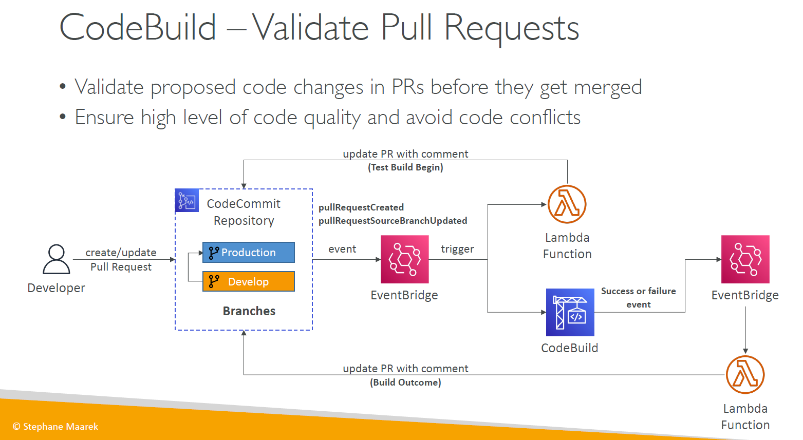
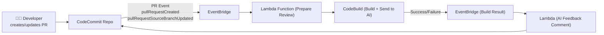

---
tags:
  - aws
  - aws/service
  - aws/domain/developer-tools
  - aws/topic/code-build
aliases:
  - "CodePipeline + AI Agent for Pull Request Review Smart PR Checks"
  - "Ai Agent As Pull Request Reviewer"
---

# 🤖 CodePipeline + AI Agent for Pull Request Review (Smart PR Checks)

> 🧠 Replace manual code review bottlenecks with **automated AI-based review** at the **pull request** (PR) level — powered by CodeCommit, Lambda, EventBridge, CodeBuild, and an AI agent.

---

<div style="text-align: center;">
  
</div>

---

## 🎯 Goal

When a developer opens or updates a Pull Request (PR):

1. Automatically trigger a **CodeBuild job**.
2. Use an **AI agent (via Lambda)** to review the code:

   - Detect code smells 🐛
   - Validate docstring coverage 📘
   - Suggest improvements 💡

3. Comment the AI feedback back onto the PR 🤖💬.

---

## 📦 Architecture Overview



---

## 🛠️ Step-by-Step Implementation

### ✅ 1. Setup CodeCommit Repository

- Create a CodeCommit repo with protected branches:

  - `main` or `production`
  - `develop`

Pull requests will be created from feature branches → target `develop` or `main`.

---

### 📡 2. EventBridge Rule for Pull Request

Create an **EventBridge Rule** for events:

```json
{
  "source": ["aws.codecommit"],
  "detail-type": ["CodeCommit Pull Request State Change"],
  "detail": {
    "event": ["pullRequestCreated", "pullRequestSourceBranchUpdated"]
  }
}
```

🎯 Target: **Lambda function** (trigger CodeBuild for review).

---

### 🧠 3. Lambda (Trigger CodeBuild for Review)

This function:

- Reads repo, PR ID, source branch
- Triggers CodeBuild with:

  - Artifact (source code)
  - Env var with PR metadata

- Posts "✅ AI Review started…" comment on the PR

---

### 🏗️ 4. CodeBuild Project

This step does two jobs:

#### a. Install Dependencies & Run Static Tests

`buildspec.yaml` example:

```yaml
version: 0.2
phases:
  install:
    commands:
      - pip install -r requirements.txt
  build:
    commands:
      - python lint.py > lint_output.txt
      - cat lint_output.txt
      - python ai_reviewer.py > ai_output.json
artifacts:
  files:
    - ai_output.json
    - lint_output.txt
```

#### b. Call AI Agent (OpenAI or Custom Model)

Your `ai_reviewer.py` should:

- Read source files from the repo
- Send code snippets to an **OpenAI model (e.g. gpt-4)** via API
- Generate structured feedback
- Save results to `ai_output.json`

---

### 🔁 5. EventBridge Rule for CodeBuild Status

Create another EventBridge rule to listen to **CodeBuild job state change**:

```json
{
  "source": ["aws.codebuild"],
  "detail-type": ["CodeBuild Build State Change"],
  "detail": {
    "build-status": ["SUCCEEDED", "FAILED"]
  }
}
```

🎯 Target: Second **Lambda function**

---

### 🧾 6. Lambda (Comment AI Feedback to PR)

This Lambda reads:

- CodeBuild artifact `ai_output.json` from S3
- Formats output
- Calls **CodeCommit API** to `postCommentForPullRequest`

✅ The developer sees AI-generated feedback directly in the PR conversation!

---

## 🧠 Example Feedback

```text
🤖 AI Code Reviewer:

File: src/utils/data_processor.py
- ⚠️ Function `clean_data()` has 18 lines — consider refactoring for readability.
- ❓ Missing docstring for `merge_columns()`.
- ✅ No obvious bugs or code smells detected.

Suggest: Add tests for edge cases on line 54.
```

---

## 🧩 Extensions (Optional)

- ✅ Enforce merge block unless PR passes AI + tests
- ✅ Detect security issues using Amazon CodeGuru or OSS tools
- ✅ Track AI comments as PR tags/labels

---

## 🔐 IAM Permissions

- **Lambda → CodeBuild**: `codebuild:StartBuild`
- **Lambda → CodeCommit**: `codecommit:PostCommentForPullRequest`
- **Lambda → S3**: `s3:GetObject` (to read AI output)
- **CodeBuild → OpenAI API** (via outbound VPC or direct internet)

---

## 📌 Summary

| Component   | Purpose                                          |
| ----------- | ------------------------------------------------ |
| CodeCommit  | Git repo + Pull Request management               |
| EventBridge | Detect PR events and build status                |
| Lambda      | Orchestrates build and AI review                 |
| CodeBuild   | Linting + AI code review + artifact creation     |
| AI Agent    | Uses OpenAI or custom LLM to analyze source code |
---

## Related Notes
- [[aws-services/10.developer/2.2.code-build/|Index]] - folder map
-[[4.2.run-code-build-in-your-vpc|CodeBuild Inside VPC]]] - previous lesson
-[[codeGuru|Amazon CodeGuru]]] - mentions Amazon CodeGuru
-[[1.1.codebuild|How AWS CodeBuild Works Internally]]] - mentions Codebuild
- [[aws-services/2.security/1.1.iam/1.fundmmentals/1.2.iam|AWS Identity and Access Management IAM]] - mentions Iam

---
