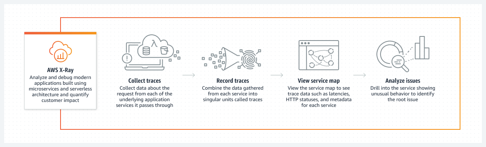
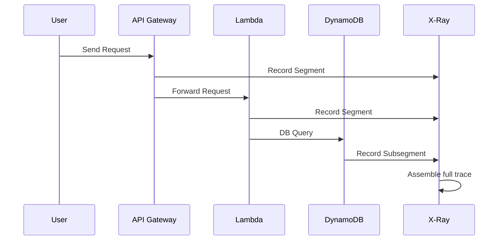
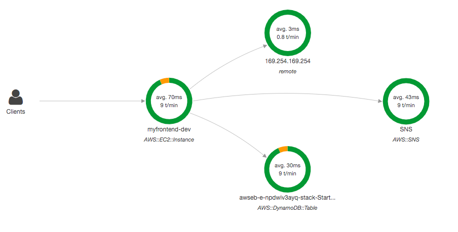

---
tags:
  - aws
  - aws/service
  - aws/domain/developer-tools
  - aws/topic/ray
aliases:
  - "AWS X-Ray Overview"
  - "X Ray"
---

# 🧠 **AWS X-Ray – Overview**

> 🔍 **Amazon X-Ray** is a **distributed tracing service** designed to help developers **analyze, debug, and visualize** how requests flow across applications — especially in **microservices and serverless architectures**.

---

    

---

## 🚨 **Why X-Ray Exists – The Problem It Solves**

| 🔧 Old Way of Debugging (Monoliths)              | ⚠️ Challenges in Modern Cloud Architectures |
| ------------------------------------------------ | ------------------------------------------- |
| Add logs everywhere in code locally and redeploy | Logs are fragmented across many services    |
| Parse CloudWatch logs manually                   | No unified view of how requests behave      |
| Debug a single app in isolation                  | Multiple microservices = blind spots        |
| Hard to detect latency and dependencies          | Impossible to trace a request end-to-end    |

✅ **AWS X-Ray** solves all that by giving you **request-level visibility** across your full stack — from frontend APIs to backend databases — in a single **visual map**.

---

## 🌐 **What AWS X-Ray Actually Does**

### X-Ray Collects & Connects

- ⛓️ Every service that processes the request adds a **segment**.
- 🧩 Segments may contain **subsegments** (e.g., DB queries, HTTP calls).
- 🧠 X-Ray assembles all segments into a complete **trace**.
- 🔎 You can view traces to **diagnose issues, see dependencies**, or check if you're meeting **SLA goals**.

> Segments are batched and sent to X-Ray every second

---

## 🎯 **Core Benefits**

| 💡 Use Case                  | 💥 What X-Ray Helps You Do                         |
| ---------------------------- | -------------------------------------------------- |
| ❗ Performance bottlenecks   | Identify slow services or APIs                     |
| 🧵 Microservice dependencies | Visualize how services interact                    |
| 🧪 Request behavior analysis | Understand what happened on each user request      |
| 🚫 Error detection           | Find out which services are failing and why        |
| ⏱️ SLA monitoring            | Check latency thresholds are met across the flow   |
| 🔐 Impacted users            | Identify which users were affected by a failure    |
| 🔄 Throttling detection      | See where you’re being throttled (e.g., SQS, APIs) |

---

## 💡 **How Tracing Works in X-Ray**

```mermaid
sequenceDiagram
    participant User
    participant API Gateway
    participant Lambda
    participant DynamoDB
    participant X-Ray

    User->>API Gateway: Send Request
    API Gateway->>X-Ray: Record Segment
    API Gateway->>Lambda: Forward Request
    Lambda->>X-Ray: Record Segment
    Lambda->>DynamoDB: DB Query
    DynamoDB->>X-Ray: Record Subsegment
    X-Ray->>X-Ray: Assemble full trace
```

---

## 🔌 **X-Ray Compatible Services**

X-Ray supports many AWS services natively:

- 🧬 **AWS Lambda**
- 🚢 **Elastic Beanstalk**
- 🐳 **Amazon ECS**
- 🌐 **API Gateway**
- ⚖️ **Elastic Load Balancer**
- 🖥️ **Amazon EC2 / On-premise**

> 💡 Even non-AWS services or custom apps can integrate with X-Ray using the SDK and daemon.

---

## 🔐 **Security & Compliance**

| Feature            | Description                                           |
| ------------------ | ----------------------------------------------------- |
| 🔐 IAM             | Controls who can **read/write traces**                |
| 🔒 KMS             | Encrypts trace data **at rest**                       |
| 🛡️ Granular Access | Supports cross-account trace ingestion with IAM trust |

---

## 🧭 **Quick Example – Trace Lifecycle**

1. User hits your **API Gateway**
2. It triggers a **Lambda** that calls **DynamoDB**
3. Each component records a **segment**
4. Segments are **batched and sent to X-Ray** every second
5. X-Ray **renders a full trace + service map**

---

## 🧰 **Troubleshooting X-Ray**

| Service           | Common Issues              | Fixes                                                |
| ----------------- | -------------------------- | ---------------------------------------------------- |
| **EC2 / On-prem** | No traces appearing        | Check IAM permissions + X-Ray Daemon is running      |
| **Lambda**        | No traces / partial traces | Enable "Active Tracing" + add correct IAM role       |
| **General**       | Missing service in map     | Check sampling, instrumentation, and IAM permissions |

---

## 🗺️ **X-Ray Magic: The Visual Service Map**

X-Ray auto-generates a **graph of your entire system**, showing:

- Nodes = services (Lambda, ECS, etc.)
- Edges = calls between services
- Errors/Throttling = highlighted in red/yellow
- Hovering = reveals latency & issues

---

  

---

> ✅ Even non-developers (QA, ops, managers) can use it to understand how the app behaves!

---

## ✅ **Summary**

> 🔍 **AWS X-Ray** gives you **real-time insights into distributed systems** by tracing requests across services and presenting them in a **visual, filterable, searchable** way.

It's your **cloud-native microscope** for debugging, performance tuning, and user impact analysis in AWS-based applications.
---

## Related Notes
- [[aws-services/10.developer/3.1.x-ray/|Index]] - folder map
- [[aws-services/10.developer/3.1.x-ray/2.1.x-ray-how-to-enable-it|AWS X-Ray Code Instrumentation & Enablement]] - next lesson
- [[aws-services/1.management-governance/3.1.cloud-watch/3.1.cw-logs|Amazon CloudWatch Logs]] - mentions CloudWatch Logs
- [[aws-services/3.network/4.api-gateway/x.api-gateway|Amazon API Gateway Streamlining API Management]] - mentions API Gateway
- [[aws-services/3.network/4.api-gateway/1.1.api-gateway|AWS API Gateway The Front Door for Your APIs]] - mentions API Gateway
- [[aws-daily/aws-architectures/3.1.serverless|Server-Based Architectures vs. Serverless Computing]] - mentions Serverless
- [[aws-services/10.developer/1.4.aws-sam/1.serverless|The Ultimate Guide to Serverless Computing & Tools]] - mentions Serverless
- [[aws-services/8.database/dynamodb/ddb-in-depth/1.1.ddb|Deep Dive into AWS DynamoDB]] - mentions DynamoDB
- [[aws-services/8.database/dynamodb/1.1.dynamodb|AWS DynamoDB]] - mentions Dynamodb
- [[aws-services/7.application-integration/sqs/1.1.sqs|Amazon SQS Mastering Serverless Message Queues]] - mentions SQS
- [[aws-services/2.security/1.1.iam/1.fundmmentals/1.2.iam|AWS Identity and Access Management IAM]] - mentions IAM
- [[aws-services/6.containers/2.ecs/1.1.ecs|Amazon ECS Elastic Container Service]] - mentions ECS

---
