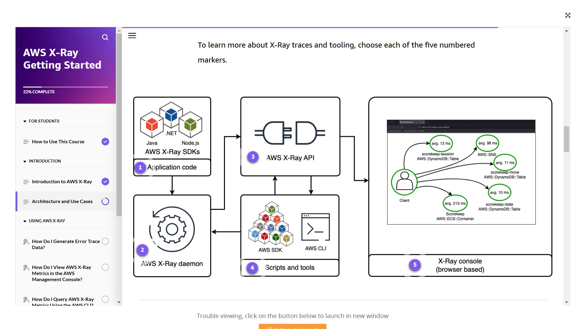

# 🧩 **AWS X-Ray – Code Instrumentation & Enablement**

> 🎯 To trace requests across your application, you need two things:  
> 👉 **Instrument your code** using the X-Ray SDK  
> 👉 **Enable X-Ray Daemon or Integration** to send trace data to AWS

---

<div style="text-align: center;">
    
</div>

---

## 🛠️ **What Is Instrumentation in X-Ray?**

**Instrumentation** means adding logic to your app to:

- ⏱️ Measure performance
- 🧪 Diagnose errors
- ✏️ Write trace data (segments, subsegments, annotations)

> 📌 X-Ray SDKs handle most of this automatically with **minimal code changes**!

---

## 🔌 **How to Instrument Your App**

### ✅ Step 1: Add the X-Ray SDK

| Language | SDK Example              |
| -------- | ------------------------ |
| Node.js  | `aws-xray-sdk`           |
| Python   | `aws-xray-sdk`           |
| Java     | `aws-xray-recorder-sdk`  |
| .NET     | `Amazon.XRay.Recorder.*` |
| Go       | `aws/aws-xray-sdk-go`    |

```js
// Example – Node.js + Express
const AWSXRay = require("aws-xray-sdk");
const app = require("express")();

app.use(AWSXRay.express.openSegment("MyApp"));
app.get("/", (req, res) => res.send("Hello!"));
app.use(AWSXRay.express.closeSegment());
```

> 💡 The SDK automatically traces:
>
> - AWS service calls (DynamoDB, S3, etc.)
> - HTTP/HTTPS requests
> - Database queries
> - Queues like SQS

---

### 🧩 Optional: Custom Trace Logic

You can enhance your traces by:

- 🧠 Adding **Annotations**: Indexed key-value pairs for filtering
- 📄 Adding **Metadata**: Extra data not used for search
- ✍️ Creating **Subsegments**: For custom logic blocks
- 🧰 Using **Interceptors / Middleware**: To auto-trace frameworks (Express, Spring, etc.)

---

## 📦 **X-Ray Core Concepts Recap**

| 🔹 Concept      | 💡 Description                                    |
| --------------- | ------------------------------------------------- |
| **Segment**     | A unit of work (API call, Lambda, etc.)           |
| **Subsegment**  | A breakdown within a segment (e.g., DB query)     |
| **Trace**       | End-to-end journey of one request                 |
| **Annotations** | Indexed tags (e.g., `userId: 123`)                |
| **Metadata**    | Non-indexed extra info                            |
| **Sampling**    | Controls which requests are traced (to save cost) |

---

## 🚀 **Enable the X-Ray Daemon (or Integration)**

After instrumenting your code, you must **enable trace collection**:

| Environment           | What to Do                                       |
| --------------------- | ------------------------------------------------ |
| **Lambda**            | Enable **Active Tracing** (daemon is built-in)   |
| **EC2 / On-Prem**     | Run the **X-Ray Daemon** as a background process |
| **ECS / Fargate**     | Add X-Ray Daemon as a **sidecar container**      |
| **Elastic Beanstalk** | Enable via console or `.ebextensions`            |

```bash
# EC2: Start daemon manually
./xray -o
```

---

## 🔐 **Grant IAM Permissions to Write Traces**

Make sure your compute resource (Lambda, EC2, ECS task) has a role with:

```json
{
  "Effect": "Allow",
  "Action": ["xray:PutTraceSegments", "xray:PutTelemetryRecords"],
  "Resource": "*"
}
```

> 🧠 For cross-account tracing: the daemon must **assume a role in the target account** with appropriate trust and permission.

---

## ✅ **Summary**

| Step             | What to Do                                      |
| ---------------- | ----------------------------------------------- |
| 📦 Add SDK       | Install and configure AWS X-Ray SDK             |
| 🧪 Instrument    | Trace HTTP calls, AWS SDK, DB, and custom logic |
| ⚙️ Enable Daemon | Launch X-Ray daemon or activate managed tracing |
| 🔐 IAM Access    | Grant `PutTraceSegments` and telemetry policies |

---

🧠 With just a few lines of code and minimal config, your app will send **trace segments**, and AWS X-Ray will show you a **full-service map and request trace** for every sampled request!
