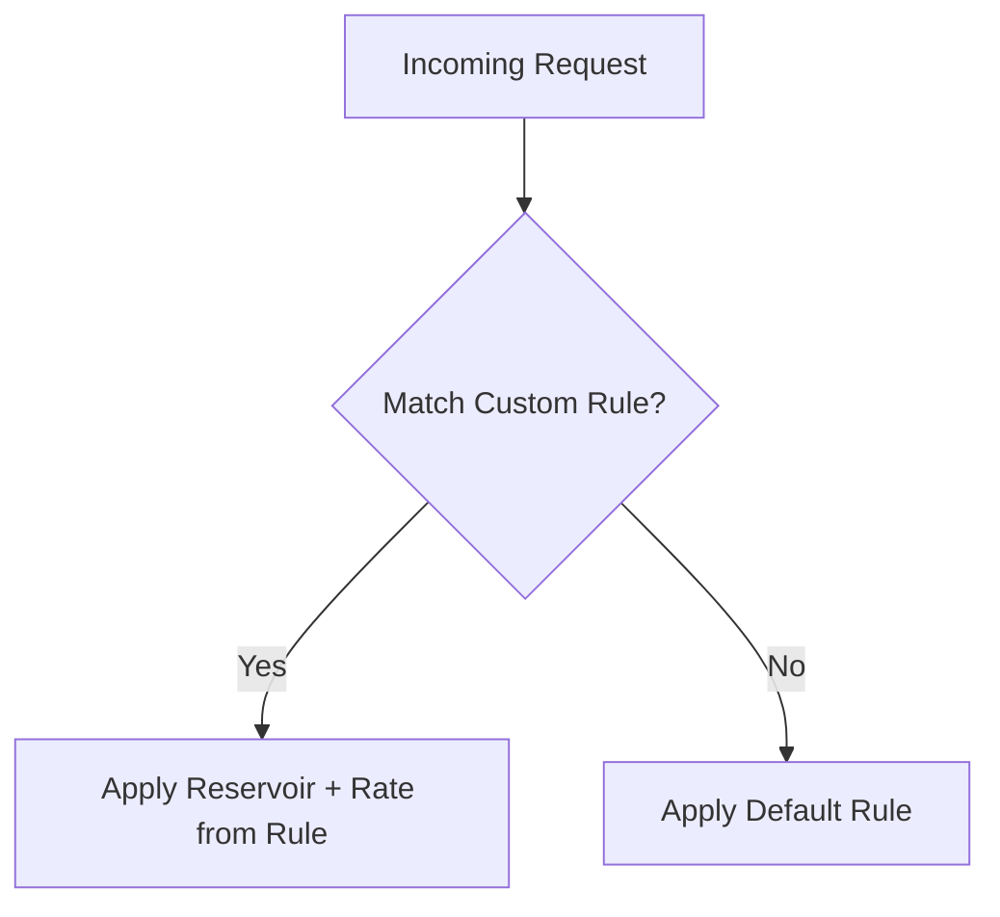

# 🎯 **AWS X-Ray – Sampling Rules Explained**

> 🔍 **X-Ray Sampling** lets you control **how many requests are traced** so you don’t overwhelm the system or incur high costs — while still gaining visibility into performance, errors, and architecture.

---

## 🧠 **Why Sampling Is Needed**

Imagine your app handles **1000 requests/second**. Tracing every request:

- ❌ Increases cost
- ❌ Adds overhead
- ❌ Makes the UI noisy and hard to analyze

✅ Instead, you trace only **some** requests and **still detect patterns**, bottlenecks, and errors effectively.

---

## 📦 **How X-Ray Sampling Works (Default Behavior)**

| Setting                   | Value                | Purpose                                 |
| ------------------------- | -------------------- | --------------------------------------- |
| **Reservoir**             | 1 request per second | Always trace at least 1 request/sec     |
| **Fixed rate (beyond 1)** | 5%                   | Randomly trace 5% of remaining requests |

> 🧪 This ensures **baseline tracing** even during low traffic, and **random samples** during high traffic.

### 🔁 Example

| Time (sec) | Incoming Requests | Traced Requests                     |
| ---------- | ----------------- | ----------------------------------- |
| 1          | 50                | 1 (guaranteed) + \~2 (5% of 49) = 3 |
| 2          | 200               | 1 + \~10 = 11                       |

---

## 🔧 **Custom Sampling Rules (Advanced Control)**

You can define your **own rules** to trace more or fewer requests **based on service, route, host, HTTP method, etc.**

### ✍️ Rule Example

```json
{
  "RuleName": "TraceLoginEndpoint",
  "Priority": 1,
  "ReservoirSize": 5,
  "FixedRate": 0.1,
  "ServiceName": "*",
  "HTTPMethod": "POST",
  "URLPath": "/login"
}
```

| Field           | Meaning                                                 |
| --------------- | ------------------------------------------------------- |
| `ReservoirSize` | Always trace this many requests/sec (if traffic exists) |
| `FixedRate`     | % of additional requests to trace                       |
| `Priority`      | Lower number = higher priority rule                     |
| `ServiceName`   | Which service to apply this rule to                     |
| `URLPath`       | Apply this rule to a specific endpoint                  |

---

## 🧰 **Where Do I Set Sampling Rules?**

| Option                        | How                                        |
| ----------------------------- | ------------------------------------------ |
| **Programmatically**          | Use the X-Ray **GetSamplingRules API**     |
| **AWS Console (X-Ray)**       | Use **Sampling Rules UI** to create/update |
| **Sampling Rule File (SDKs)** | Define rules in a local file (optional)    |

> ✅ Sampling rules can be **changed without modifying your code** — this gives you runtime control over trace behavior!

---

## 🔐 **Sampling Rule Evaluation Logic**

1. Rules are **evaluated top-down** based on **priority**
2. First matching rule is used
3. If no match, default rule is applied



---

## ✅ **Summary**

| Concept            | Description                                            |
| ------------------ | ------------------------------------------------------ |
| **Reservoir**      | Ensures a minimum number of traced requests per second |
| **Fixed Rate**     | % of additional requests that are traced randomly      |
| **Custom Rule**    | Lets you tailor sampling to URL, method, host, etc.    |
| **Priority**       | Ensures most specific rules apply first                |
| **No Code Change** | Modify rules at runtime without redeploying            |

---

## 🧪 Real-World Advice

- Trace **everything** in dev/staging → Use `reservoir=10`, `rate=1.0`
- In production:

  - Use **custom rules** for important routes (e.g., `/checkout`, `/login`)
  - Keep the default rule at a **low rate** to reduce noise and cost
