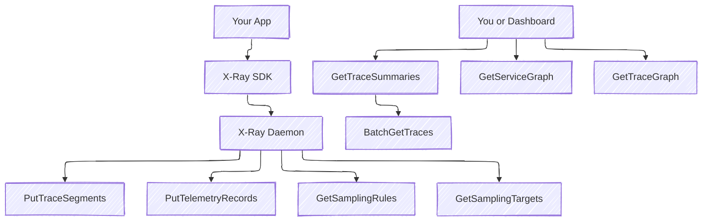

# 🔌 **AWS X-Ray APIs**

> 🧠 AWS X-Ray provides a set of APIs that help:
>
> - Send trace data from your app to X-Ray
> - Read and analyze trace data (like slow requests or errors)
> - Control how many requests get traced (sampling)

---

## ✍️ **Write APIs – Used to Send Trace Data**

These are used by your app or the **X-Ray Daemon** to send data to AWS X-Ray.

---

<div style="text-align: left;">
    
</div>

---

### 🔹 `PutTraceSegments`

- 📤 Used to **send trace data**
- Sent automatically by the X-Ray Daemon every second
- Includes things like:

  - Which service handled the request
  - How long it took
  - Any sub-operations (e.g., DB query)

---

### 🔹 `PutTelemetryRecords`

- 📦 Used to **tell AWS if the X-Ray daemon is working well**
- It sends simple counters like:

  - How many traces were sent
  - How many failed
  - Any connection problems

> ✅ Used internally for diagnostics — **you don’t need to call this yourself**.

---

### 📄 **IAM Permissions for Write APIs**

To allow your app or the daemon to send trace data, attach this managed policy to the IAM role:

```ini
AWSXRayDaemonWriteAccess
```

It includes permissions for:

```json
"xray:PutTraceSegments"
"xray:PutTelemetryRecords"
"xray:GetSamplingRules"
"xray:GetSamplingTargets"
```

---

## 👁️ **Read APIs – View and Analyze Trace Data**

These APIs let you **read and visualize trace data** stored in X-Ray.

---

<div style="text-align: left;">
    
</div>

---

### 🔹 `GetServiceGraph`

- Shows a **visual map** of how your services talk to each other
- Helps you understand dependencies and see where delays happen

---

### 🔹 `GetTraceSummaries`

- Lists **all traces** that happened in a time range (but without full details)
- You can filter by:

  - Time
  - Error
  - URL
  - User ID (if annotated)

---

### 🔹 `BatchGetTraces`

- Fetches the **full trace details** by trace ID
- Includes:

  - Each service touched
  - Response times
  - Errors or throttling

---

### 🔹 `GetTraceGraph`

- Like `GetServiceGraph`, but only for **specific trace IDs**
- Helpful for zooming into one request flow

---

## 🎯 **Sampling APIs – Control How Much to Trace**

These APIs control **how many requests get traced** so you can save cost and avoid too much data.

### 🔹 `GetSamplingRules`

- Returns a list of **rules** that define what kind of requests to trace (e.g., trace 5% of all traffic)

### 🔹 `GetSamplingTargets`

- Gives the daemon **limits and rates** to follow for each rule

### 🔹 `GetSamplingStatisticSummaries`

- Shows **how many requests were traced** per rule
- Helps you tune your sampling strategy

---

## 🧠 **How They Work Together**

<div align="center">



</div>

---

## ✅ **Summary Table**

| API Name                        | What It Does                             |
| ------------------------------- | ---------------------------------------- |
| `PutTraceSegments`              | Send trace data to AWS X-Ray             |
| `PutTelemetryRecords`           | Report if the daemon is working properly |
| `GetSamplingRules`              | Get trace rules (how much to trace)      |
| `GetSamplingTargets`            | Control the sampling rate per rule       |
| `GetSamplingStatisticSummaries` | View sampling activity                   |
| `GetServiceGraph`               | See how services connect and flow        |
| `GetTraceSummaries`             | Get a list of traces                     |
| `BatchGetTraces`                | Get full trace details                   |
| `GetTraceGraph`                 | Visualize a specific trace’s flow        |

---

## 📌 Final Tips

- ✅ These APIs are **used automatically** by X-Ray behind the scenes
- 🛠️ You can also use them to build your **own monitoring tools**
- 🔐 Make sure your IAM role includes the right permissions
- 🔍 Use `GetTraceSummaries` + `BatchGetTraces` for custom search/reporting

---

Want examples using AWS CLI, SDK, or building a small dashboard with these APIs? Just say the word!
▶️ Next topic: **X-Ray Integration with ECS, Elastic Beanstalk, and Lambda?**
