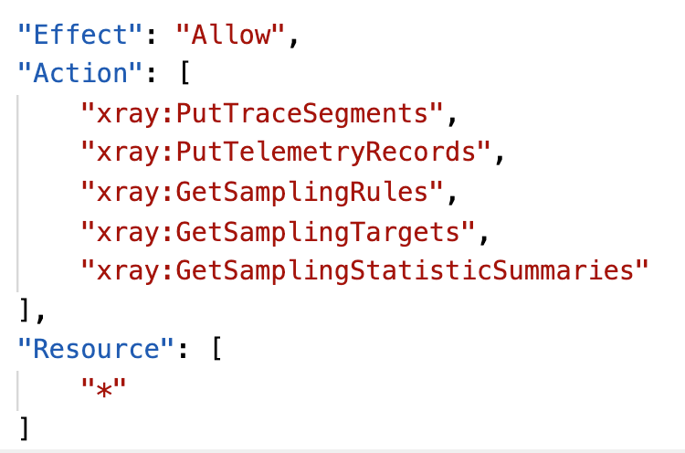
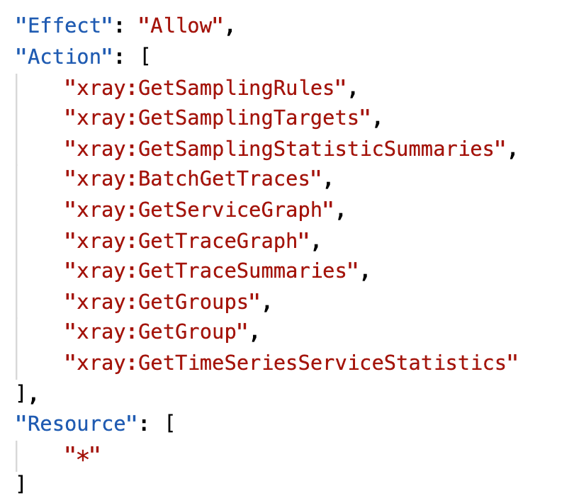
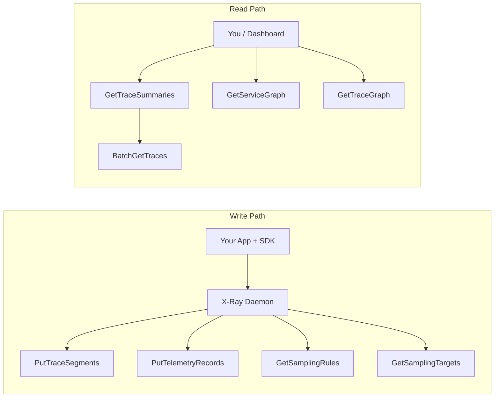

# 🔌 **AWS X-Ray APIs – Read & Write Explained**

> 💬 AWS X-Ray exposes a set of **APIs** that let the daemon (and you) upload trace data, fetch trace information, retrieve graphs, and manage sampling behavior — giving you **deep control and visibility** over your distributed traces.

---

## ✍️ **Write APIs – Used by the X-Ray Daemon**

These APIs are used internally by the **X-Ray daemon** or SDK to send trace and telemetry data to the X-Ray service.

---

<div style="text-align: center;">
    
</div>

---

### 🔹 `PutTraceSegments`

- 🚀 **Uploads trace segment documents**
- Includes:

  - Full trace info: segment ID, timestamps, subsegments, service info
  - Sent in batches every second by the daemon

### 🔹 `PutTelemetryRecords`

- 📊 Sends **telemetry metrics** about the daemon’s health
- Includes:

  - `SegmentsReceivedCount`
  - `SegmentsRejectedCount`
  - `BackendConnectionErrors`

> ✅ Useful for **monitoring the health of the X-Ray agent** itself!

---

### 📄 **IAM Permissions for Write APIs**

To allow your app or daemon to send data, the IAM role must include:

```json
{
  "Effect": "Allow",
  "Action": ["xray:PutTraceSegments", "xray:PutTelemetryRecords", "xray:GetSamplingRules", "xray:GetSamplingTargets"],
  "Resource": "*"
}
```

> 🔐 Use the AWS-managed policy:
> `arn:aws:iam::aws:policy/AWSXRayDaemonWriteAccess`

---

## 🎯 **Sampling Control APIs**

These APIs help the daemon **fetch sampling configuration**, which determines how many requests to trace.

### 🔹 `GetSamplingRules`

- 📜 Returns the **current list of sampling rules** from X-Ray
- Used by the daemon to decide what to trace

### 🔹 `GetSamplingTargets`

- 🎯 Provides dynamic **quotas and rate limits** for each rule (reservoirs, quotas)

### 🔹 `GetSamplingStatisticSummaries`

- 📈 Returns **metrics about sampling** activity (e.g., number of requests traced per rule)

---

## 👁️ **Read APIs – View Traces & Service Maps**

These APIs are used to **retrieve trace data**, graphs, and summaries — perfect for custom monitoring dashboards, analytics, or troubleshooting tools.

---

<div style="text-align: center;">
    
</div>

---

### 🔹 `GetServiceGraph`

- 🌐 Returns the **visual service graph**
- Shows how services interact with each other over a time range
- Useful for architecture discovery and dependency tracing

### 🔹 `GetTraceSummaries`

- 🔍 Lists **trace IDs** and high-level data (annotations, duration, start time)
- Used to **filter** and paginate traces over a specific time range
- ✅ Used before `BatchGetTraces` to find trace candidates

### 🔹 `BatchGetTraces`

- 📦 Retrieves **full details** of specific traces (by Trace IDs)
- Includes:

  - All segments and subsegments
  - Exceptions, throttling, annotations
  - Timing and latency info

### 🔹 `GetTraceGraph`

- 🧬 Like `GetServiceGraph` but for **specific trace IDs**
- Useful when you already know which traces you want to inspect

---

## 🧠 **Visual Summary of API Usage**



---

## ✅ **Summary Table**

| API Name                        | Type  | Purpose                               |
| ------------------------------- | ----- | ------------------------------------- |
| `PutTraceSegments`              | Write | Uploads raw trace data                |
| `PutTelemetryRecords`           | Write | Sends daemon metrics                  |
| `GetSamplingRules`              | Write | Fetches current sampling rules        |
| `GetSamplingTargets`            | Write | Gets quotas for sampling              |
| `GetSamplingStatisticSummaries` | Write | View sampling activity metrics        |
| `GetServiceGraph`               | Read  | Visual graph of service dependencies  |
| `GetTraceSummaries`             | Read  | Get a list of trace metadata          |
| `BatchGetTraces`                | Read  | Fetch full details of specific traces |
| `GetTraceGraph`                 | Read  | Visual graph for specific traces      |

---

## 📌 Final Tips

- ⚙️ These APIs are used by X-Ray under the hood — but you can use them directly in **your own monitoring tools** or **custom dashboards**
- 🛡️ Always configure **IAM permissions** carefully, especially if running the daemon in **cross-account setups**
- 🔍 For custom search, use `GetTraceSummaries` with filters (annotations, duration, etc.)
