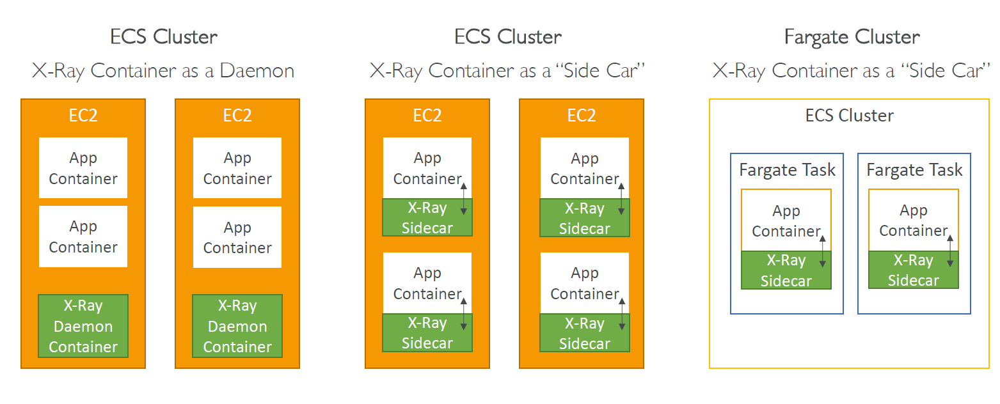

# 🔄 **AWS X-Ray – Integration with Elastic Beanstalk, ECS, and Lambda**

> ✅ To trace requests in real-world AWS environments, you must **enable X-Ray properly** for your deployment platform — whether you're using Elastic Beanstalk, ECS, or Lambda.

---

## 🌿 **1. Elastic Beanstalk + X-Ray**

### 🧠 How It Works

Elastic Beanstalk comes with **X-Ray Daemon support pre-installed** (for most platforms like Node.js, Python, Java, etc.).

> ⚠️ Note: The daemon is **not included** in Multicontainer Docker platforms.

### ✅ Steps to Enable

#### Option A – Console (UI)

1. Go to your **Elastic Beanstalk environment**
2. Click **Configuration > Monitoring**
3. ✅ Enable **X-Ray Tracing**

#### Option B – .ebextensions (Code)

Create a file called:
`/.ebextensions/xray-daemon.config`

```yaml
option_settings:
  aws:elasticbeanstalk:xray:
    XRayEnabled: true
```

### 🔐 IAM Permissions

Your **instance profile (EC2 role)** must include:

```json
{
  "Effect": "Allow",
  "Action": ["xray:PutTraceSegments", "xray:PutTelemetryRecords"],
  "Resource": "*"
}
```

### 🧑‍💻 Example

✅ Enable tracing for a Node.js app on Beanstalk by:

- Adding `.ebextensions/xray-daemon.config`
- Adding the X-Ray SDK to your code (`aws-xray-sdk`)
- Attaching `AWSXRayDaemonWriteAccess` policy

---

## 🐳 **2. Amazon ECS (EC2 or Fargate) + X-Ray**

### 🧠 Integration Modes

| Mode             | Description                                          |
| ---------------- | ---------------------------------------------------- |
| **Daemon Mode**  | One shared X-Ray Daemon runs per EC2 instance        |
| **Sidecar Mode** | Each task/pod has its **own X-Ray Daemon container** |

---

<div style="text-align: center;">
  
</div>

---

### 🚀 A. ECS (EC2 Launch Type)

#### Option 1 – Daemon Container (shared per EC2)

- Launch a **separate X-Ray Daemon container**
- Ensure it's on the **same EC2 instance** and **same network**

##### Task Definition Sample (Node.js + X-Ray Daemon)

```json
[
  {
    "name": "app",
    "image": "your-app-image",
    "essential": true,
    "portMappings": [{ "containerPort": 3000 }]
  },
  {
    "name": "xray-daemon",
    "image": "amazon/aws-xray-daemon",
    "essential": false,
    "portMappings": [{ "containerPort": 2000, "protocol": "udp" }]
  }
]
```

---

#### Option 2 – Sidecar Container (1 per task)

- Add X-Ray Daemon to **every task definition** as a sidecar
- More isolated, better suited for **multi-tenant ECS apps**

##### Example

Same as above, but both `app` and `xray-daemon` are part of the **same task**.

> 🎯 Use `"protocol": "udp"` and point the SDK to `127.0.0.1:2000`

---

### 🚀 B. ECS with Fargate

Fargate doesn’t give access to the underlying host, so **sidecar is required**.

#### Example Task Definition (Fargate Sidecar)

```json
[
  {
    "name": "app",
    "image": "your-app-image",
    "portMappings": [{ "containerPort": 3000 }]
  },
  {
    "name": "xray-daemon",
    "image": "amazon/aws-xray-daemon",
    "portMappings": [{ "containerPort": 2000, "protocol": "udp" }],
    "essential": false
  }
]
```

> 🧠 The app SDK must send trace data to `127.0.0.1:2000` (localhost UDP).

---

### 🔐 IAM Permissions (ECS Task Role)

Attach this policy to your ECS **task execution role**:

```json
{
  "Effect": "Allow",
  "Action": ["xray:PutTraceSegments", "xray:PutTelemetryRecords"],
  "Resource": "*"
}
```

---

## ☁️ **3. AWS Lambda + X-Ray**

> 🪄 Good news: **X-Ray is built into AWS Lambda!**

### ✅ How to Enable

#### Option A – Console

1. Go to your Lambda function
2. Under **Configuration > Monitoring & Operations tools**
3. ✅ Turn on **Active Tracing**

#### Option B – IaC Example (CloudFormation)

```yaml
TracingConfig:
  Mode: Active
```

### 🧑‍💻 Example Code (Node.js)

```js
const AWSXRay = require("aws-xray-sdk");
const AWS = AWSXRay.captureAWS(require("aws-sdk"));
```

---

### 🔐 IAM Role for Lambda

Lambda’s execution role must include:

```json
{
  "Effect": "Allow",
  "Action": ["xray:PutTraceSegments", "xray:PutTelemetryRecords"],
  "Resource": "*"
}
```

> ✅ Or just attach the managed policy: `AWSXRayDaemonWriteAccess`

---

## ✅ Summary Table

| Platform              | X-Ray Daemon Required? | How to Enable                           |
| --------------------- | ---------------------- | --------------------------------------- |
| **Elastic Beanstalk** | ✅ Yes (except Docker) | Console or `.ebextensions` file         |
| **ECS (EC2)**         | ✅ Yes                 | Daemon or Sidecar container in task     |
| **ECS (Fargate)**     | ✅ Yes (Sidecar only)  | Sidecar container in each task          |
| **AWS Lambda**        | ❌ Built-in            | Enable "Active Tracing" from UI or code |

---

## 🧠 Final Tips

- Always install the **X-Ray SDK** in your application code
- Make sure **IAM permissions** are attached to instances or task roles
- Use **sidecar pattern** in ECS for better isolation and flexibility
- Lambda makes tracing super easy — just enable it and go!
