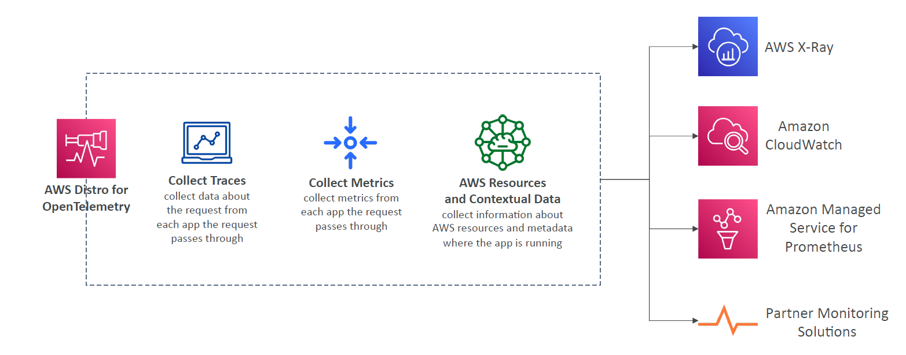
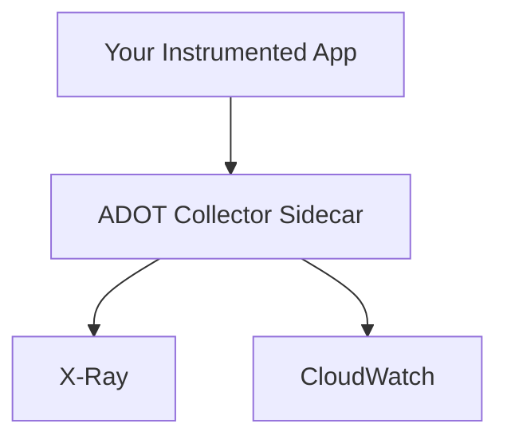

# 📦 **What is AWS Distro for OpenTelemetry (ADOT)?**

> 🧠 **AWS Distro for OpenTelemetry (ADOT)** is **Amazon’s official distribution** of the **OpenTelemetry project**, customized and supported by AWS.

---

    

---

> ✅ It helps you **collect, process, and export telemetry data** (like traces, metrics, and logs) from your applications running in AWS — to services like **AWS X-Ray**, **CloudWatch**, or third-party tools like **Prometheus**, **Jaeger**, or **Datadog**.

---

## 🎯 Why Does It Exist?

OpenTelemetry is a **standardized open-source project** under CNCF (Cloud Native Computing Foundation) that unifies:

- 🔍 **Tracing** (like AWS X-Ray)
- 📈 **Metrics** (like CloudWatch Metrics)
- 📜 **Logs** (coming soon as a standard)

> AWS took this project and built a **production-ready, secure, and tested version** for AWS services — that's what ADOT is.

---

## ⚙️ What Can You Do with ADOT?

| Task                          | Example Outcome                                         |
| ----------------------------- | ------------------------------------------------------- |
| 📤 Export traces              | Send traces to **X-Ray**, **Jaeger**, or **OTLP**       |
| 📈 Export metrics             | Send custom app metrics to **CloudWatch** or Prometheus |
| 🔄 Auto-instrument services   | Automatically trace Lambda, ECS, EKS apps               |
| 🔧 Add custom instrumentation | Add your own spans or metrics in code                   |

---

## 🚀 Where Can You Use It?

You can use ADOT in:

- ✅ **AWS Lambda**
- ✅ **Amazon ECS / Fargate**
- ✅ **Amazon EKS (Kubernetes)**
- ✅ **Amazon EC2 / on-premises servers**

> In short: You install and configure the **OpenTelemetry Collector**, and then instrument your app or use prebuilt ADOT layers or containers.

---

## 🧰 Example Use Case

### 🎯 Scenario: You want to monitor your microservices running on ECS with traces + metrics

1. 🐳 Add **OpenTelemetry Collector** as a **sidecar container**
2. 📦 Use **ADOT SDK or auto-instrumentation agent** in your app
3. ⚙️ Configure the collector to:

   - Send traces to **AWS X-Ray**
   - Send metrics to **AWS CloudWatch**

4. 🎉 View service map in X-Ray + custom metrics in CloudWatch

---

## 🧪 Sample Architecture

---

## ✅ Key Benefits of ADOT

- 🛠️ Unified instrumentation across services
- 🔄 Auto-instrumentation support for Lambda, ECS, EKS
- 🔐 Integrated with AWS IAM and security
- 📦 Works with multiple backends (not just AWS)

---

## 🔗 Learn More

- [📚 ADOT Documentation](https://aws-otel.github.io/)
- [GitHub – AWS Distro for OpenTelemetry](https://github.com/aws-observability/aws-otel-collector)
- [OpenTelemetry Project](https://opentelemetry.io/)

---

Let me know if you want:

- Setup steps for ADOT in ECS, Lambda, or EKS
- Example config files for the OpenTelemetry Collector
- Comparison between **ADOT** and **native X-Ray** SDKs!
