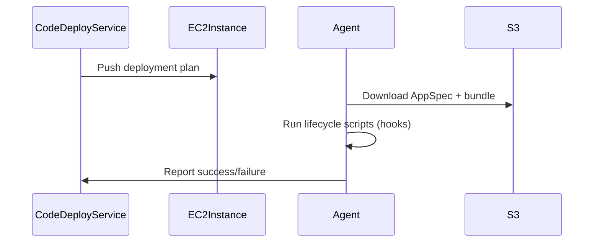

---
tags:
  - aws
  - aws/service
  - aws/domain/developer-tools
  - aws/topic/code-deploy
aliases:
  - "AWS CodeDeploy Agent"
  - "Code Deploy Agent"
---

# 🤖 AWS CodeDeploy Agent

The **AWS CodeDeploy Agent** is a critical component in EC2 and on-premises deployments.  
It runs on target compute instances and is responsible for managing the **deployment lifecycle**, executing **lifecycle hooks**, and reporting back status to the CodeDeploy service.

---

## 🧠 What Is the CodeDeploy Agent?

- It’s a **background daemon/service** installed on EC2/on-prem instances.
- It:

  - Pulls deployment instructions from CodeDeploy
  - Downloads application bundle (AppSpec + files)
  - Executes **hooks/scripts** in each deployment phase
  - Reports results (success/failure)

> 🔥 Without it, EC2 or on-prem deployments via CodeDeploy will fail!

---

## 📦 Platforms That Require the Agent

| Platform            | Requires Agent? |
| ------------------- | --------------- |
| EC2 (Linux/Windows) | ✅ Yes          |
| On-Premises Servers | ✅ Yes          |
| Lambda Deployments  | ❌ No           |
| ECS Deployments     | ❌ No           |

---

## 🔧 How to Install the CodeDeploy Agent

### ✅ 1. **Install Manually (Amazon Linux 2)**

```bash
sudo yum update -y
sudo yum install -y ruby wget
cd /home/ec2-user
wget https://aws-codedeploy-<region>.s3.<region>.amazonaws.com/latest/install
chmod +x ./install
sudo ./install auto
sudo systemctl enable codedeploy-agent
sudo systemctl start codedeploy-agent
```

🧠 Replace `<region>` with your AWS region (e.g., `us-east-1`)

---

### 🛠️ 2. **Install via EC2 User Data (for Auto Scaling / Launch Templates)**

```bash
#!/bin/bash
yum update -y
yum install -y ruby wget
cd /home/ec2-user
wget https://aws-codedeploy-<region>.s3.<region>.amazonaws.com/latest/install
chmod +x ./install
./install auto
systemctl enable codedeploy-agent
systemctl start codedeploy-agent
```

> ✅ Ideal for Auto Scaling Group (ASG) instances  
> ✅ Works well in Launch Templates / Launch Configurations

---

### 🧊 3. **Bake It into a Custom AMI**

1. Launch an EC2 instance
2. Install the CodeDeploy agent manually
3. Create an **Amazon Machine Image (AMI)** from the instance
4. Use that AMI in your ASG or EC2 provisioning process

> ✅ Best for consistency and fast boot times  
> 🔁 No need to repeat agent setup

---

## 🧑‍🚀 IAM Role for EC2 Instances

CodeDeploy needs to **communicate with the EC2 instance** via the agent, and **the instance must be allowed to interact with CodeDeploy**.

### ✅ Create an IAM Role for EC2 (Instance Profile)

#### 📄 Example Policy (Managed)

Attach this AWS-managed policy to the IAM Role:

```json
arn:aws:iam::aws:policy/service-role/AmazonEC2RoleforAWSCodeDeploy
```

#### 🔐 Trust Policy

```json
{
  "Version": "2012-10-17",
  "Statement": [
    {
      "Effect": "Allow",
      "Principal": {
        "Service": "ec2.amazonaws.com"
      },
      "Action": "sts:AssumeRole"
    }
  ]
}
```

Then **attach this IAM Role to the EC2 instance** (or reference it in Launch Templates).

---

## 🪓 Common Permissions Required (Custom Policy)

If using a **custom policy**, ensure it has:

```json
{
  "Effect": "Allow",
  "Action": [
    "s3:Get*",
    "s3:List*",
    "codedeploy:PollHostCommand",
    "codedeploy:GetDeployment",
    "codedeploy:GetDeploymentGroup",
    "codedeploy:PutHostCommandComplete",
    "codedeploy:PutLifecycleEventHookExecutionStatus"
  ],
  "Resource": "*"
}
```

✅ Also allow access to S3 if you're storing your deployment bundles there.

---

## 📌 How the CodeDeploy Agent Works



---

## ✅ Verifying Agent Status

On Linux EC2:

```bash
sudo systemctl status codedeploy-agent
sudo systemctl restart codedeploy-agent
```

Get agent version:

```bash
codedeploy-agent --version
```

---

## 🚨 Troubleshooting Common Issues

| Error                                  | Solution                                                                                      |
| -------------------------------------- | --------------------------------------------------------------------------------------------- |
| `The CodeDeploy agent did not respond` | Agent not running or not installed                                                            |
| `AccessDenied` errors                  | Check IAM role or permissions                                                                 |
| App not downloading                    | Check S3 access, region, or AppSpec syntax                                                    |
| Hook script fails                      | Debug `codedeploy-agent-deployments.log` in `/opt/codedeploy-agent/deployment-root/.../logs/` |

---

## 📦 Best Practices

- 🔁 Always use **Launch Templates** with **User Data** or pre-baked AMIs
- 🔐 Never forget the **IAM Role with CodeDeploy permissions**
- 🧪 Use **ValidateService** and **health checks** in hooks
- 🧾 Use **SNS Triggers** for deployment status alerts
---

## Related Notes
- [[aws-services/10.developer/2.3.code-deploy/|AWS CodeDeploy Deployment Strategies EC2 Lambda and ECS]] - folder map
-[[1.3.ec2-deployment-hooks|EC2 Deployment Hooks]]] - previous lesson
-[[4.1.1.ec2-deployments|AWS CodeDeploy with EC2 Deployments]]] - next lesson
-[[6.ecs-deployments|ECS Deployments]]] - mentions ECS Deployments
- [[aws-services/5.compute/1.3.ec2-auto-scaling/4.1.lifecycle-hooks|EC2 Auto Scaling Lifecycle Hooks Pause Prepare Proceed]] - mentions Lifecycle Hooks
-[[1.1.codedeploy|Introduction to AWS CodeDeploy]]] - mentions Codedeploy
-[[x.2.1.appspec|AWS CodeDeploy appspec.yml Full Syntax & Usage Guide]]] - mentions Appspec
- [[aws-services/7.application-integration/sns/1.sns|Amazon SNS The Clouds Pub/Sub Notification Engine]] - mentions SNS
- [[aws-services/2.security/1.1.iam/1.fundmmentals/1.2.iam|AWS Identity and Access Management IAM]] - mentions IAM
- [[aws-services/6.containers/2.ecs/1.1.ecs|Amazon ECS Elastic Container Service]] - mentions ECS

---
