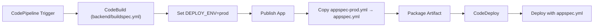

---
tags:
  - aws
  - aws/service
  - aws/domain/developer-tools
  - aws/topic/code-deploy
aliases:
  - "Monorepo Deployment with Multiple Projects and Environments in AWS"
  - "Multi Environment Deployment"
---

# 🏗️ Monorepo Deployment with Multiple Projects and Environments in AWS

> ✅ Use Case: Deploy multiple independent projects (e.g., **frontend**, **backend**) from a **single monorepo**  
> 🌍 Environments: **staging**, **production**, etc.  
> 📦 Tools: CodePipeline, CodeBuild, CodeDeploy  
> 🎯 Goal: Clean, environment-specific deployment using per-project `buildspec.yml` and `appspec.yml`

---

## 🗂️ Example Monorepo Structure

```ini
/repo-root
  /frontend
    /dist
    /scripts
    appspec-stage.yml
    appspec-prod.yml
    buildspec.yml
  /backend
    /publish
    /scripts
    appspec-stage.yml
    appspec-prod.yml
    buildspec.yml
```

---

## ✅ Objective

| Feature                          | Solution                                                                  |
| -------------------------------- | ------------------------------------------------------------------------- |
| Separate pipelines per project   | ✅ One CodePipeline per project (`frontend`, `backend`)                   |
| Separate buildspec per project   | ✅ Each project folder has its own `buildspec.yml`                        |
| Separate appspec per environment | ✅ Use `appspec-stage.yml`, `appspec-prod.yml` inside each project folder |
| CodeDeploy needs only 1 file     | ✅ Dynamically copy the correct one as `appspec.yml` during build         |

---

## 🧱 Step 1: Use Per-Project `buildspec.yml`

Each project (frontend/backend) has its own isolated `buildspec.yml`.

### 📘 Example: `backend/buildspec.yml`

```yaml
version: 0.2

phases:
  install:
    commands:
      - dotnet restore

  build:
    commands:
      - dotnet publish -c Release -o publish

  post_build:
    commands:
      - echo "Environment: $DEPLOY_ENV"
      - |
        if [ "$DEPLOY_ENV" == "prod" ]; then
          cp backend/appspec-prod.yml publish/appspec.yml
        else
          cp backend/appspec-stage.yml publish/appspec.yml
        fi

artifacts:
  files:
    - "**/*"
  base-directory: backend/publish
```

> 💡 This ensures the correct `appspec.yml` is included in the artifact root (CodeDeploy requirement).

---

## ⚙️ Step 2: Set Environment Variable in CodePipeline

In your **Build stage** in CodePipeline:

- Set environment variable:

  - Name: `DEPLOY_ENV`
  - Value: `stage` or `prod`

> You can also use **different pipelines per environment** if you prefer full separation.

---

## 📦 Step 3: appspec.yml per Environment

Inside each project folder:

### 🔹 `appspec-stage.yml`

```yaml
version: 0.0
os: linux

files:
  - source: /
    destination: /var/www/stage-backend

hooks:
  ApplicationStart:
    - location: scripts/start-stage.sh
```

### 🔹 `appspec-prod.yml`

```yaml
version: 0.0
os: linux

files:
  - source: /
    destination: /var/www/prod-backend

hooks:
  ApplicationStart:
    - location: scripts/start-prod.sh
```

> 🧠 Use different hook scripts or destinations per environment.

---

## 🔄 Final Deployment Flow



---

## ✅ Summary

| Goal                               | Technique                                                   |
| ---------------------------------- | ----------------------------------------------------------- |
| Multi-project monorepo             | Organize into folders: `/frontend`, `/backend`              |
| Environment-specific deployments   | Use multiple `appspec-<env>.yml` per project                |
| CodeDeploy requires one appspec    | Dynamically copy correct file as `appspec.yml` in buildspec |
| Different build logic per project  | Use per-project `buildspec.yml` files                       |
| Separate pipelines per environment | Optional, or control via `DEPLOY_ENV` variable              |

---

## 🚀 Best Practices

- ✅ Keep `appspec-*.yml` files and hook scripts next to project code
- ✅ Use CodePipeline variables to avoid hardcoding environment logic
- ✅ Validate your `buildspec.yml` locally using `codebuild-agent`
- ✅ Log into EC2 and check `/opt/codedeploy-agent/deployment-root` for deploy issues
---

## Related Notes
- [[aws-services/10.developer/2.3.code-deploy/|AWS CodeDeploy Deployment Strategies EC2 Lambda and ECS]] - folder map
-[[x.3.1.monorepo-deployment|Monorepo Deployment with CodePipeline CodeBuild and CodeDeploy]]] - previous lesson
-[[2.1.buildspec.yml|AWS CodeBuild buildspec.yml]]] - mentions Buildspec.Yml
-[[1.1.codedeploy|Introduction to AWS CodeDeploy]]] - mentions Codedeploy
-[[1.1.codebuild|How AWS CodeBuild Works Internally]]] - mentions Codebuild
-[[x.2.1.appspec|AWS CodeDeploy appspec.yml Full Syntax & Usage Guide]]] - mentions Appspec

---
