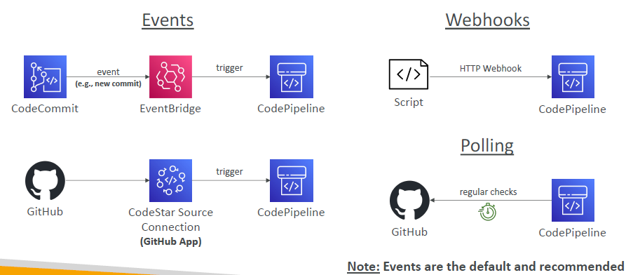

---
tags:
  - aws
  - aws/service
  - aws/domain/developer-tools
  - aws/topic/code-pipeline
aliases:
  - "AWS CodePipeline Source Stage"
  - "Source Stage"
---

# 🔄 **AWS CodePipeline: Source Stage**

Understand how the **Source Stage** of CodePipeline works by exploring **source types**, **how changes are detected**, and **how to control triggers** using filters and best practices.

---

## 🧩 Source Types in CodePipeline

CodePipeline supports two main source types:

### 🟦 **1. First-Party AWS Sources**

These are AWS-native services that deeply integrate with CodePipeline.

| Source         | Description                          |
| -------------- | ------------------------------------ |
| **S3**         | Upload ZIP files or raw objects      |
| **CodeCommit** | Git-based AWS-managed source control |
| **ECR**        | Container image registry             |

---

### 🌐 **2. Third-Party Sources (via AWS CodeConnections)**

Use **AWS CodeConnections** to securely connect to popular external repositories.

| Source                | Notes                          |
| --------------------- | ------------------------------ |
| **GitHub.com**        | Official GitHub App with OAuth |
| **GitHub Enterprise** | Cloud and self-hosted versions |
| **Bitbucket Cloud**   | Cloud only                     |
| **GitLab**            | GitLab Cloud and Self-Managed  |

> 🔐 CodeConnections handles secure OAuth, webhook setup, and token rotation.

---

## 🔁 How Change Detection Works

  

---

Each source type uses a different change detection mechanism to know **when to trigger the pipeline**:

### 🟦 First-Party Detection

| Source         | Detection Method         | Details                                     |
| -------------- | ------------------------ | ------------------------------------------- |
| **S3**         | EventBridge + CloudTrail | Requires both to detect object uploads      |
| **CodeCommit** | EventBridge              | Auto-configured when using console          |
| **ECR**        | EventBridge              | Triggers when new image versions are pushed |

📌 When you use the **AWS Console**, EventBridge rules are created automatically.  
🚨 When using **CLI/CloudFormation**, you must create EventBridge rules manually.

---

### 🌐 Third-Party Detection (via CodeConnections)

| Source        | Detection Method               | Notes                                              |
| ------------- | ------------------------------ | -------------------------------------------------- |
| **GitHub**    | Webhooks (GitHub App)          | Secure and scalable                                |
| **Bitbucket** | Webhooks (via CodeConnections) | Server version not supported                       |
| **GitLab**    | Webhooks                       | Self-managed GitLab needs trusted connection setup |

> ✅ Webhooks offer real-time detection with minimal delay. No polling required.

---

### 🔁 Summary of Detection Methods

| Detection Type       | Description                       | Used By                   |
| -------------------- | --------------------------------- | ------------------------- |
| **EventBridge**      | Native AWS event bus (real-time)  | S3, CodeCommit, ECR       |
| **Webhooks**         | OAuth-based webhook (real-time)   | GitHub, GitLab, Bitbucket |
| **Polling** (legacy) | Slow, inefficient periodic check  | Deprecated for most       |
| **Manual**           | Trigger from console, CLI, or API | All sources               |

> ⚠️ **Avoid polling**. Prefer EventBridge or Webhooks.

---

## 🎛️ Trigger Filters (for Fine-Grained Control)

After change detection, CodePipeline can further control **whether to start a pipeline** using **trigger filters**.

### 🧠 Available Only in V2 Pipelines (for CodeConnections)

| Filter Type          | Description                                         |
| -------------------- | --------------------------------------------------- |
| **No Filter**        | Trigger on any push                                 |
| **Branch Filter**    | Trigger only on specific branches                   |
| **Tag Filter**       | Trigger when matching Git tags are pushed           |
| **File Path Filter** | Trigger only when specific files/folders change     |
| **PR Events**        | Trigger on PR create, update, merge (GitHub/GitLab) |

> 🧠 You can define **only one trigger filter per source action**.

---

## 📊 Feature Summary Table

| Feature                    | First-Party Sources | Third-Party via CodeConnections |
| -------------------------- | ------------------- | ------------------------------- |
| Real-time detection        | ✅ EventBridge      | ✅ Webhook                      |
| Trigger filtering          | ❌ (limited)        | ✅ Full (V2)                    |
| Pull request events        | ❌                  | ✅ GitHub, GitLab               |
| Full Git clone support     | ✅ (CodeCommit)     | ✅                              |
| S3 object override support | ✅ New in 2025      | ❌                              |
| Cross-account sharing      | ❌                  | ✅ via AWS RAM                  |

---

## ✅ Best Practices for Source Stages

| Best Practice                               | Why It Matters                                     |
| ------------------------------------------- | -------------------------------------------------- |
| ✅ Prefer EventBridge/webhooks over polling | Real-time, scalable, reliable                      |
| ✅ Use V2 Pipelines with CodeConnections    | Gain access to file/tag/PR filters                 |
| ✅ Disable polling in legacy pipelines      | Reduce delays and costs                            |
| ✅ Use revision override on re-runs         | Ensure reproducible builds                         |
| ✅ Protect CodeConnections usage            | Use IAM condition keys + AWS RAM for scoped access |

---

## 🆕 Source Stage Highlights

| Feature                                                  | Benefit                                        |
| -------------------------------------------------------- | ---------------------------------------------- |
| 🔄 GitHub V2 support                                     | PR, file path, and tag filters                 |
| 🪄 S3 object key override (`AllowOverrideForS3ObjectKey`) | Dynamically select uploaded artifact           |
| 📣 Shared CodeConnections                                | Reuse third-party integrations across accounts |
| 🔁 Manual revision override (API/CLI)                    | Run pipeline with specific commit/sha          |
| 📊 Enhanced CloudWatch metrics                           | Source-level metrics and failure insights      |

📘 Docs:

- [CodePipeline Triggers](https://docs.aws.amazon.com/codepipeline/latest/userguide/pipelines-triggers.html)
- [CodeConnections Setup](https://docs.aws.amazon.com/codepipeline/latest/userguide/connections.html)
---

## Related Notes
- [[aws-services/10.developer/2.1.code-pipeline/|Index]] - folder map
-[[2.1.aws-code-pipeline-creation|AWS CodePipeline Creating Your First Pipeline from Scratch]]] - previous lesson
-[[3.2.1.first-party-source-providers|How AWS Source Providers Trigger CodePipeline Using EventBridge]]] - next lesson
-[[1.1.what-is-aws-code-pipeline|AWS CodePipeline]]] - mentions AWS CodePipeline
-[[1.1.cfn|AWS CloudFormation]]] - mentions CloudFormation
- [[aws-services/2.security/7.2.resource-access-manager/2.aws-ram|AWS Resource Access Manager RAM]] - mentions AWS Ram
- [[aws-services/1.management-governance/1.cloudformation/.docs|CND Useful References]] - mentions Docs
- [[aws-services/6.containers/1.ecr/1.2.ecr|Amazon ECR Your Secure Container Image Vault]] - mentions ECR
- [[aws-services/2.security/1.1.iam/1.fundmmentals/1.2.iam|AWS Identity and Access Management IAM]] - mentions IAM

---
