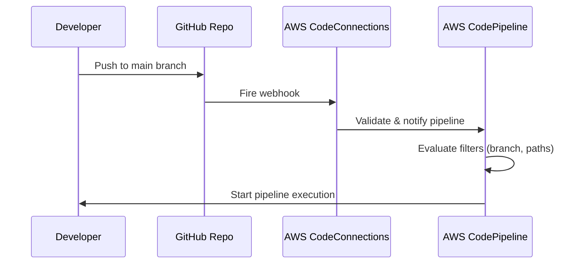

---
tags:
  - aws
  - aws/service
  - aws/domain/developer-tools
  - aws/topic/code-pipeline
aliases:
  - "Change Detection with Third-Party Source Providers in CodePipeline GitHub GitLab Bitbucket"
  - "Third Party Source Providers"
---

# 🌐 Change Detection with Third-Party Source Providers in CodePipeline (GitHub, GitLab, Bitbucket)

> 📦 Applies to: GitHub, GitLab, Bitbucket  
> 🔌 Integration Method: AWS CodeConnections + Webhooks  
> 🚀 Purpose: Automatically trigger CodePipeline when external code changes  
> 🔒 Auth Model: GitHub App + OAuth + IAM roles

---

## ❓ The Problem

You’re using **GitHub or GitLab** as your code source, and you want to:

✅ Automatically trigger AWS **CodePipeline**  
✅ On every push to a specific branch (like `main`)  
❌ Without polling or manual triggers

But you're not sure how AWS detects those source changes.

---

## ✅ The Solution: CodeConnections + Webhooks

For **third-party repositories**, AWS uses a different mechanism than S3/ECR:

| Source Type                  | Change Detection Mechanism     |
| ---------------------------- | ------------------------------ |
| S3, ECR (first-party)        | ✅ Native Events → EventBridge |
| GitHub, GitLab (third-party) | ✅ Webhooks → CodeConnections  |

---

## 🔧 How Change Detection Works Internally

<div align="center">



</div>

---

## 🧩 Core Components

| Component                | Role                                                                |
| ------------------------ | ------------------------------------------------------------------- |
| 🧑‍💻 GitHub (or GitLab) | Holds your source code and sends webhooks on changes                |
| 🔌 CodeConnections       | Authenticates with GitHub, manages webhooks, bridges to AWS         |
| 🧪 CodePipeline          | Executes stages (source → build → deploy) when changes are detected |

---

## 🔌 What Is AWS CodeConnections?

**AWS CodeConnections** is a fully managed service that:

- 🔐 Establishes secure OAuth-based connections to GitHub/GitLab
- 🔁 Manages incoming webhooks from your source repo
- 🚀 Notifies CodePipeline when a relevant change occurs

### Example ARN:

```plaintext
arn:aws:codestar-connections:region:account-id:connection/abc123
```

---

## 🛠️ How to Set It Up (Step-by-Step)

### 1️⃣ Create a Connection

- Go to **CodePipeline → Settings → Connections**
- Choose **GitHub** (or GitLab)
- Approve GitHub App installation and grant access

### 2️⃣ Configure Source in CodePipeline

- Add a **source stage**
- Choose **GitHub (CodeStar Connection)** as the source provider
- Select repo, branch, and connection ARN

### 3️⃣ Define Build & Deploy Stages (as usual)

---

## 📬 Webhook Payload: What GitHub Sends

When a push happens, GitHub sends a webhook to AWS:

```json
{
  "repository": {
    "name": "my-repo"
  },
  "ref": "refs/heads/main",
  "head_commit": {
    "id": "abcdef123456"
  },
  "pusher": {
    "name": "john-dev"
  }
}
```

AWS **extracts** this metadata to:

- Detect the branch
- Match it to the pipeline config
- Verify filters (branch name, file paths, etc.)

---

## 🔐 Security Overview

| Security Layer       | Details                                                               |
| -------------------- | --------------------------------------------------------------------- |
| 🔐 GitHub App        | Installed in your repo to authorize AWS                               |
| 🔒 CodeConnections   | Manages tokens, webhook secrets, and validation                       |
| 🛡 IAM Roles          | CodePipeline assumes roles to access CodeBuild, deploy targets, etc.  |
| 🔑 Webhook Signature | Ensures only signed payloads are accepted (handled by AWS internally) |

---

## ⚙️ Behind the Scenes: How Webhooks Trigger CodePipeline

When the webhook arrives, CodeConnections:

1. **Validates** the sender and signature
2. **Maps** the event to the right CodePipeline source action
3. **Applies filters**:

   - ✅ Branch match?
   - ✅ File path filters?
   - ✅ Trigger mode = Continuous Delivery?

4. **Updates source revision** and **starts pipeline execution**

---

## ⚠️ How Is This Different From First-Party (S3/ECR)?

| Feature          | First-Party (S3, ECR)       | Third-Party (GitHub, GitLab)          |
| ---------------- | --------------------------- | ------------------------------------- |
| Trigger Source   | EventBridge (native events) | Git webhook → CodeConnections         |
| Needs CloudTrail | ❌ No                       | ❌ No                                 |
| Filtering Method | JSON event pattern          | Branch & file filters in CodePipeline |
| Authentication   | IAM roles only              | IAM + GitHub App token                |
| Delay            | Seconds                     | Seconds                               |

---

## 🚀 Example Use Case

> “Trigger pipeline when code is pushed to the `main` branch on GitHub.”

### 🧩 Steps:

1. Create CodeConnection to GitHub
2. Add source stage:

   - Provider: `GitHub (CodeStar)`
   - Branch: `main`

3. Push code to GitHub:

   - GitHub fires webhook
   - CodeConnections handles event
   - Pipeline is triggered automatically

---

## ✅ Summary

| Concept              | Value                                                 |
| -------------------- | ----------------------------------------------------- |
| Change Detection     | Webhooks from GitHub → CodeConnections                |
| CodeConnections Role | Manages webhook, validates payload, triggers pipeline |
| No Polling Needed    | Webhook-based, event-driven                           |
| Trigger Evaluation   | Branch name + optional file path filters              |
| Security             | IAM + GitHub App + signed webhook + OAuth             |
| Better Than Polling  | ✅ Instantaneous, secure, no cron jobs                |

---

## 📘 References

- [🔗 AWS CodeConnections](https://docs.aws.amazon.com/codepipeline/latest/userguide/connections.html)
- [📦 GitHub Integration in CodePipeline](https://docs.aws.amazon.com/codepipeline/latest/userguide/connections-github.html)
- [⚙️ Source Action Filter Options](https://docs.aws.amazon.com/codepipeline/latest/userguide/pipelines-triggers.html)
- [🔐 CodeStar Connection Source](https://docs.aws.amazon.com/codepipeline/latest/userguide/action-reference-CodestarConnectionSource.html)
---

## Related Notes
- [[aws-services/10.developer/2.1.code-pipeline/|Index]] - folder map
-[[3.2.3.aws-ecr-connection|AWS CodePipeline & Amazon ECR Integration Using EventBridge]]] - previous lesson
-[[3.3.2.github-connection|Connect GitHub to AWS CodePipeline via GitHub App]]] - next lesson
-[[3.1.source-stage|AWS CodePipeline Source Stage]]] - mentions Source Stage
-[[1.1.codebuild|How AWS CodeBuild Works Internally]]] - mentions Codebuild
- [[aws-services/1.management-governance/4.3.config/x.config|AWS Config Track Manage and Secure Your AWS Resources]] - mentions Config
- [[aws-services/1.management-governance/1.cloudformation/.docs|CND Useful References]] - mentions Docs
- [[aws-services/6.containers/1.ecr/1.2.ecr|Amazon ECR Your Secure Container Image Vault]] - mentions ECR
- [[aws-services/2.security/1.1.iam/1.fundmmentals/1.2.iam|AWS Identity and Access Management IAM]] - mentions IAM

---
