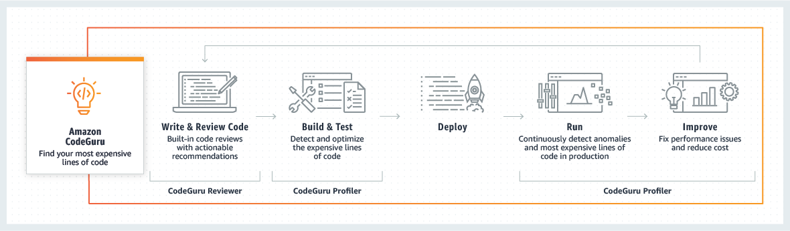
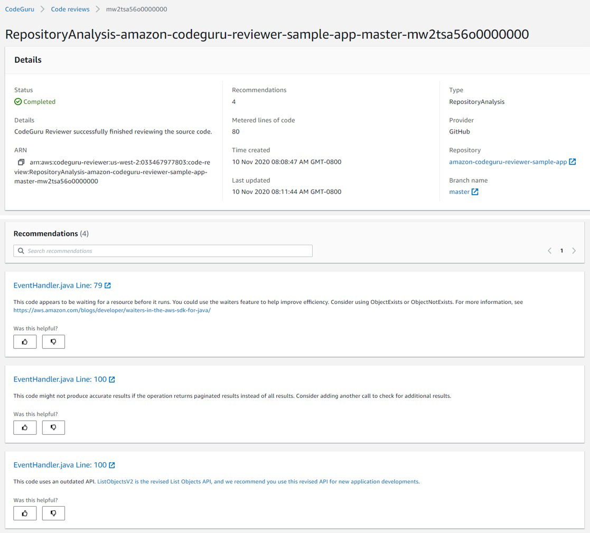
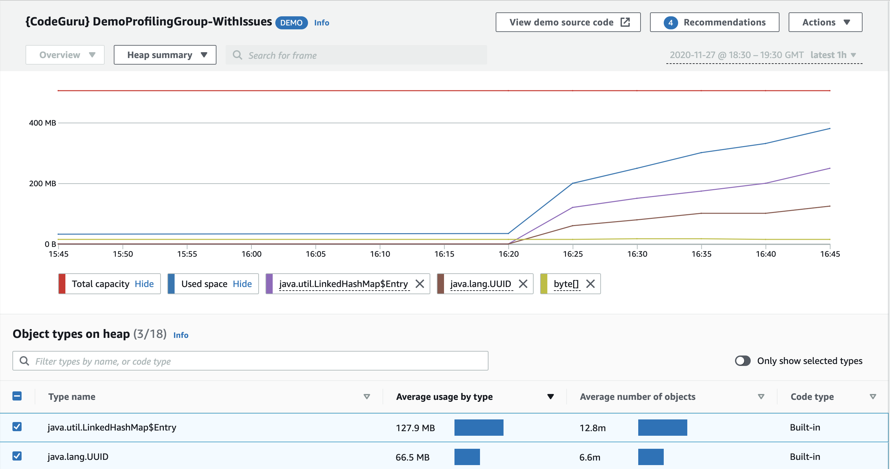

# 🤖 **Amazon CodeGuru**

_ML-Powered Code Reviews & Performance Tuning!_

---

    

---

**Amazon CodeGuru** is a developer tool powered by **machine learning** that helps you **automate code reviews** and **optimize application performance**.

It offers **two main components**:

---

## 🧠 1. **CodeGuru Reviewer** (🛠️ Development Phase)

    

---

Automated **static code analysis** that helps find:

| ✅ Detects Issues Like      |
| --------------------------- |
| 🐞 Bugs and resource leaks  |
| 🔒 Security vulnerabilities |
| 📏 Best practice violations |
| 🧪 Missing input validation |

### 🔧 Features

- Trained on millions of real code reviews from Amazon and open-source projects
- Supports **Java** and **Python**
- Integrates with **GitHub**, **Bitbucket**, and **CodeCommit**
- Gives **actionable recommendations** via pull request comments

> 🔍 Example: Warns if a method uses unvalidated user input or forgets to close a file stream

---

## 📊 2. **CodeGuru Profiler** (🚀 Production Phase)

    

---

Helps analyze **runtime behavior** of your applications to:

| 📉 Optimize For         | 🧪 Insights Provided    |
| ----------------------- | ----------------------- |
| ⚙️ CPU utilization      | 🧠 Detect "hot paths"   |
| 💰 Compute cost savings | 📦 Heap summaries       |
| ⚡ Performance tuning   | 📉 Bottleneck detection |
| 🔍 Anomaly detection    | 🧾 Expensive methods    |

### 🔧 Features

- Lightweight agent runs in production or pre-production
- Works for AWS-hosted or on-prem apps
- Visual flame graphs to pinpoint inefficiencies
- Supports **Java** and **Python**

---

## 🔁 When to Use Each

| Tool                  | Use It For...                                         |
| --------------------- | ----------------------------------------------------- |
| **CodeGuru Reviewer** | During development — for better code quality          |
| **CodeGuru Profiler** | In production — for performance tuning & cost savings |

---

## 🧠 Summary

| 🔹 Tool  | 💡 Benefit                                                      |
| -------- | --------------------------------------------------------------- |
| Reviewer | Automated code reviews with ML-backed suggestions               |
| Profiler | Real-time performance profiling with cost and CPU optimizations |
