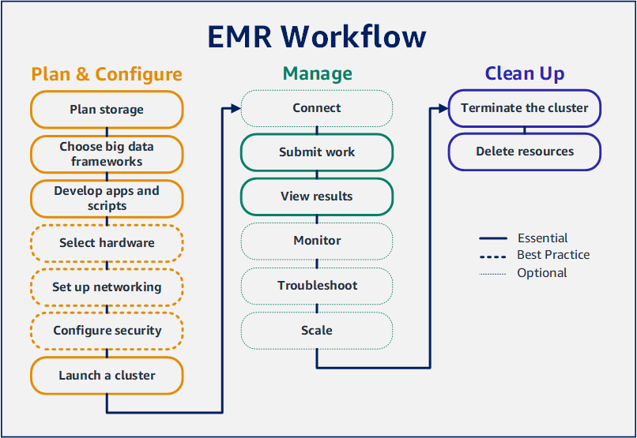

---
tags:
  - aws
  - aws/service
  - aws/domain/analytics
  - aws/topic/emr
aliases:
  - "Tutorial Getting started with Amazon EMR"
  - "Emr Workshop"
---

# 📖 Tutorial: Getting started with Amazon EMR

[Setting up your Amazon EMR cluster](https://docs.aws.amazon.com/emr/latest/ManagementGuide/emr-gs.html)

---

## Related Notes
- [[aws-services/11.analytics/emr/|Index]] - folder map
- [[aws-services/11.analytics/emr/2.2.emr-storage-options|Storage Options in Amazon EMR]] - previous lesson
- [[aws-services/11.analytics/emr/3.migration-to-emr|Migrating Your On-Prem Hadoop Cluster to Amazon EMR]] - next lesson
- [[aws-services/1.management-governance/1.cloudformation/.docs|CND Useful References]] - mentions Docs

---
