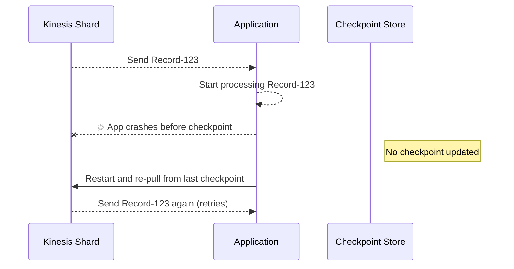

# 🫴 **What Happens If a KDS Consumer Fails During Processing?**

> _If a consumer reads a record from Kinesis and **crashes or fails** before completing the task — will the record be lost or retried?_ Let’s break it down.

---

## 🎯 **KDS Doesn’t Manage Offsets — You Do**

Unlike SQS or DynamoDB Streams, **Kinesis Data Streams does not track which records have been “processed.”**

Instead, it follows a **pull-based model**, and your **consumer application is responsible for managing checkpointing** (where you last successfully read and processed).

> 📌 There’s no concept of “shifting” like in Kafka — the record is **always available** until the **retention window expires** (default: 24 hours, up to 365 days).

---

## 💥 **What If a Consumer Crashes After Reading a Record?**

Let’s say a consumer retrieves a record, starts processing it, and **fails before finishing**.

### 🤔 Will the record be reprocessed?

✅ **Yes**, because:

- The record is still in the stream.
- The consumer **never checkpointed** that it finished processing.
- On restart, the consumer **resumes from the last checkpoint** → which includes the unprocessed record.

---

## ✅ **Checkpointing = Responsibility of the Consumer**

### When do you checkpoint?

- After **successful processing** of a record or batch.
- If the app crashes **before checkpointing**, the same record will be read again.

> 🧠 AWS SDKs like the **Kinesis Client Library (KCL)** handle checkpointing **via DynamoDB**.

---

## 📊 **Workflow: Record Fetched but App Crashes Before Checkpoint**

---

## 🔁 **Kinesis = At-Least-Once Delivery**

- **Records are not deleted** once read.
- You get **at-least-once delivery**.
- You must **design your consumer to be idempotent** (processing same record twice shouldn't break your system).

---

## 🔒 **Best Practices for Failure Resilience**

| Strategy                         | Why It Helps                                             |
| -------------------------------- | -------------------------------------------------------- |
| ✅ Checkpoint **after** success  | Prevents premature advancement                           |
| 💡 Idempotent consumers          | Ensure double-processing has no side effects             |
| 🛠 Use **KCL / Lambda**           | AWS handles checkpointing and retries automatically      |
| 🧪 Monitor w/ CloudWatch metrics | Catch processing errors and retry trends                 |
| 🗓 Tune stream retention          | Keep records longer (24h–365d) to allow replay if needed |

---

## ✅ Summary

| Concept                       | Behavior                                                            |
| ----------------------------- | ------------------------------------------------------------------- |
| Record lost if consumer dies? | ❌ No — still in stream                                             |
| Is offset auto-managed?       | ❌ No — consumer manages checkpoint                                 |
| What happens on restart?      | ✅ Consumer re-reads from last checkpoint (retries unfinished data) |
| Safe from duplication?        | ⚠️ Only if **you design your logic to be idempotent**               |
