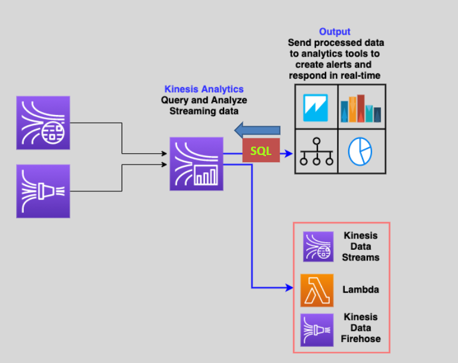

---
tags:
  - aws
  - aws/service
  - aws/domain/analytics
  - aws/topic/kinesis-trash
aliases:
  - "Kinesis Data Analytics"
  - "Kinesis Data Analysis"
---

# 📉 Kinesis Data Analytics

Amazon `Kinesis data analytics` is used to process and analyze real-time streaming data from `Kinesis Data Streams` or `Kinesis Data Firehose` using standard `SQL` code.

- `It requires Kinesis Data Analytics applications` to continuously read and process streaming data.
- `It can send the output to analytics tools`
- Supports Kinesis data streams, kinesis data firehose, and lambda functions as destination.
- **Use cases:** Produce time series analytics, feed real-time dashboards, and create real-time metrics.
---

## Related Notes
- [[aws-services/11.analytics/kinesis-trash/|Index]] - folder map
- [[aws-services/11.analytics/kinesis-trash/3.kinesis-data-firehose|Amazon Kinesis Data Firehose]] - previous lesson
- [[aws-services/11.analytics/kinesis-trash/4.2.kinesis-data-analysis-for-apache-flink|Kinesis Data Analytics for Apache Flink]] - next lesson
- [[aws-services/11.analytics/kds/1.1.kds|Amazon Kinesis Data Streams KDS - Real-Time Streaming Storage]] - mentions Kinesis Data Streams
- [[aws-services/11.analytics/kinesis-trash/2.kinesis-data-streams|Amazon Kinesis Data Streams Real-Time Data Processing]] - mentions Kinesis Data Streams
- [[aws-daily/aws-architectures/4.1.streaming-data|Streaming Data The Power of Real-Time Data Processing]] - mentions Streaming Data
- [[aws-services/11.analytics/firehose/1.1.firehose|Amazon Data Firehose The Pipeline That Never Sleeps]] - mentions Firehose

---
