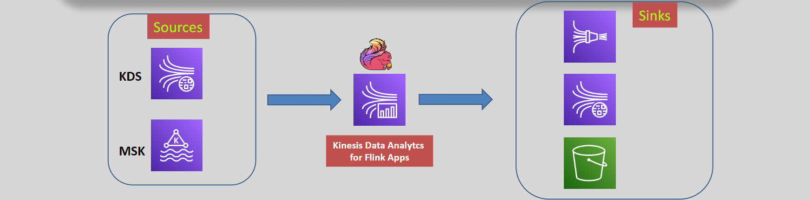

---
tags:
  - aws
  - aws/service
  - aws/domain/analytics
  - aws/topic/kinesis-trash
aliases:
  - "Kinesis Data Analytics for Apache Flink"
  - "Kinesis Data Analysis For Apache Flink"
---

# 📉 🦨 Kinesis Data Analytics for Apache Flink

Kinesis Data Analytics for Apache Flink is a **fully managed service** that enables developers to process and analyze real-time streaming data using **Apache Flink**, a widely-used, open-source framework for distributed stream processing.

---

  

---

## 🌟 **Key Features**

1. **Real-Time Data Processing**:

   - Perform complex transformations, aggregations, and analytics on streaming data with **low latency**.

2. **AWS Service Integration**:

   - **Data Sources**:
     - **Kinesis Data Streams**
     - **Amazon MSK (Managed Service for Apache Kafka)**
     - **Custom Sources** (via Flink connectors)
   - **Data Sinks (Destinations)**:
     - **Amazon S3**: Store processed data for analytics and long-term storage.
     - **Kinesis Data Streams**: Re-ingest processed data for further workflows.
     - **Kinesis Data Firehose**: Deliver processed data to destinations like **Redshift**, **OpenSearch**, or **Splunk**.

3. **Fully Managed Environment**:

   - AWS handles infrastructure, scaling, and availability of Apache Flink applications, letting you focus on development.

4. **Stateful Stream Processing**:

   - Efficiently maintain application state with Flink’s robust state management.

5. **Scalable Architecture**:
   - Automatically scales resources to handle varying data volumes without manual intervention.

---

## 🛠️ **How It Works**

1. **Input Data**:

   - Stream real-time data from **Kinesis Data Streams**, **Amazon MSK**, or other custom sources using supported Flink connectors.

2. **Processing with Apache Flink**:

   - Use Apache Flink's APIs to build applications that process streaming data, performing operations like:
     - Filtering, transforming, and aggregating.
     - Anomaly detection or enrichment with external data sources.

3. **Output Data**:
   - Send processed data to:
     - **Amazon S3** for storage.
     - **Kinesis Data Streams** for further real-time workflows.
     - **Kinesis Data Firehose** for delivery to analytics destinations like Redshift or Splunk.

---

## 🚀 **Use Cases**

1. **Real-Time Monitoring**:

   - Analyze data from IoT devices or sensors to detect anomalies and trigger alerts.

2. **Log and Metric Aggregation**:

   - Aggregate logs and metrics from applications for improved observability and insights.

3. **Event-Driven Applications**:

   - Build applications that react to real-time data events.

4. **Stream Analytics Dashboards**:
   - Power interactive dashboards with live analytics for user behavior or transaction tracking.

---

## 🔑 **Limitations**

- **No Direct Source Connector for Kinesis Data Firehose**:
  - Data can flow to Firehose as a **sink**, but it cannot be used as a **source**.

---

## ✅ **Why Use Kinesis Data Analytics for Apache Flink?**

1. **Streamlined Management**:

   - Fully managed service eliminates the need for infrastructure management.

2. **Advanced Analytics**:

   - Apache Flink's APIs provide powerful capabilities for real-time transformations and analytics.

3. **AWS Ecosystem Integration**:

   - Seamless connection with AWS services for ingestion, storage, and delivery.

4. **Cost Efficiency**:
   - Pay only for the resources consumed by your applications.

---

## 📚 **Conclusion**

Kinesis Data Analytics for Apache Flink enables **real-time stream processing** with powerful analytics capabilities, seamless AWS integration, and a fully managed environment. Whether you're building event-driven architectures, analyzing IoT data, or powering real-time dashboards, this service simplifies the process of handling and analyzing streaming data at scale.
---

## Related Notes
- [[aws-services/11.analytics/kinesis-trash/|Index]] - folder map
- [[aws-services/11.analytics/kinesis-trash/4.1.kinesis-data-analysis|Kinesis Data Analytics]] - previous lesson
- [[aws-services/11.analytics/kinesis-trash/5.kinesis-video-steams|Amazon Kinesis Video Streams]] - next lesson
- [[aws-services/11.analytics/kinesis-trash/3.kinesis-data-firehose|Amazon Kinesis Data Firehose]] - mentions Kinesis Data Firehose
- [[aws-services/11.analytics/kds/1.1.kds|Amazon Kinesis Data Streams KDS - Real-Time Streaming Storage]] - mentions Kinesis Data Streams
- [[aws-services/11.analytics/kinesis-trash/2.kinesis-data-streams|Amazon Kinesis Data Streams Real-Time Data Processing]] - mentions Kinesis Data Streams
- [[aws-daily/aws-architectures/4.1.streaming-data|Streaming Data The Power of Real-Time Data Processing]] - mentions Streaming Data
- [[aws-services/11.analytics/msk/1.1.apache-kafka|What is Apache Kafka]] - mentions Apache Kafka
- [[aws-services/11.analytics/kinesis-trash/1.2.apache-flink|Introduction to Apache Flink]] - mentions Apache Flink
- [[aws-services/11.analytics/msf/1.1.apache-flink|What is Apache Flink Stream It Like Its Hot]] - mentions Apache Flink
- [[aws-services/11.analytics/firehose/1.1.firehose|Amazon Data Firehose The Pipeline That Never Sleeps]] - mentions Firehose
- [[aws-services/11.analytics/redshift/1.redshift|Amazon Redshift]] - mentions Redshift

---
