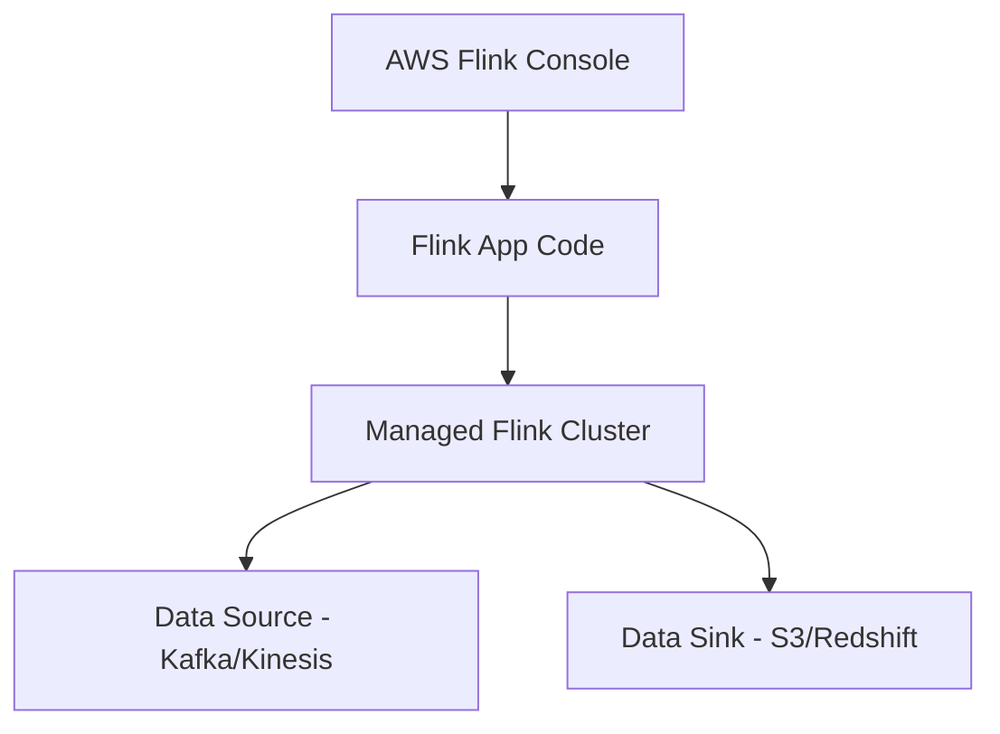
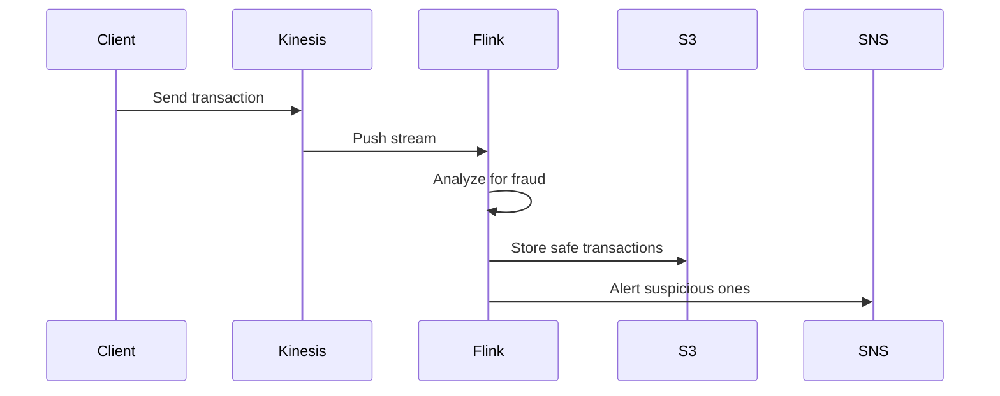

---
tags:
  - aws
  - aws/service
  - aws/domain/analytics
  - aws/topic/msf
aliases:
  - "Amazon Managed Service for Apache Flink"
---

# ⚡ Amazon Managed Service for Apache Flink

## 🧠 **What is Apache Flink?**

Apache Flink is an **open-source distributed processing engine** designed to handle **both batch and real-time streaming data**.

### 📌 Key Use Cases

- Stream processing with **millisecond latency**
- Real-time **analytics** and **event-driven applications**
- Real-time **ETL (Extract, Transform, Load)** pipelines
- Complex **event processing** (CEP)
- Batch analytics with Flink’s unified API

### 🧑‍💻 Programming Support

You can write Flink apps in:

- Java / Scala
- Python
- SQL
- Kotlin (via JVM)

---

## ⚙️ **How Apache Flink Works**

A Flink application generally consists of the following components:

### 🔌 Sources

- Read streaming data from external systems (e.g., Kafka, Kinesis, S3, socket)

### 🧮 Operators

- Transform, enrich, aggregate, or filter data (e.g., map, flatMap, reduce, join)

### 📤 Sinks

- Output processed data to destinations (e.g., S3, Redshift, RDS, Elasticsearch)

---

## ☁️ **Amazon Managed Service for Apache Flink**

Amazon Managed Service for Apache Flink is a **fully managed, serverless** service to run Flink applications on AWS **without managing infrastructure**.

### 🧰 What It Handles For You

- Provisioning compute resources
- Availability Zone (AZ) failover
- Application state backups & checkpoints
- Parallel execution and job recovery
- Automatic scaling based on workload

### 💡 Benefits

- **No cluster management** required
- **Sub-second latency** for real-time processing
- **Scales automatically** as your workload grows
- **Secure & resilient** (multi-AZ failover and IAM integration)
- **Direct integrations** with AWS services

---

## 🕒 **Evolution Timeline**

| Year | Event                                                     |
| ---- | --------------------------------------------------------- |
| 2016 | Launched Kinesis Data Analytics for SQL                   |
| 2018 | Launched Kinesis Data Analytics for Java (based on Flink) |
| 2020 | Renamed to Kinesis Data Analytics for Apache Flink        |
| 2023 | Rebranded as Amazon Managed Service for Apache Flink      |

---

## 🔗 **Flink Integration with AWS Streaming Ecosystem**

### ✅ Supported Sources

- Amazon Kinesis Data Streams
- Amazon MSK (Managed Kafka)
- Direct PUT from apps

### ✅ Supported Destinations

- Amazon S3
- Amazon Redshift
- Amazon OpenSearch
- Amazon RDS
- Lambda, 3rd-party HTTP endpoints

---

## 🌍 **Real-World Example**

Imagine you're building a **fraud detection** system:

1. Transactions stream into Kinesis
2. Apache Flink (via Amazon Managed Service) processes them in real-time
3. Detects anomalies
4. Sends flagged transactions to S3 and alerts via SNS

This happens **within milliseconds** thanks to Flink’s low-latency engine.

---

## ✅ **When to Use Amazon Managed Service for Apache Flink**

- Need **real-time** stream analytics
- Want **sub-second latency** without provisioning infrastructure
- Use **AWS-native sources and sinks** like Kinesis, S3, Redshift
- Need **fault tolerance**, **exactly-once guarantees**, and **low ops overhead**

---

## 📌 **Final Thoughts**

> Amazon Managed Service for Apache Flink = Power of Flink + Simplicity of Serverless

If you're already in the AWS ecosystem and want the power of Apache Flink **without managing clusters**, this is your go-to solution!

Let me know if you want a cheat sheet, hands-on guide, or a tutorial on writing your first Flink app on AWS!
---

## Related Notes
- [[aws-services/11.analytics/msf/|Index]] - folder map
- [[aws-services/11.analytics/msf/1.2.different-ways-to-setup-flink-cluster|How to Set Up Apache Flink The Complete Guide]] - previous lesson
- [[aws-services/11.analytics/msf/2.2.msf-workshop|Getting Started with Amazon Managed Service for Apache Flink MSF]] - next lesson
- [[aws-services/11.analytics/kinesis-trash/4.2.kinesis-data-analysis-for-apache-flink|Kinesis Data Analytics for Apache Flink]] - mentions Kinesis Data Analytics for Apache Flink
- [[aws-services/11.analytics/kinesis-trash/4.1.kinesis-data-analysis|Kinesis Data Analytics]] - mentions Kinesis Data Analytics
- [[aws-services/11.analytics/kds/1.1.kds|Amazon Kinesis Data Streams KDS - Real-Time Streaming Storage]] - mentions Kinesis Data Streams
- [[aws-services/11.analytics/kinesis-trash/2.kinesis-data-streams|Amazon Kinesis Data Streams Real-Time Data Processing]] - mentions Kinesis Data Streams
- [[aws-services/11.analytics/redshift/1.redshift|Amazon Redshift]] - mentions Amazon Redshift
- [[aws-daily/aws-architectures/4.1.streaming-data|Streaming Data The Power of Real-Time Data Processing]] - mentions Streaming Data
- [[aws-services/11.analytics/open-search/1.1.elastic-search|Elasticsearch]] - mentions Elasticsearch
- [[aws-services/11.analytics/kinesis-trash/1.2.apache-flink|Introduction to Apache Flink]] - mentions Apache Flink
- [[aws-services/11.analytics/msf/1.1.apache-flink|What is Apache Flink Stream It Like Its Hot]] - mentions Apache Flink

---
