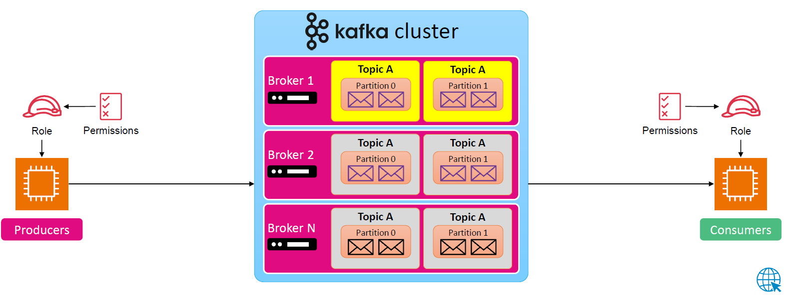

---
tags:
  - aws
  - aws/service
  - aws/domain/analytics
  - aws/topic/msk
aliases:
  - "Provisioned MSK Workshop"
  - "Msk Provisioned Mode Workshop"
---

# Provisioned MSK Workshop

[Get started using Amazon MSK](https://docs.aws.amazon.com/msk/latest/developerguide/getting-started.html)
---

## Related Notes
- [[aws-services/11.analytics/msk/2.2.msk-components|Amazon MSK Managed Streaming for Apache Kafka]] - previous lesson
- [[aws-services/11.analytics/msk/3.1.msk-serverless|Amazon MSK Serverless Kafka Without the Chaos]] - next lesson
- [[aws-services/1.management-governance/1.cloudformation/.docs|CND Useful References]] - mentions Docs

---
