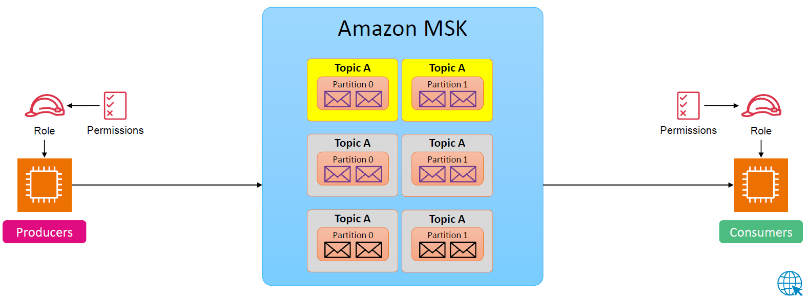

---
tags:
  - aws
  - aws/service
  - aws/domain/analytics
  - aws/topic/msk
aliases:
  - "MSK Serverless Mode Workshop"
  - "Msk Serverless Mode Workshop"
---

# MSK Serverless Mode Workshop

[Use MSK Serverless clusters](https://docs.aws.amazon.com/msk/latest/developerguide/serverless-getting-started.html)
---

## Related Notes
- [[aws-services/11.analytics/msk/3.1.msk-serverless|Amazon MSK Serverless Kafka Without the Chaos]] - previous lesson
- [[aws-services/11.analytics/msk/4.msk-connect|Amazon MSK Connect Plug-and-Stream Without the Pain]] - next lesson
- [[aws-daily/aws-architectures/3.1.serverless|Server-Based Architectures vs. Serverless Computing]] - mentions Serverless
-[[1.serverless|The Ultimate Guide to Serverless Computing & Tools]]] - mentions Serverless
- [[aws-services/1.management-governance/1.cloudformation/.docs|CND Useful References]] - mentions Docs

---
