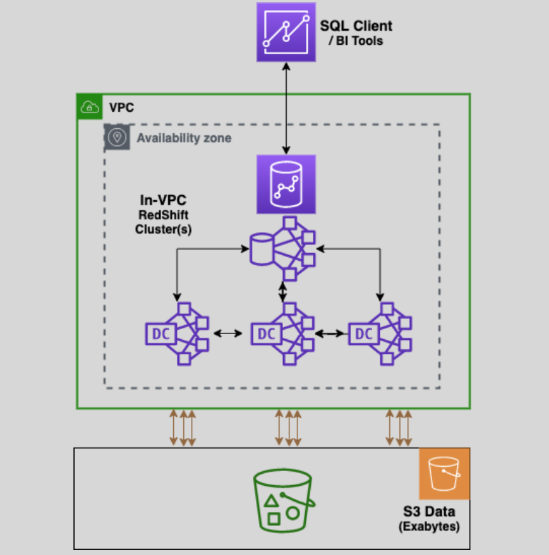
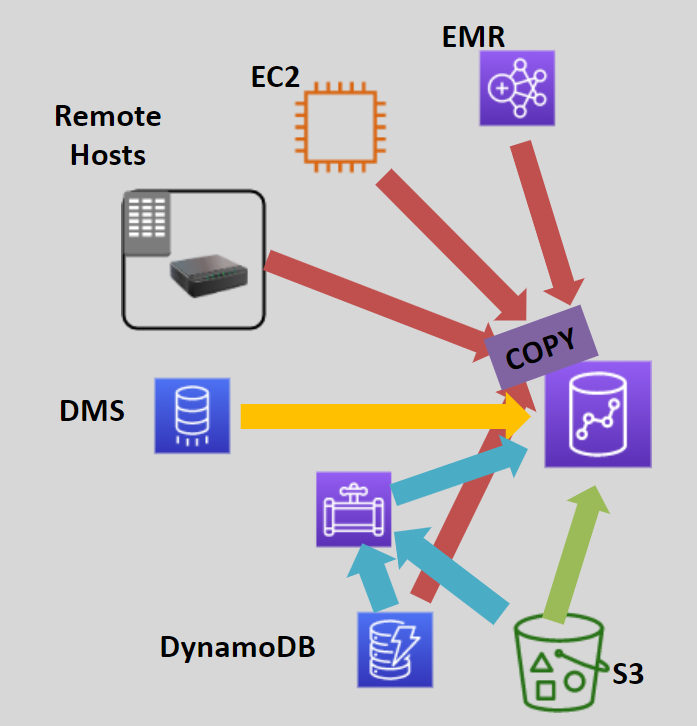
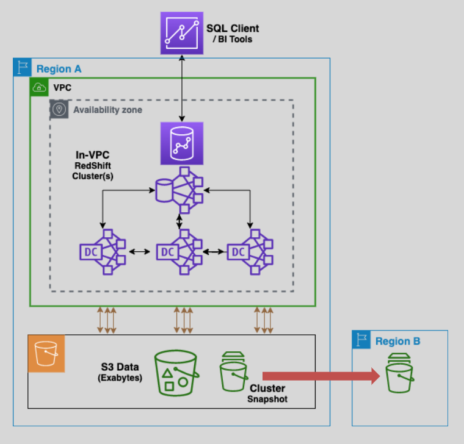

---
tags:
  - aws
  - aws/service
  - aws/domain/analytics
  - aws/topic/redshift
aliases:
  - "Amazon Redshift"
  - "Redshift"
---

# Amazon Redshift 📊

`A High-Performance Data Warehouse Solution`

Amazon Redshift is a **fully managed data warehouse service** designed for **online analytical processing (OLAP)**. It enables businesses to run **complex analytics and queries** on structured data at petabyte scale, making it an ideal choice for analytics, reporting, and visualization.

    

---

## 🌟 **What is a Data Warehouse?**

A **data warehouse** is a centralized repository for storing and analyzing large volumes of structured data. Key characteristics include:

- **OLAP (Online Analytical Processing)**: Focused on **complex queries** with **aggregations** for insights and reporting.
- **Low Transaction Volume**: Optimized for analytics, not frequent transactional updates.
- **Relational Database**: Uses **SQL queries** for data processing.

---

## 🔑 **What is Amazon Redshift?**

Amazon Redshift is a fully managed, **petabyte-scale data warehouse** service that:

- Supports fast SQL-based querying using tools like **ODBC** and **JDBC**.
- Seamlessly integrates with business intelligence tools like **QuickSight**, **Tableau**, and more.
- Handles large datasets but is not designed for **real-time data ingestion**.

---

## 👜 **Core Components of Redshift**

### 1️⃣ **Cluster Architecture**

- **Leader Node**:

  - Manages client connections and query coordination.
  - Receives queries and sends optimized execution plans to compute nodes.

- **Compute Nodes**:
  - Perform data storage and query processing.
  - Up to **128 nodes** per cluster for scalability.

### 2️⃣ **Columnar Storage**

- Data is stored in **columns**, not rows, reducing the I/O needed for queries.
- Makes it **10x faster** than traditional transactional databases.

---

## 🚀 **Performance Features**

1. **Advanced Compression**:

   - Compresses data efficiently to save storage and improve performance.

2. **Massive Parallel Processing (MPP)**:

   - Distributes data across multiple compute nodes, enabling parallel query execution.

3. **Concurrency Scaling**:
   - Automatically adds cluster capacity to handle spikes in query demand without impacting performance.

---

## 🔗 **Data Sources for Redshift**

    

- **S3**: Supports parallel reads for high-speed data ingestion.
- **Redshift COPY Command**: Import data from:
  - EMR, EC2, Remote Hosts, DynamoDB.
- **AWS Data Pipeline**: Automates data copying from S3 or DynamoDB.
- **Database Migration Service**: Migrates data from on-premises or cloud databases to Redshift.

---

## 🛠 **Workload Management (WLM)**

- Allows defining **query queues** to prioritize workloads.
- `Accelerates short-running queries` by **avoiding delays behind long-running ones**.
- Supports up to **8 queues** for workload segregation.

---

## 🔒 **Availability and Durability**

1. **Automatic Replication**:

   - Redshift maintains **three copies of data** within the cluster for durability.

2. **Automatic Recovery**:

   - Can recover from node or component failures without manual intervention.

3. **Single AZ Deployment**:
   - Redshift clusters are deployed in a **single availability zone (AZ)**.

---

## 🛡️ **Data Security**

1. **Encryption**:

   - Data **at rest** can be encrypted using **AWS KMS** or **Amazon HSM**.
   - Data **in transit** is secured with **SSL**.

2. **Snapshot Encryption**:
   - Snapshots of encrypted clusters are also encrypted.

## 💾 **Backup and Restore**

    

1. **Automatic Backups**:

   - enabled by default.
   - Incremental snapshots every **8 hours** or **5GB of data changes**.
   - Retention: Default is **24 hours**, extendable to **35 days**.

2. **Manual Backups**:

   - Users can create and manage their own snapshots.

3. **Cross-Region Replication**:
   - Automatically copies snapshots to another AWS region for disaster recovery or migration.

---

## 🌐 **Redshift Enhanced VPC Routing**

- this is used to manage the flow of data between the redshift cluster and other resources
- by default, amazon redshift routes all COPY and UNLOAD commands data over the internet which big problem
- by enabling redshift enhanced VPC routing, all COPY and UNLOAD traffic between the cluster and data repositories is forced to flow through the VPC
- Ensures that **COPY** and **UNLOAD** commands use the **VPC** for routing traffic.
- Leverages:
- **VPC Endpoints** for private communication.
- **NAT Gateways** or **Internet Gateways** for cross-region data transfer.

---

## ✅ **Conclusion**

Amazon Redshift is an industry-leading **data warehouse solution** for analyzing massive datasets with speed and efficiency. Its combination of **columnar storage**, **MPP architecture**, and integration with AWS services makes it a go-to choice for businesses looking to derive actionable insights. Whether you need seamless scalability, advanced performance, or strong security, Redshift provides a powerful, fully managed OLAP solution.
---

## Related Notes
- [[aws-services/11.analytics/redshift/2.redshift-spectrum|AWS Redshift Spectrum The Complete Guide]] - next lesson
- [[aws-daily/aws-cloud-Concepts/6.disaster-recovery|Disaster Recovery DR in AWS]] - mentions Disaster Recovery
- [[aws-services/4.storage/1.s3/2.5.encryption|Amazon S3 Encryption]] - mentions Encryption
- [[aws-services/11.analytics/quicksight/1.1.quicksight|Amazon QuickSight A Serverless BI Tool for Scalable and Interactive Dashboards]] - mentions Quicksight
- [[aws-services/8.database/dynamodb/ddb-in-depth/1.1.ddb|Deep Dive into AWS DynamoDB]] - mentions DynamoDB
- [[aws-services/8.database/dynamodb/1.1.dynamodb|AWS DynamoDB]] - mentions Dynamodb
- [[aws-services/5.compute/2.ebs/4.1.snapshot|Amazon EBS Snapshots Efficient Scalable Backup for Your Volumes]] - mentions Snapshot
- [[aws-services/2.security/2.1.kms/2.aws-kms|AWS KMS Centralized Key Management for Secure Cloud Encryption]] - mentions AWS KMS
- [[aws-services/8.database/dynamodb/1.4.backup|AWS DynamoDB Backup]] - mentions Backup

---
