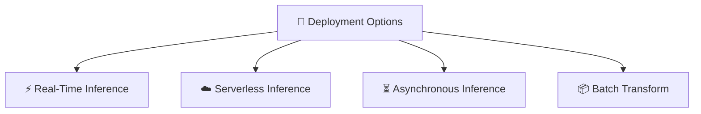
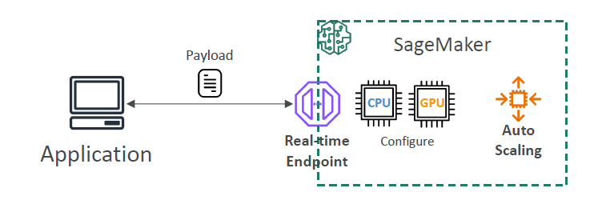
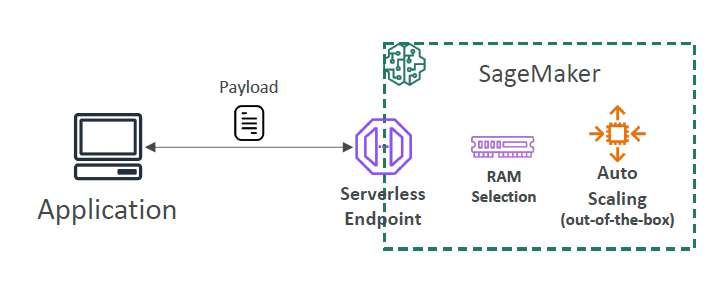
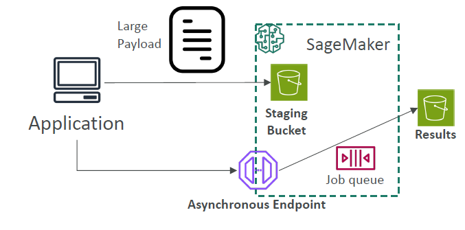
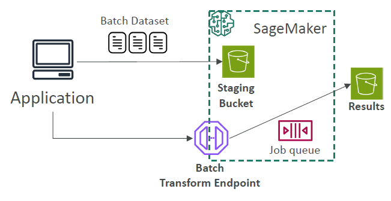

# 🚀 5. Model Deployment and Inference Options in SageMaker

## 🧠 What is Model Deployment?

> **Definition**:  
> **Model Deployment** is the process of **taking a trained machine learning model** and **making it available** for **real-world usage** —  
> so applications, users, or systems can **send data to it** and **get predictions back**.

📌 **Simply**:

- **Training** teaches the model 📚.
- **Deployment** brings the model **to life** for serving real users 🚀.

📌 In SageMaker:

- You have **multiple deployment options**, depending on:
  - How fast you need predictions 🏃‍♂️.
  - How big your data is 📦.
  - How much you want to pay 💰.

---

## 🏛️ SageMaker Inference Options Overview

---

### ⚡ 1. Real-Time Inference

> **Definition**:  
> Deploy your model to a **real-time HTTPS endpoint** that responds **immediately** to prediction requests.

---

    

---

📌 **Key Characteristics**:

| Aspect          | Value                                          |
| :-------------- | :--------------------------------------------- |
| Latency         | Low (milliseconds to seconds)                  |
| Payload Size    | Up to 6 MB                                     |
| Processing Time | Max 60 seconds per request                     |
| Use Case        | Real-time applications needing instant results |

📌 **Examples**:

- Fraud detection during a credit card payment 💳.
- Real-time recommendations on an e-commerce site 🛒.

📌 **Notes**:

- Auto-scaling available 📈.
- Requires instance management (but SageMaker handles it).

---

### ☁️ 2. Serverless Inference

> **Definition**:  
> **Real-time predictions**, but **without running servers** all the time.

---

    

---

📌 **Key Characteristics**:

| Aspect          | Value                                      |
| :-------------- | :----------------------------------------- |
| Latency         | Low, but cold starts possible              |
| Payload Size    | Up to 4 MB                                 |
| Processing Time | Max 60 seconds                             |
| Use Case        | Infrequent, unpredictable traffic patterns |

📌 **Examples**:

- Prediction API for a startup MVP 🚀.
- Chatbot support system that isn’t heavily used 24/7 💬.

📌 **Notes**:

- Pay **only for usage** (no standby instance costs).
- Good for **cost savings** if traffic is sporadic.
- **cold starts** which is can tolerate more latency.

---

### ⏳ 3. Asynchronous Inference

> **Definition**:  
> Make a prediction request and **get the results later**, especially for **large inputs or slow models**.

---

    

---

📌 **Key Characteristics**:

| Aspect          | Value                                      |
| :-------------- | :----------------------------------------- |
| Latency         | Medium to High ("near real-time")          |
| Payload Size    | Up to 1 GB                                 |
| Processing Time | Max 1 hour                                 |
| Use Case        | Large payloads or heavy computation models |

📌 **Examples**:

- Predicting outcomes on **large video files** 🎥.
- Image segmentation on **massive satellite images** 🛰️.

📌 **Notes**:

- Request and response managed via **Amazon S3 buckets**.
- No timeout worries for large tasks.

---

### 📦 4. Batch Transform

> **Definition**:  
> Predict results on an **entire dataset at once** (bulk processing).

---

    

---

📌 **Key Characteristics**:

| Aspect          | Value                                          |
| :-------------- | :--------------------------------------------- |
| Latency         | High (minutes to hours)                        |
| Payload Size    | Up to 100 MB per mini-batch                    |
| Processing Time | Max 1 hour per mini-batch                      |
| Use Case        | Massive offline predictions on historical data |

📌 **Examples**:

- Predict loan approvals for **10 million customer records** 📚.
- Classify **millions of product images** in a database 📸.

📌 **Notes**:

- No need for real-time endpoints.
- Great for **big one-shot jobs**.

---

## 📊 Full Comparison Table

| Inference Type            | Latency                            | Payload Size                | Processing Time | Best For                        |
| :------------------------ | :--------------------------------- | :-------------------------- | :-------------- | :------------------------------ |
| ⚡ Real-Time Inference    | Low (ms-seconds)                   | Up to 6 MB                  | Max 60 sec      | Fast, instant predictions       |
| ☁️ Serverless Inference   | Low (ms-seconds, with cold starts) | Up to 4 MB                  | Max 60 sec      | Infrequent traffic, cost-saving |
| ⏳ Asynchronous Inference | Medium-High ("near real-time")     | Up to 1 GB                  | Max 1 hour      | Big payloads, slow computations |
| 📦 Batch Transform        | High (minutes-hours)               | Up to 100 MB per mini-batch | Max 1 hour      | Massive offline/bulk datasets   |

---

## ✍️ Mini Smart Recap

| Concept                | Key Idea                            |
| :--------------------- | :---------------------------------- |
| Real-Time Inference    | Instant predictions for live apps   |
| Serverless Inference   | Real-time without server management |
| Asynchronous Inference | For big, slow requests, reply later |
| Batch Transform        | For huge offline bulk predictions   |

📌 **Simple Rule**:

> Choose based on **speed need** ⚡, **payload size** 📦, and **cost optimization** 💸.
