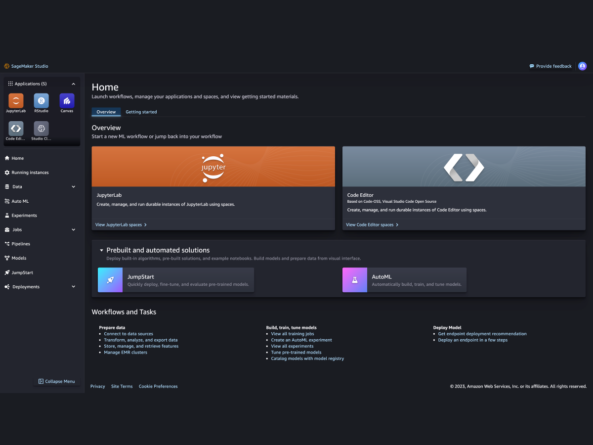

# 🏛️ 6. SageMaker Studio: Unified ML Development

## 🧠 What is SageMaker Studio?

> **Definition**:  
> **SageMaker Studio** is the **first fully integrated development environment (IDE)** for machine learning (ML).  
> It allows you to **build, train, tune, deploy, and monitor** ML models — **all from a single web-based visual interface**.

---

    

---

📌 **Simply**:

- Think of **VSCode or JupyterLab**, but **built for machine learning** — and even more powerful.
- It **combines** everything you need in **one place**: data preparation, model building, training jobs, experiments, deployments, monitoring, and automation.

📌 **Key Highlights**:

| Feature                 | Benefit                                                             |
| :---------------------- | :------------------------------------------------------------------ |
| Web-based               | No local setup needed                                               |
| End-to-End ML Lifecycle | Covers data, training, deployment, and monitoring                   |
| Collaboration Ready     | Teams can work on the same projects                                 |
| Integrated Tools        | Data Wrangler, Feature Store, Pipelines, JumpStart, Canvas, Clarify |
| Pay-as-you-go           | Pay only for compute resources used                                 |

---

## 🏛️ Main Features of SageMaker Studio

### 👥 1. Team Collaboration

> **Definition**:  
> Multiple users (data scientists, ML engineers) can work together inside Studio, sharing resources and experiments.

📌 **What’s Supported**:

- Shared project spaces 🛠️.
- Centralized access to datasets 📚.
- Consistent environments across the team 📦.
- Versioning and experiment tracking 📈.

📌 **Real-World Example**:

- One data scientist prepares data ➡️
- Another trains a model ➡️
- Another tunes and deploys the model ➡️  
  **All inside SageMaker Studio!**

📌 **Benefit**:

- No need to move files around manually.
- Everyone works in **synchronized workspaces**.

---

### 🚀 2. Model Deployment (Straight from Studio)

> **Definition**:  
> Train a model and **deploy it to production directly from the Studio interface** with a few clicks.

📌 **Options**:

- Deploy to:
  - **Real-Time Endpoints** ⚡.
  - **Serverless Inference** ☁️.
  - **Batch Transform Jobs** 📦.
  - **Async Endpoints** ⏳.

📌 **Supported Workflows**:

- Select a trained model → Right-click → Deploy 🚀.
- No need to manually configure infrastructure.

📌 **Benefit**:

- Reduces deployment time from hours to **minutes** ⏱️.
- Makes production-grade deployment accessible to **non-infrastructure experts**.

---

### 🐞 3. Debugging and Monitoring

> **Definition**:  
> Detect and fix problems in training jobs and deployed models **visually** — no more digging through logs manually!

📌 **Tools Integrated**:

- **SageMaker Debugger**:
  - Automatically tracks model training issues like overfitting, vanishing gradients, and underfitting.
- **SageMaker Model Monitor**:
  - Continuously monitors live models for data drift, prediction quality, and bias.

📌 **Visual Dashboards**:

- View alerts and warnings.
- Analyze metrics like loss, accuracy, precision.
- Compare training jobs and experiments side-by-side.

📌 **Benefit**:

- **Early detection** of training failures 🚨.
- **Faster troubleshooting** and model improvement loops 🛠️.

---

## 🔁 Automated Workflows inside Studio

> **Definition**:  
> SageMaker Studio automates many ML tasks through **visual and code pipelines**, removing repetitive manual work.

📌 **Key Automation Tools**:

| Tool                           | Purpose                                                                        |
| :----------------------------- | :----------------------------------------------------------------------------- |
| SageMaker Pipelines            | Build, automate, and manage entire ML workflows (training, tuning, deployment) |
| AutoML via SageMaker Autopilot | Automatically find best model and hyperparameters                              |
| Data Wrangler Integration      | Automate data preparation pipelines                                            |
| Model Registry Integration     | Register models automatically after training                                   |

📌 **Examples**:

- Create a pipeline that:
  - Preprocesses data.
  - Trains multiple models.
  - Tunes hyperparameters.
  - Selects the best model.
  - Deploys it automatically based on evaluation metrics!

📌 **Benefits**:

- **Consistency**: No manual steps missed.
- **Speed**: Faster time-to-production.
- **Repeatability**: Rerun full ML experiments with minimal changes.

---

## ✍️ Mini Smart Recap

| Feature                | Key Idea                                      |
| :--------------------- | :-------------------------------------------- |
| Collaboration          | Teams work together inside Studio             |
| Deployment             | Models deployed from a single UI              |
| Debugging & Monitoring | Early detection of training/deployment issues |
| Automation             | Build full ML pipelines visually or with code |

📌 **Simple Rule**:

> SageMaker Studio = **One Place to Do Everything ML** — from data to production — with **speed, automation, and collaboration** 🚀.
