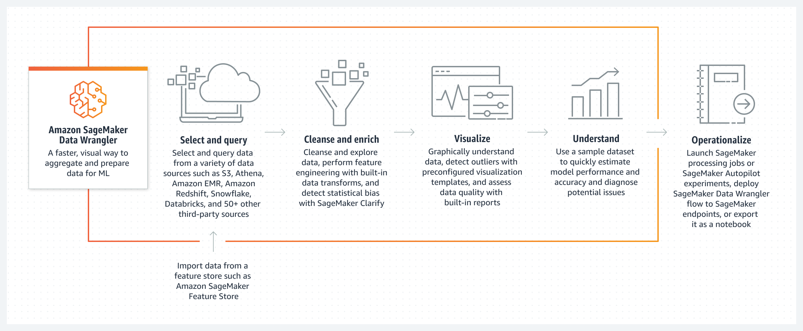
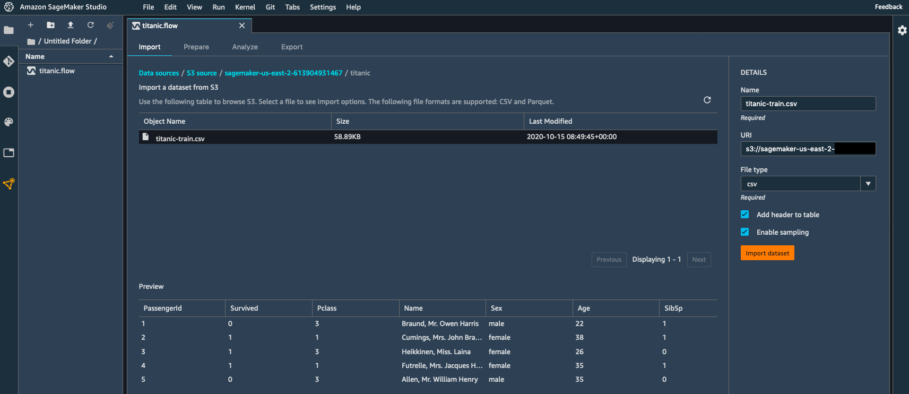
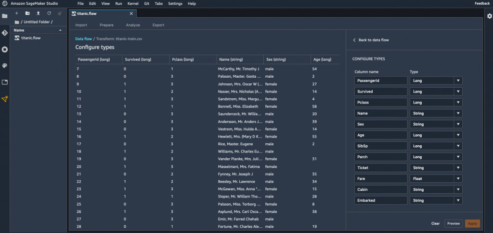
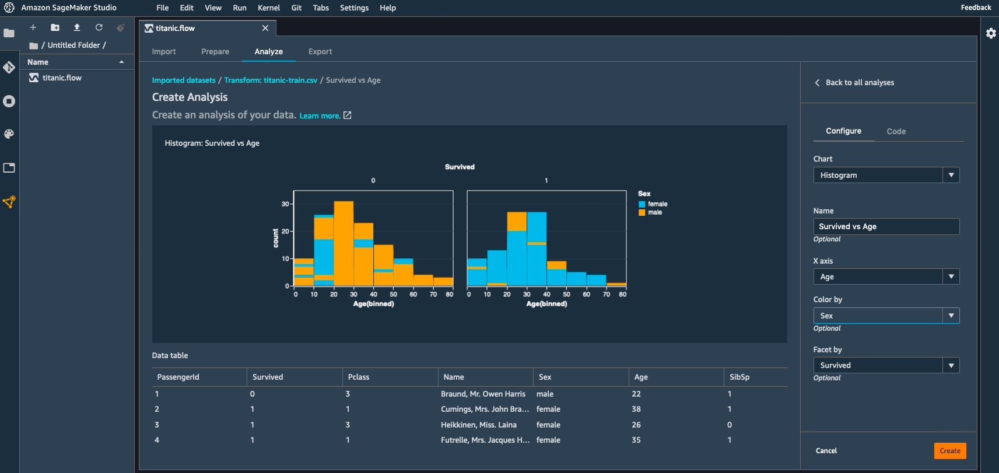
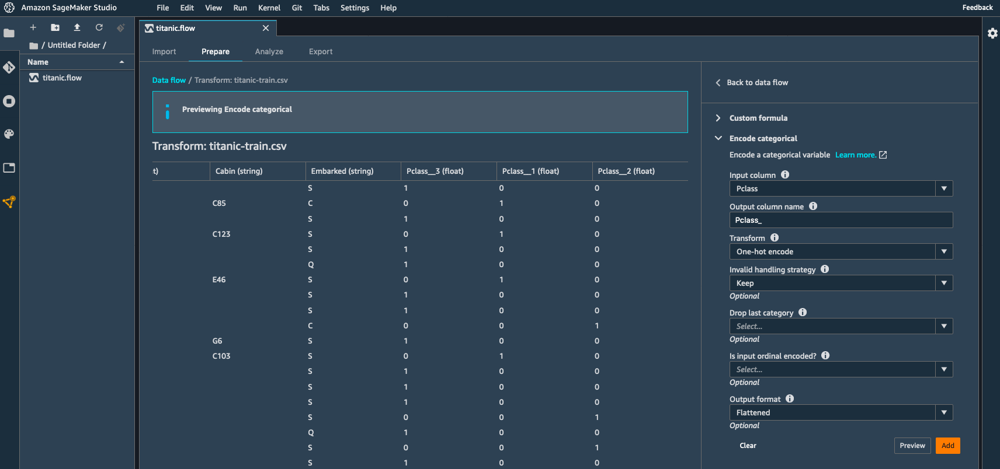
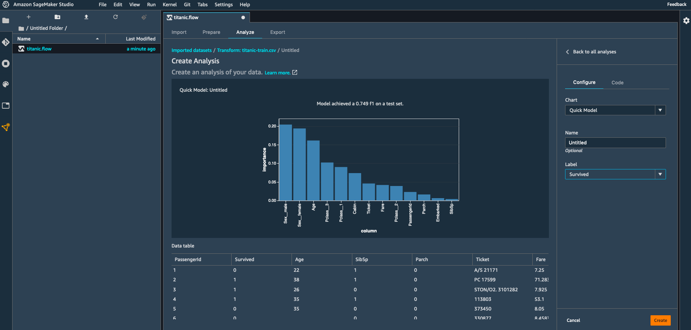
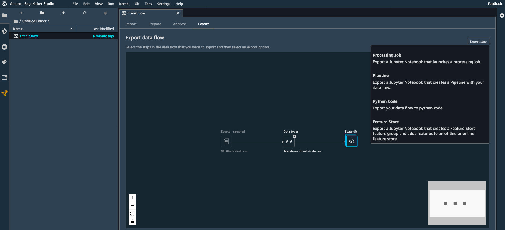

# 🧹 7. Data Preparation with SageMaker Data Wrangler

## 🧠 What is SageMaker Data Wrangler?

> **Definition**:  
> **SageMaker Data Wrangler** is a **visual data preparation tool** inside SageMaker Studio that helps you **import**, **analyze**, **transform**, **clean**, and **export** datasets for machine learning —  
> **without needing to write a lot of code**.

---

    

---

📌 **Simply**:

- It's like a **magic workshop** for **cleaning and preparing data** before training your model 🪄.
- Everything happens in an **easy point-and-click interface** — but it still gives you **full control** if you want to dive into code!

📌 **Key Benefits**:

| Feature                   | Benefit                                                            |
| :------------------------ | :----------------------------------------------------------------- |
| Visual Interface          | Prepare datasets without heavy coding                              |
| Multiple Data Sources     | Connect to S3, RDS, Redshift, Snowflake, etc.                      |
| Pre-built Transformations | Apply common data wrangling steps easily                           |
| Data Quality Checks       | Detect missing values, outliers, and inconsistencies               |
| Export to Pipelines       | Seamlessly send data flows to SageMaker Pipelines for automated ML |

---

## 🛠️ Core Capabilities of SageMaker Data Wrangler

### 📥 1. Importing Data

    

---

    

---

📌 **Supported Sources**:

- **Amazon S3** buckets (CSV, Parquet, JSON files).
- **Databases** like RDS, Redshift, Snowflake.
- **Athena Queries** (for querying your data lake).
- **SageMaker Feature Store** (import pre-engineered features).

📌 **Steps**:

- Choose a data source 🎯.
- Browse or query the dataset 🔎.
- Preview before importing 📋.

📌 **Real-World Example**:

- Pull customer transactions directly from an S3 bucket into the Wrangler workspace!

---

### 📊 2. Visualizing Data

    

---

📌 **Tools available**:

- Histograms 📊.
- Scatter plots 🖋️.
- Correlation matrices 🔗.
- Box plots 🗃️.
- Target leakage detection 📢.

📌 **What you can detect**:

| Issue                     | Visual Help          |
| :------------------------ | :------------------- |
| Skewed distributions      | Histograms           |
| Outliers                  | Box plots            |
| Strongly related features | Correlation heatmaps |

📌 **Real-World Example**:

- Plot customer age vs purchase amount to see if a relationship exists!

📌 **Benefit**:

- **Detect problems early** before training a bad model!

---

### 🔄 3. Transforming Data

    

---

📌 **Common Transformations** (Pre-built templates):

| Transformation          | Purpose                                    |
| :---------------------- | :----------------------------------------- |
| One-Hot Encoding        | Convert categorical variables into numeric |
| Scaling/Normalization   | Standardize numeric features               |
| Handling Missing Values | Fill in or drop missing data               |
| Date Transformations    | Extract day, month, year from timestamps   |
| Text Transformations    | Tokenization, text cleaning                |

📌 **Custom Transformations**:

- You can **write your own Pandas, PySpark, or SQL code** inside the visual flow when needed.

📌 **Real-World Example**:

- One-hot encode "payment method" field into separate features like `payment_credit`, `payment_cash`, `payment_online`.

📌 **Benefit**:

- Prepares **perfect features** for your model 🚀!

---

### ⚡ 4. Quick Model Building

    

---

📌 **Quick Model**:

- After preparing data, you can **immediately run a basic AutoML model** inside Data Wrangler to:
  - Quickly test how well your data can predict a target.
  - Get an instant idea of potential **model accuracy** or **issues**.

📌 **Steps**:

- Select a target variable 🎯.
- Launch quick model 🚀.
- Review results (accuracy, feature importance) 📈.

📌 **Benefit**:

- **Early feedback** on whether your dataset is ready for real training!

---

### 📤 5. Exporting Data Flows

    

---

📌 **After preparing data**, you can export it easily to:

| Export Destination        | Usage                                                      |
| :------------------------ | :--------------------------------------------------------- |
| Amazon S3                 | Save prepared dataset                                      |
| SageMaker Pipelines       | Include preprocessing step inside an automated ML pipeline |
| SageMaker Processing Jobs | Scale data preparation to large datasets                   |
| Local Disk                | Download for offline work                                  |

📌 **Export Includes**:

- Data Transformations
- Data Quality Reports
- Metadata

📌 **Real-World Example**:

- Export a fully cleaned, normalized customer dataset to SageMaker Pipelines ➔ then trigger model training automatically!

---

### 🛡️ 6. Data Quality Tool

📌 **Built-in Quality Reports**:

| Check                   | Purpose                                         |
| :---------------------- | :---------------------------------------------- |
| Missing Value Detection | Identify incomplete records                     |
| Cardinality Analysis    | Spot fields with too many/too few unique values |
| Data Type Validation    | Detect incorrectly formatted fields             |
| Statistical Summary     | Get mean, median, std dev for numeric features  |

📌 **Benefit**:

- **Catch bad data early** before it sabotages your training! 🎯

📌 **Example**:

- If a column "age" has negative values, Data Wrangler will flag it 🚨.

---

## ✍️ Mini Smart Recap

| Step            | Key Action                                      |
| :-------------- | :---------------------------------------------- |
| 📥 Import       | Connect to data sources (S3, databases, Athena) |
| 📊 Visualize    | Spot trends, problems visually                  |
| 🔄 Transform    | Apply pre-built or custom transformations       |
| ⚡ Quick Model  | Instantly test data quality for ML              |
| 📤 Export       | Save cleaned data or integrate into pipelines   |
| 🛡️ Data Quality | Detect missing data, outliers, errors           |

📌 **Simple Rule**:

> Before you "train smarter," you must "prepare smarter" — and **Data Wrangler makes it fun and easy**! 🚀
