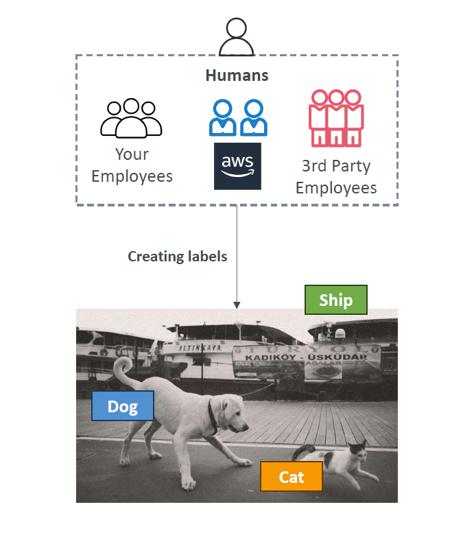

---
tags:
  - aws
  - aws/service
  - aws/domain/machine-learning
  - aws/topic/sagemaker
aliases:
  - "10. SageMaker Ground Truth and Ground Truth Plus"
  - "Sagemaker Ground Truth"
---

# 🧑‍🏫 10. SageMaker Ground Truth and Ground Truth Plus

## 🧠 What is SageMaker Ground Truth?

> **Definition**:  
> **SageMaker Ground Truth** is a **data labeling service** that helps you create **high-quality training datasets** for machine learning by using **humans** to review, label, and validate data.

---

  

---

📌 **Simply**:

- Humans **add the "truth"** to your raw data 📦.
- Essential for supervised ML: **Good labels = Good models** 🎯.

📌 **Key Features**:

| Feature           | Benefit                                                               |
| :---------------- | :-------------------------------------------------------------------- |
| Manual Labeling   | Humans label images, texts, videos, etc.                              |
| Auto-Labeling     | Machine helps label after a small set is manually labeled             |
| Managed Workforce | Use Amazon Mechanical Turk, your employees, or 3rd-party vendors      |
| Integration       | Seamlessly integrates with S3, SageMaker Pipelines, and Training Jobs |

---

## 🧠 What is SageMaker Ground Truth Plus?

> **Definition**:  
> **SageMaker Ground Truth Plus** is a **fully managed labeling service** where AWS manages **everything for you**:  
> project setup, worker management, quality control, and delivering labeled datasets.

📌 **Difference from regular Ground Truth**:

| Ground Truth                                    | Ground Truth Plus                              |
| :---------------------------------------------- | :--------------------------------------------- |
| You manage the labeling workforce and workflows | AWS manages it for you                         |
| You build the labeling UI and tasks             | AWS handles labeling operations                |
| You pay per labeling task                       | Fully managed service with per-dataset pricing |

📌 **Use Case**:

- If you have **complex data** and **don’t want to manage labeling operations**, use **Ground Truth Plus**.

---

## 🧠 Reinforcement Learning from Human Feedback (RLHF)

> **Definition**:  
> **RLHF** (Reinforcement Learning from Human Feedback) is the process where **humans evaluate ML outputs** and **their feedback is used as a reward signal** to improve the model.

📌 **How it Works**:

1. Model makes a prediction 🎯.
2. Human reviews and grades the prediction 🧑‍🏫.
3. Model is fine-tuned to align better with human feedback 💬.

📌 **Real-World Examples**:

- Training a chatbot to give **more helpful, polite responses**.
- Improving a translation model to produce **more natural translations**.

📌 **Why it Matters**:

- Moves AI closer to **human-like** thinking and behavior.
- Increases **trustworthiness** and **usefulness** of AI systems.

📌 **SageMaker + RLHF**:

- Use Ground Truth to **collect human feedback**.
- Feed this feedback into **fine-tuning or reinforcement training** loops.

---

## 📚 Data Labeling and Model Evaluation

📌 **Ground Truth supports many labeling jobs**:

| Job Type                 | Example                                           |
| :----------------------- | :------------------------------------------------ |
| Image Classification     | Tagging cats vs dogs in pictures 🐱🐶             |
| Object Detection         | Drawing bounding boxes around objects 🖼️          |
| Text Classification      | Labeling customer reviews as positive/negative 📜 |
| Named Entity Recognition | Highlighting names, dates, and locations in text  |
| Video Frame Labeling     | Tracking objects across video frames 🎥           |

📌 **Model Evaluation**:

- Humans can also **grade** model outputs:
  - E.g., Mark chatbot responses as "helpful" or "unhelpful".
- Essential for **training reward models** (for RLHF).

📌 **Labeling UI**:

- Pre-built templates (bounding boxes, multi-class classification, etc.)
- Customize your own UIs if needed.

---

## 🧑‍🏫 Role of Mechanical Turk or Internal Teams

📌 **SageMaker Ground Truth Workers**:

| Worker Source          | Details                                   |
| :--------------------- | :---------------------------------------- |
| Amazon Mechanical Turk | Access a massive global workforce         |
| Private Workforce      | Use your own employees for sensitive data |
| Vendor Workforce       | Use 3rd-party AWS-vetted labeling vendors |

📌 **When to Use Each**:

- **Mechanical Turk**:
  - Best for large, non-sensitive public datasets.
- **Private/Internal Teams**:
  - Best for sensitive, confidential, or industry-specific data (finance, healthcare).
- **Vendor Workforce**:
  - Best when you want professional labeling without managing workers directly.

📌 **Benefit**:

- **Flexible options** depending on cost, speed, sensitivity, and quality needs.

---

## 🤖 Labeling Automation with Ground Truth Plus

📌 **How Labeling Automation Works**:

- First **small set of labeled examples** created manually (by humans).
- Then SageMaker **builds a labeling model** using those examples (semi-supervised learning).
- This model **auto-labels** the remaining unlabeled data.
- **Humans review** auto-labeled data to ensure high quality.

📌 **Benefit**:

- **Massively reduce manual effort**.
- **Speed up dataset creation** without sacrificing quality.
- **Save costs**: Human effort is focused only where needed.

📌 **Real-World Example**:

- Label 5,000 product images manually.
- Auto-label next 50,000 images.
- Human-review only suspicious or uncertain cases.

---

## ✍️ Mini Smart Recap

| Ground Truth Capability | Key Action                                             |
| :---------------------- | :----------------------------------------------------- |
| 🧑‍🏫 Human Labeling    | Manually create high-quality training data             |
| 🚀 Auto-Labeling        | Machine assists after initial human labels             |
| 🎯 RLHF                 | Train models using human feedback for better alignment |
| 🏢 Workforce Options    | Mechanical Turk, Private teams, Vendors                |
| ⚡ Ground Truth Plus    | Fully managed labeling by AWS, faster and easier       |

📌 **Simple Rule**:

> "Better labels ➔ Better models ➔ Better AI outcomes."  
> **Ground Truth brings humans into the loop to build smarter ML systems.** 🤝🤖
---

## Related Notes
- [[aws-services/12.machine-learning/1.1.sagemaker/|Index]] - folder map
- [[aws-services/12.machine-learning/1.1.sagemaker/3.4.sagemaker-clarify|9. SageMaker Clarify Bias and Explainability]] - previous lesson
- [[aws-services/12.machine-learning/1.1.sagemaker/3.6.sagemaker-ml-governance|11. ML Governance with SageMaker]] - next lesson
- [[aws-exams/aws-aif/1.ai-ml-dp-genai-basics/2.8.reinforcement-learning|What is Reinforcement Learning RL]] - mentions Reinforcement Learning
- [[aws-services/12.machine-learning/1.1.sagemaker/3.7.sagemaker-pipelines|12. SageMaker Pipelines Automating ML Workflows]] - mentions Sagemaker Pipelines
- [[aws-exams/aws-aif/1.ai-ml-dp-genai-basics/2.4.supervised-learning|ML Algorithms Supervised Learning]] - mentions Supervised Learning
- [[aws-exams/aws-aif/1.ai-ml-dp-genai-basics/3.2.model-evaluation|Model Evaluation]] - mentions Model Evaluation
- [[aws-exams/aws-aif/1.ai-ml-dp-genai-basics/2.3.training-data|Training Data Foundation of Machine Learning Success]] - mentions Training Data
- [[aws-services/12.machine-learning/1.1.sagemaker/1.2.sagemaker|1. Introduction to Amazon SageMaker]] - mentions Sagemaker

---
