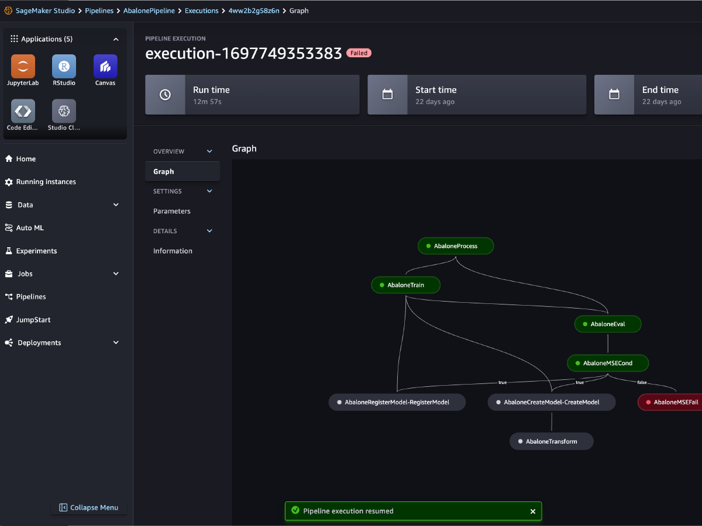
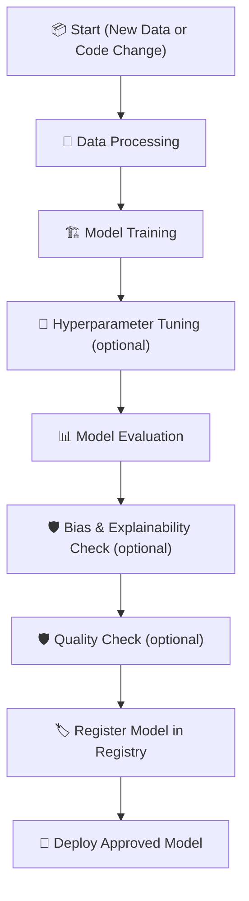

# 🔁 12. SageMaker Pipelines: Automating ML Workflows

## 🧠 What is a SageMaker Pipeline?

> **Definition**:  
> A **SageMaker Pipeline** is a **fully managed workflow service** for building, automating, and managing **end-to-end machine learning pipelines** —  
> from **data preparation** ➡️ **model training** ➡️ **evaluation** ➡️ **deployment**.

---

<div style="text-align: center;">
  
</div>

---

📌 **Simply**:

- Think of it as **CI/CD for Machine Learning** 🛠️🚀.
- You define **steps**, their **order**, and **conditions** — SageMaker automatically runs them **reliably and repeatably**.

📌 **Key Highlights**:

| Feature     | Benefit                                       |
| :---------- | :-------------------------------------------- |
| Declarative | Define workflows as code (Python SDK)         |
| Managed     | SageMaker handles orchestration and scaling   |
| Repeatable  | Same process every time (no manual mistakes)  |
| Trackable   | Full metadata for each step and model lineage |
| Auditable   | Helps with compliance and governance          |

📌 **Simple Rule**:

> "**Training a model once** is good.  
> **Automating it forever** is genius." 🎯

---

## 🏗️ Workflow Automation for ML (CI/CD for ML)

📌 **Traditional CI/CD** for software:

- Build → Test → Deploy 🚀.

📌 **CI/CD for Machine Learning** (via SageMaker Pipelines):

- **Data Collection** ➔
- **Data Processing** ➔
- **Model Training** ➔
- **Model Evaluation** ➔
- **Model Approval** ➔
- **Deployment** 🚀.

📌 **Visual Overview**:

<div style="text-align: center;">



</div>

📌 **Benefits**:

| Benefit         | Description                              |
| :-------------- | :--------------------------------------- |
| Reproducibility | Same pipeline = same results             |
| Speed           | No manual clicking around                |
| Collaboration   | Teams can work on defined steps          |
| Compliance      | Full traceability for audits             |
| Automation      | Less human intervention, more innovation |

---

## 🛠️ Supported Step Types

📌 In a SageMaker Pipeline, each **Step** does a specific job.

| Step Type    | What It Does                                       | Example                               |
| :----------- | :------------------------------------------------- | :------------------------------------ |
| Processing   | Data transformation, cleaning, feature engineering | Normalize numerical features          |
| Training     | Train a model on prepared data                     | Train XGBoost model                   |
| Tuning       | Find best hyperparameters automatically            | Tune learning rate and tree depth     |
| AutoML       | Let SageMaker Autopilot search for the best model  | Auto-train multiple models            |
| Model        | Register the trained model for deployment          | Save model to Model Registry          |
| ClarifyCheck | Check model or data bias and explainability        | Detect sampling bias                  |
| QualityCheck | Check data and model quality                       | Validate prediction quality over time |

📌 **Bonus**:

- Steps can be **chained**, **branched**, and **conditional**.
- For example:
  - Only deploy the model if accuracy > 90%! 🎯

📌 **Example Workflow**:

```plaintext
Data Processing ➔ Model Training ➔ Evaluation ➔
If Accuracy > 90% ➔ Register Model ➔ Deploy Model
Else ➔ Stop and alert.
```

---

## 🛡️ ClarifyCheck and QualityCheck Steps

📌 **ClarifyCheck**:

- Use SageMaker Clarify **inside the pipeline** to:
  - Detect **bias** in input data or model predictions 🎯.
  - Generate **feature importance reports** (SHAP values).

📌 **Why ClarifyCheck Matters**:

| Reason               | Benefit                                  |
| :------------------- | :--------------------------------------- |
| Early Bias Detection | Catch fairness issues before deployment  |
| Explainability       | Understand feature impacts automatically |

📌 **QualityCheck**:

- Continuously validate:
  - **Data quality** (e.g., missing features, distribution changes).
  - **Model quality** (e.g., drop in accuracy, drift).

📌 **Why QualityCheck Matters**:

| Reason                | Benefit                                |
| :-------------------- | :------------------------------------- |
| Prevent Data Issues   | Catch broken/misaligned data pipelines |
| Maintain Model Health | Ensure models stay accurate over time  |

📌 **Practical Real-World Use**:

- After training, automatically run ClarifyCheck.
- If no major bias found and data quality OK → move to deployment!
- Otherwise → stop the pipeline, fix the issue, retrain.

---

## ✍️ Mini Smart Recap

| Concept            | Key Idea                                                                |
| :----------------- | :---------------------------------------------------------------------- |
| SageMaker Pipeline | Automates entire ML lifecycle                                           |
| Step Types         | Processing, Training, Tuning, AutoML, Model, ClarifyCheck, QualityCheck |
| ClarifyCheck       | Explain predictions and detect bias                                     |
| QualityCheck       | Monitor data and model health over time                                 |

📌 **Simple Rule**:

> "Great models aren't just built —  
> they are **automated, monitored, and governed** through pipelines!" 🚀

### 📌 **Supported Step Types:**

1. `Processing` – for data processing (e.g., feature engineering)
2. `Training` – for training a model
3. `Tuning` – for hyperparameter tuning (e.g., Hyperparameter Optimization)
4. `AutoML` – to automatically train a model
5. `Model` – to create or register a SageMaker model
6. `ClarifyCheck` – perform drift checks against baselines (Data bias, Model bias, Model explainability)
7. `QualityCheck` – perform drift checks against baselines (Data quality, Model quality)

> For a full list check docs: <https://docs.aws.amazon.com/sagemaker/latest/dg/build-andmanage-steps.html#build-and-manage-steps-types>
