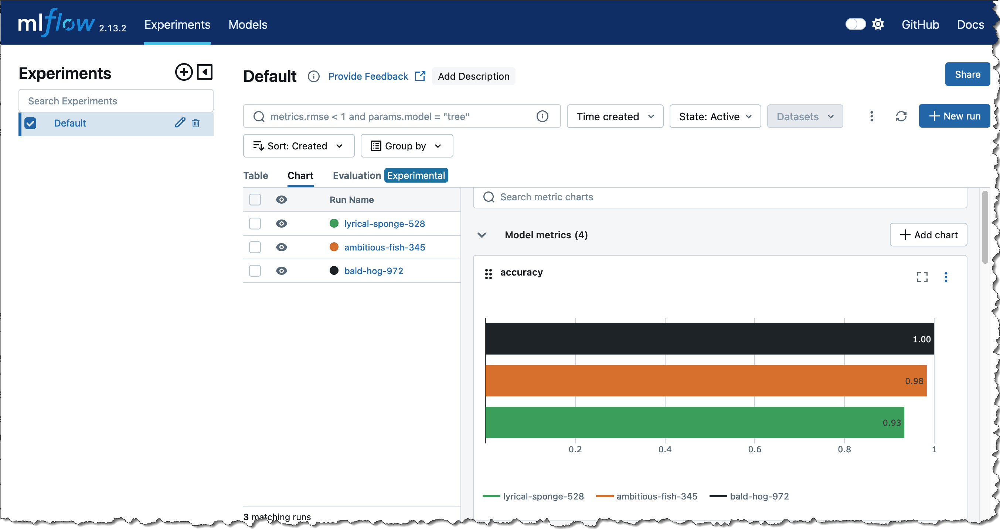
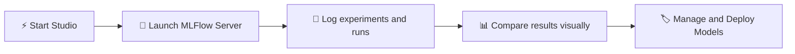

---
tags:
  - aws
  - aws/service
  - aws/domain/machine-learning
  - aws/topic/sagemaker
aliases:
  - "15. MLFlow on SageMaker"
  - "Mlflow On Sagemaker"
---

# ⚙️ 15. MLFlow on SageMaker

## 🧠 What is MLFlow?

> **Definition**:  
> **MLFlow** is an **open-source platform** that helps you **manage the entire machine learning lifecycle**, including **experiment tracking**, **model versioning**, **deployment**, and **reproducibility**.

---

<div style="text-align: center;">
  
</div>

---

📌 **Simply**:

- It’s like **GitHub for Machine Learning Experiments** 📚✨.
- You can **log, organize, compare, and deploy** your ML experiments easily.

📌 **Core Components of MLFlow**:

| Component       | Purpose                                            |
| :-------------- | :------------------------------------------------- |
| MLFlow Tracking | Log parameters, metrics, models during experiments |
| MLFlow Projects | Package code and environments for reproducibility  |
| MLFlow Models   | Manage model artifacts and versions                |
| MLFlow Registry | Centralized model storage and lifecycle management |

📌 **Simple Rule**:

> "**Track your experiments** like you track your code."  
> No more "final_final_model_v2_really_final.pkl" files! 😅

---

## 🏗️ MLFlow Tracking Servers inside SageMaker

📌 **Big News**:

> You can **launch MLFlow Tracking Servers** inside **SageMaker Studio** with just a few clicks!

📌 **How It Works**:

| Step                   | What Happens                                                           |
| :--------------------- | :--------------------------------------------------------------------- |
| Launch Tracking Server | SageMaker provisions an MLFlow server inside your Studio environment   |
| Track Experiments      | All training jobs can log parameters, metrics, artifacts automatically |
| Visualize Runs         | Use MLFlow UI inside Studio to compare models                          |

📌 **Workflow Overview**:



📌 **Benefits of Using MLFlow inside SageMaker**:

| Benefit           | Why it Matters                        |
| :---------------- | :------------------------------------ |
| Fully Integrated  | Works natively with SageMaker Studio  |
| No Setup Overhead | No need to build your own servers     |
| Scalable          | SageMaker handles compute and storage |
| Secure            | Integrated with AWS IAM and VPCs      |

---

## 📚 Managing ML Experiments with MLFlow + SageMaker Studio

📌 **Experiment Tracking Features**:

| Feature            | Example                                                   |
| :----------------- | :-------------------------------------------------------- |
| Parameters Logging | Log learning rate, batch size, model type                 |
| Metrics Logging    | Log accuracy, loss, F1 score, precision                   |
| Artifact Storage   | Save model weights, preprocessing pipelines, config files |
| Visualization      | Compare multiple experiment runs in a simple dashboard    |

📌 **Typical Workflow**:

1. Train a model (XGBoost, PyTorch, TensorFlow, etc.).
2. Use MLFlow API to **log parameters**, **metrics**, and **model artifacts**.
3. After many experiments:
   - **Visualize comparisons** 🧠📈.
   - **Find best model** based on evaluation metrics.
4. Push the selected model to **SageMaker Model Registry** if needed!

📌 **Example Python Snippet**:

```python
import mlflow
import mlflow.sagemaker

mlflow.start_run()
mlflow.log_param("learning_rate", 0.01)
mlflow.log_metric("accuracy", 0.92)
mlflow.log_artifact("model.pkl")
mlflow.end_run()
```

📌 **Real-World Scenario**:

- You test 50 different learning rates for a neural network.
- MLFlow neatly tracks all your runs.
- You instantly **select the best model** based on validation accuracy from the MLFlow UI inside Studio!

---

## ✍️ Mini Smart Recap

| Concept                | Key Action                                             |
| :--------------------- | :----------------------------------------------------- |
| ⚙️ MLFlow              | Open-source tool to track ML experiments               |
| 🚀 MLFlow on SageMaker | Launch MLFlow Tracking Server inside Studio            |
| 📚 Manage Experiments  | Log parameters, metrics, artifacts, and compare easily |

📌 **Simple Rule**:

> "**If you don't track your experiments, you're flying blind.**"  
> MLFlow + SageMaker = **Organized, professional ML workflows**! 🎯
---

## Related Notes
- [[aws-services/12.machine-learning/1.1.sagemaker/|Index]] - folder map
- [[aws-services/12.machine-learning/1.1.sagemaker/3.9.sagemaker-canvas|14. SageMaker Canvas No-Code ML]] - previous lesson
- [[aws-services/12.machine-learning/1.1.sagemaker/5.sagemaker-summary|16. Final SageMaker Summary]] - next lesson
- [[aws-services/12.machine-learning/1.1.sagemaker/3.1.sagemaker-studio|6. SageMaker Studio Unified ML Development]] - mentions Sagemaker Studio
- [[aws-services/12.machine-learning/1.1.sagemaker/1.2.sagemaker|1. Introduction to Amazon SageMaker]] - mentions Sagemaker
- [[aws-services/1.management-governance/4.3.config/x.config|AWS Config Track Manage and Secure Your AWS Resources]] - mentions Config
- [[aws-services/2.security/1.1.iam/1.fundmmentals/1.2.iam|AWS Identity and Access Management IAM]] - mentions IAM

---
