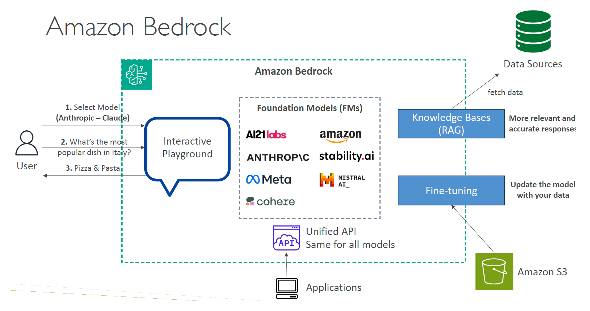
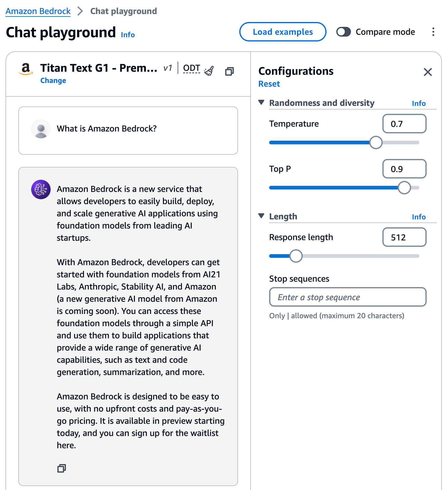

# 🏗️ What is Amazon Bedrock?

## 🧠 Quick Definition

> **Amazon Bedrock** is a **fully managed AWS service** that lets you **build and scale Generative AI applications** using **pre-trained foundation models (FMs)** — without needing to manage any infrastructure or train models yourself.

---

<div style="text-align: center;">
    
    
</div>

---

✅ Simply put:

- **You focus on using the AI models** 🎯
- **AWS handles the heavy lifting** 💪

---

## 🌟 What Makes Bedrock Special?

| Feature                      | Why It Matters                                                                   |
| ---------------------------- | -------------------------------------------------------------------------------- |
| 🏢 Access to Multiple Models | Choose models from top providers (Anthropic, Cohere, Meta, AWS, Stability AI)    |
| 🧩 Fully Managed             | No need to provision servers, GPUs, or scale infrastructure manually             |
| 🛠️ Easy API Integration      | Access models through simple APIs for chatbots, summarization, RAG apps, etc.    |
| 🔒 Security & Compliance     | Built on top of AWS security standards (VPCs, IAM, encryption)                   |
| ⚙️ Model Customization       | Fine-tune foundation models on your private data without retraining from scratch |

---

## 🧠 What Foundation Models Are Available?

| Provider            | Models Offered                                |
| ------------------- | --------------------------------------------- |
| Anthropic           | Claude family (Claude 2, 3, etc.)             |
| AI21 Labs           | Jurassic family (for text generation)         |
| Stability AI        | Stable Diffusion (image generation)           |
| Cohere              | Embed, Generate models (language tasks)       |
| Meta (coming soon)  | Llama models (open-source LLMs)               |
| Amazon Titan Models | Titan Text, Titan Embeddings (AWS native FMs) |

---

## 📦 Common Use Cases

| Use Case                | What You Can Do                                            |
| ----------------------- | ---------------------------------------------------------- |
| 🤖 Build Chatbots       | Use Claude, Jurassic, or Titan to power chat assistants    |
| 📚 Summarize Documents  | Quickly generate summaries from long reports               |
| 🔍 Improve Search (RAG) | Embed your documents and make them semantic searchable     |
| 🎨 Image Generation     | Create unique art, product images, marketing content       |
| ✍️ Content Creation     | Help with blog posts, marketing copy, product descriptions |

---

## 🛡️ Security & Compliance

- **Data stays private** (your inputs/outputs are not used to retrain models unless you explicitly allow it).
- **IAM (Identity & Access Management)** integrations.
- **VPC** and encryption controls to isolate your workloads.
- Complies with major standards (HIPAA, GDPR, SOC 2, etc.).

---

## 📜 Example: Bedrock API Request (Simplified)

```bash
POST /invoke-model
{
  "modelId": "anthropic.claude-v2",
  "contentType": "application/json",
  "inputText": "Summarize this article about climate change."
}
```

➡️ **Response** will contain a **generated summary** without you needing to install, fine-tune, or manage any server.

---

## 🎯 Why Use Bedrock?

| Benefit               | Explanation                                                          |
| --------------------- | -------------------------------------------------------------------- |
| 🏗️ Rapid Development  | No model building. Focus purely on innovation.                       |
| 🔄 Model Flexibility  | Swap models easily (Claude ➡️ Titan ➡️ Stable Diffusion)             |
| 📈 Scale Effortlessly | Handle sudden increases in traffic without worries.                  |
| 🔒 AWS-grade Security | Trust the infrastructure used by banks, healthcare, and governments. |

---

## 🧠 Smart Memory Tip

> "**Amazon Bedrock is your bridge to world-class AI models — without building the bridge yourself.**" 🏗️🌉

---

## ✍️ Quick Recap

| Section        | Key Point                                                 |
| -------------- | --------------------------------------------------------- |
| 🧠 What is it? | Managed service to access FMs easily                      |
| 🧩 Models      | Multiple providers (Anthropic, Titan, Stability AI, etc.) |
| 📦 Use Cases   | Chatbots, summarization, RAG, generation                  |
| 🛡️ Security    | AWS standards, privacy-first                              |
| 🚀 Why Use It? | Save time, save effort, innovate fast                     |
