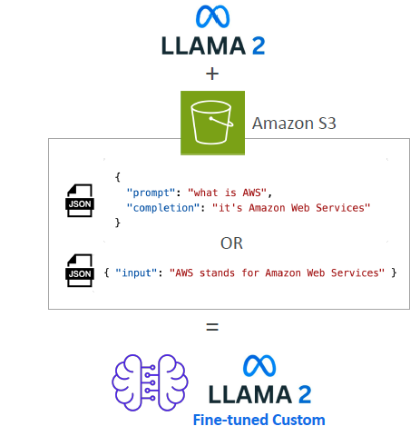
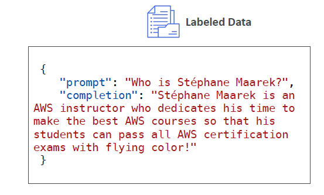
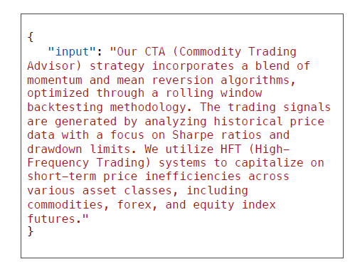

# 🧪 Amazon Bedrock – Fine-Tuning a Foundation Model

## 🔍 What is Fine-Tuning in Bedrock?

> **Fine-tuning** is the process of adapting a **copy of a pre-trained Foundation Model (FM)** using **your own domain-specific data**, so the model becomes more aligned with your tasks or industry.

---

✅ It **modifies the weights** of the model — making it _smarter in your context_.

---

<div style="text-align: center;">
    
</div>

---

## ⚙️ Bedrock Fine-Tuning Requirements

| Requirement               | Description                                                                    |
| ------------------------- | ------------------------------------------------------------------------------ |
| 📁 Data Format            | Must follow Bedrock’s **structured format** (JSONL, single-turn or multi-turn) |
| ☁️ Data Storage           | Training data must be in **Amazon S3**                                         |
| 📈 Provisioned Throughput | Fine-tuned models require **reserved throughput** to run                       |
| ⚠️ Model Support          | **Not all FMs** in Bedrock support fine-tuning                                 |

---

## 🧠 Two Types of Fine-Tuning

### 1. 🎓 Instruction-Based Fine-Tuning

> Teaches the model using **prompt-response** examples (supervised learning)

---

<div style="text-align: center;">
    
</div>

---

| Feature     | Description                                                             |
| ----------- | ----------------------------------------------------------------------- |
| 📌 Format   | Prompt → Expected response (like Q&A or instruction-output)             |
| ✅ Benefit  | Best for **domain-specific tasks** and behaviors                        |
| 🧪 Use Case | Train chatbot to respond like a customer agent, ad copy generator, etc. |

**Single-Turn Example**:

```json
{
  "system": "You are an AWS tutor.",
  "messages": [
    { "role": "user", "content": "Explain S3 versioning." },
    { "role": "assistant", "content": "S3 versioning allows..." }
  ]
}
```

**Multi-Turn Example**:

```json
{
  "messages": [
    { "role": "user", "content": "Hi, what’s SageMaker used for?" },
    { "role": "assistant", "content": "SageMaker helps you train ML models..." },
    { "role": "user", "content": "Can I use it for tuning?" },
    { "role": "assistant", "content": "Yes, you can use AMT..." }
  ]
}
```

---

### 2. 🧠 Continued Pre-training (Domain Adaptation)

> You feed **unlabeled data** to the model to make it familiar with specific terminology or knowledge.

---

<div style="text-align: center;">
  
</div>

---

| Feature       | Description                                                          |
| ------------- | -------------------------------------------------------------------- |
| 📚 Input Type | Raw text — no prompt/response structure needed                       |
| 💼 Use Case   | Feed **company manuals**, **industry docs**, or **AWS docs**         |
| 🔁 Dynamic    | Can keep updating as **more domain-specific data becomes available** |

---

## 💡 Transfer Learning vs. Fine-Tuning

| Concept              | Meaning                                                             |
| -------------------- | ------------------------------------------------------------------- |
| 🧠 Transfer Learning | Reusing knowledge from one task/model to apply it to another task   |
| 🧪 Fine-Tuning       | A **specific form of transfer learning** where you update the model |

📌 Used heavily in NLP models like BERT, GPT — also appears on exams!

---

## 💰 Cost & Expertise Considerations

| Category              | Notes                                                              |
| --------------------- | ------------------------------------------------------------------ |
| 💸 Training Cost      | **Expensive** for large models; continued pre-training is costlier |
| 💡 Instruction Tuning | More efficient — less compute and fewer examples required          |
| 👨‍🔧 Skill Level Needed | Requires **ML engineers** to prep data, fine-tune, evaluate        |
| 💵 Runtime Cost       | Running fine-tuned models requires **provisioned throughput**      |

---

## 🎯 Common Fine-Tuning Use Cases

| Use Case                     | Purpose                                                     |
| ---------------------------- | ----------------------------------------------------------- |
| 🤖 Chatbot with tone/persona | Create AI with specific behavior or style                   |
| 📬 Exclusive internal data   | Train on customer messages, helpdesk chats, internal docs   |
| 📅 Updated knowledge         | Teach model recent data beyond its original training cutoff |
| 📊 Business classification   | Custom model for ticket tagging, sentiment scoring, etc.    |

---

## ✍️ Smart Summary Table

| Area                      | Quick Notes                                                 |
| ------------------------- | ----------------------------------------------------------- |
| 🔧 Instruction Tuning     | Labeled prompt/response data → domain task optimization     |
| 📚 Continued Pre-training | Unlabeled data → improve model knowledge on specific domain |
| 🧠 Transfer Learning      | General concept; fine-tuning is one specific method         |
| 💰 Cost Consideration     | Training + serving costs are higher, but value is immense   |
