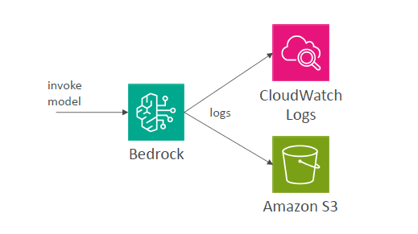
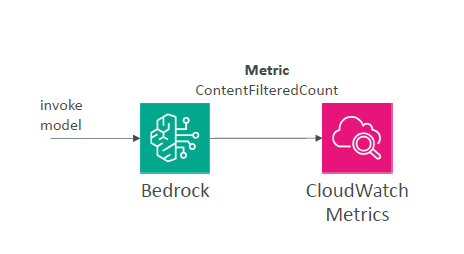

---
tags:
  - aws
  - aws/service
  - aws/domain/machine-learning
  - aws/topic/bedrock
aliases:
  - "Amazon Bedrock & CloudWatch Integration"
  - "Bedrock Integrations"
---

# 📊 Amazon Bedrock & CloudWatch Integration

Amazon Bedrock integrates with **Amazon CloudWatch** to give you **full visibility** into your model activity and guardrail effectiveness.

---

## 🔎 1. Model Invocation Logging

> 🧠 **What it does**:  
> Captures logs of every model invocation (requests and responses) and sends them to **CloudWatch Logs** and optionally **Amazon S3**.

---

  

---

✅ Logs can include:

- Text prompts & completions
- Uploaded images
- Embedding payloads

🔍 **Use Case**:  
Analyze model behavior, debug errors, or monitor for misuse using **CloudWatch Logs Insights**.

---

## 📈 2. CloudWatch Metrics

> 📊 **What it does**:  
> Publishes real-time metrics to CloudWatch for observability and alerting.

---

  

---

📌 Examples:

- `ContentFilteredCount` – detects how often content was blocked by Guardrails.
- `InvocationCount` – number of model calls.
- `Latency` – time taken for model responses.

📌 You can:

- Visualize with **CloudWatch Dashboards**
- Set **CloudWatch Alarms** for proactive monitoring
---

## Related Notes
- [[aws-services/12.machine-learning/1.2.bedrock/7.bedrock-agents|Amazon Bedrock Agents The AI That Gets Work Done]] - previous lesson
- [[aws-services/12.machine-learning/1.2.bedrock/9.bedrock-pricing|Amazon Bedrock Pricing Overview]] - next lesson
- [[aws-services/1.management-governance/3.1.cloud-watch/2.3.cw-dashboards|Amazon CloudWatch Dashboards]] - mentions CloudWatch Dashboards
- [[aws-services/1.management-governance/3.1.cloud-watch/3.1.cw-logs|Amazon CloudWatch Logs]] - mentions CloudWatch Logs
- [[aws-services/12.machine-learning/1.2.bedrock/1.bedrock|What is Amazon Bedrock]] - mentions Bedrock

---
