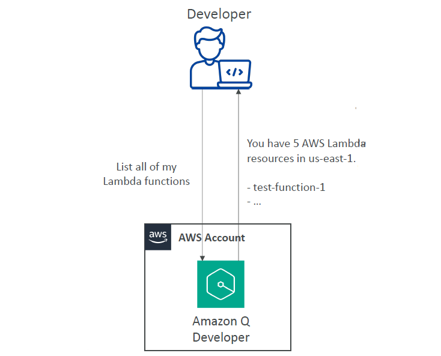
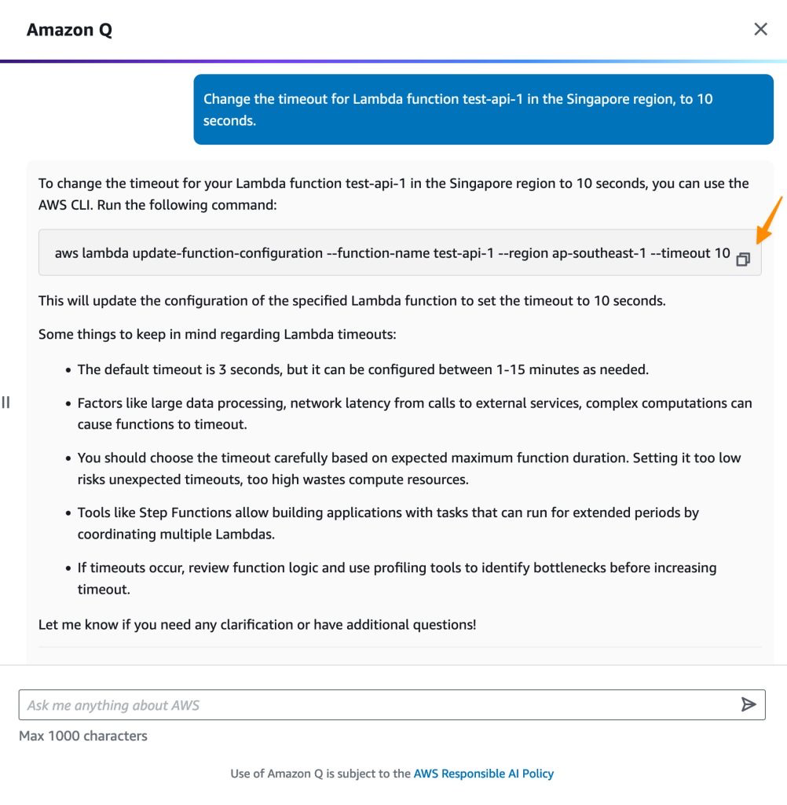
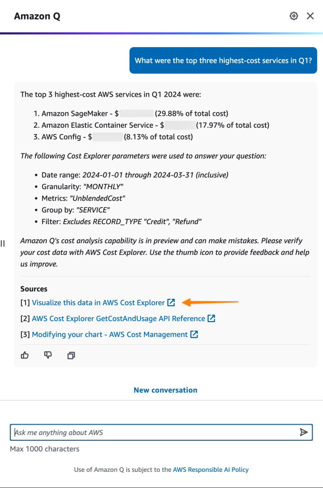
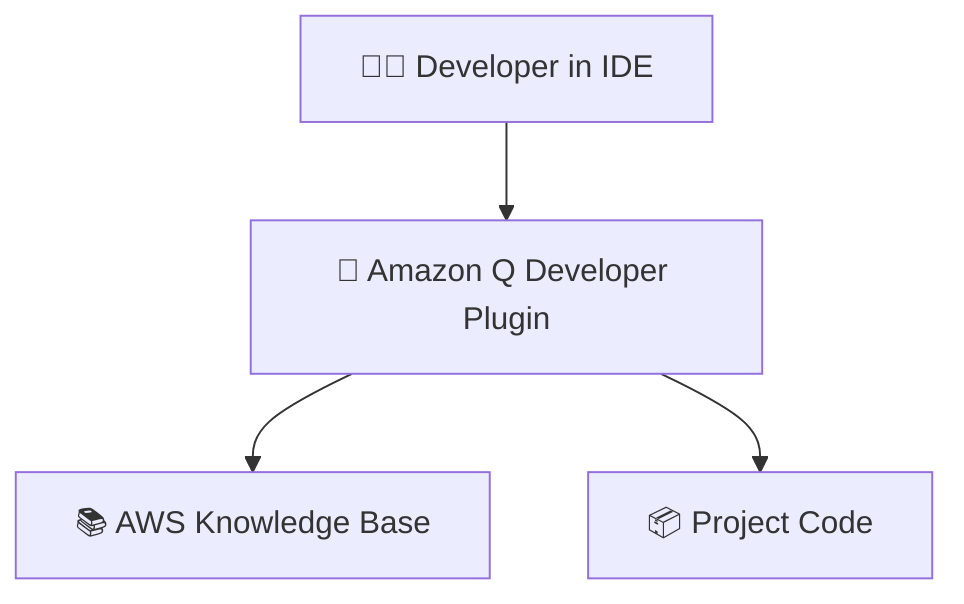

# 🛠️ Amazon Q Developer: AI Assistant for Developers

## 🧠 What is Amazon Q Developer?

> **Definition**:  
> **Amazon Q Developer** is an **AI-powered assistant** designed specifically for **developers** to **accelerate cloud development**, **understand AWS services**, **generate and optimize code**, **analyze bills**, and **troubleshoot errors** —  
> all directly inside your IDE or through chat interfaces.

---

    

---

📌 **Simply**:

- It’s like having **an AWS Expert + GitHub Copilot + Cloud Advisor** — inside your development tools. 🧠💻
- Helps you **code faster**, **understand AWS better**, and **manage your cloud resources smarter**.

📌 **Key Highlights**:

| Feature                | Benefit                                              |
| :--------------------- | :--------------------------------------------------- |
| AWS Cloud Q&A          | Instantly understand AWS services and billing        |
| Code Generation        | Suggest code for apps, infrastructure, and CLI       |
| Real-time Help         | Troubleshoot errors, security, and optimizations     |
| Multi-language Support | Java, JavaScript, Python, TypeScript, C#, and more   |
| IDE Integration        | Available inside Visual Studio Code, JetBrains, etc. |

📌 **Simple Rule**:

> "**One developer = 10x faster, smarter, safer.**" 🚀

---

## 🌩️ Cloud Understanding and Management

📌 **Amazon Q Developer helps you with AWS Services**:

| Area                      | Example                                             |
| :------------------------ | :-------------------------------------------------- |
| AWS Documentation Help    | "What does Amazon S3 Event Notifications do?"       |
| AWS Service Selection     | "Which AWS database should I use for a mobile app?" |
| AWS Account Resource Help | "How many EC2 instances are running in my account?" |
| AWS Cost Understanding    | "Why was my AWS bill high last month?"              |
| AWS Error Troubleshooting | "How to fix a 403 error from S3 bucket?"            |

📌 **Benefit**:

- **Cut research time** from hours to seconds.
- **Understand** your cloud without needing multiple tabs open!

📌 **Real-World Example**:

- You ask:
  > "Which AWS service is best for real-time video streaming?"
- Amazon Q Developer **suggests** Amazon IVS (Interactive Video Service) and explains **why**!

---

    

---

    

---

## 🛠️ AI Code Companion for Development

📌 **Amazon Q Developer also acts like a Coding Copilot**:

| Feature                    | What It Helps You Do                                        |
| :------------------------- | :---------------------------------------------------------- |
| Code Suggestions           | Complete your code as you type                              |
| Feature Implementation     | Auto-generate scaffolding for features                      |
| Documentation Generation   | Write comments and documentation automatically              |
| Project Bootstrapping      | Create full starter projects (like React apps, Python apps) |
| Real-Time Security Scans   | Detect vulnerabilities instantly as you code                |
| Debugging and Optimization | Suggest fixes and improvements                              |

📌 **Programming Languages Supported**:

- Java ☕
- JavaScript 🌐
- Python 🐍
- TypeScript 🧩
- C# 💻
- (More being added over time!)

📌 **Benefit**:

- **Code faster**, **write safer**, **build better apps** without needing to memorize every AWS service or SDK.

📌 **Real-World Example**:

- You're building a serverless app ➔
- Amazon Q Developer **suggests** the Lambda function, the IAM policy, and the API Gateway configuration in real time! 🚀

---

    

---

## 💻 Amazon Q Developer IDE Extensions

📌 **Amazon Q Developer integrates directly into your favorite IDEs**:

| IDE                                          | Support         |
| :------------------------------------------- | :-------------- |
| Visual Studio Code                           | Fully supported |
| JetBrains IDEs (IntelliJ, PyCharm, WebStorm) | Supported       |
| AWS Cloud9                                   | Supported       |

> Future: Other major IDEs coming soon

📌 **Inside the IDE**, you get:

| Feature              | Example                                     |
| :------------------- | :------------------------------------------ |
| Q&A Chatbot          | Ask AWS or code questions inside the editor |
| Code Autocomplete    | Get real-time code completions              |
| Auto Code Generation | Auto-generate service calls, setup files    |
| Security Scan        | Highlight vulnerabilities inside your code  |
| Debugging Help       | Suggest fixes for common errors             |

📌 **Workflow Overview**:

📌 **Real-World Example**:

- You’re coding a Lambda function in VS Code ➔
- Amazon Q Developer **suggests**:
  - IAM Role Policy,
  - Error handling best practices,
  - Environment variable setup —  
    all inside your editor! 🧠💻

---

## ✍️ Mini Smart Recap

| Amazon Q Developer Capability | Key Action                                         |
| :---------------------------- | :------------------------------------------------- |
| 🌩️ Cloud Understanding        | AWS documentation, services, billing, errors       |
| 🛠️ AI Coding Assistant        | Code generation, optimization, documentation       |
| 💻 IDE Integration            | Real-time help inside your development environment |
| 🛡️ Security and Optimization  | Catch vulnerabilities, fix errors                  |

📌 **Simple Rule**:

> "**If you're building on AWS, you should have Amazon Q Developer by your side.  
> Code faster. Learn smarter. Build safer.**" 🚀👨‍💻
