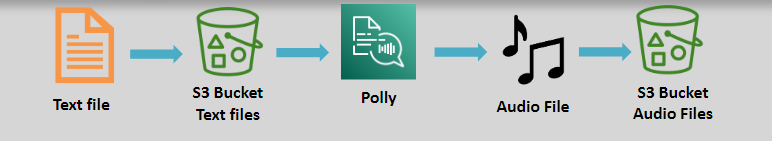

# 🧾 to 🗣️ = **Amazon Polly: Turn Text into Lifelike Speech**

> _Bring your applications to life with natural, dynamic, and engaging voice experiences._

---

    

---

## 🌟 **What is Amazon Polly?**

**Amazon Polly** is a **fully managed Text-to-Speech (TTS) service** that:

- 📖 Converts plain text or SSML into **natural-sounding audio**.
- 🌍 Supports **multiple languages** and **diverse voices** (male, female, child).
- 🚀 Provides **real-time streaming** capabilities for dynamic applications.

✅ Whether you’re building apps for **learning**, **accessibility**, **gaming**, or **global audiences** —  
Polly **gives your text a voice**.

---

## ✨ **Key Features of Amazon Polly**

| Feature                                     | Description                                                               |
| :------------------------------------------ | :------------------------------------------------------------------------ |
| 🌍 **Multilingual Support**                 | Dozens of languages and regional accents supported.                       |
| 🧑‍🤝‍🧑 **Wide Range of Voices**                 | Choose from male, female, and child personas.                             |
| ⚡ **Real-Time Speech Synthesis**           | Stream generated audio instantly for low-latency applications.            |
| 🛠️ **Advanced Speech Customization (SSML)** | Fine-tune pronunciation, pitch, emphasis, breathing sounds, and more.     |
| 📖 **Custom Lexicons**                      | Control specific word pronunciations for unique brand or technical terms. |

✅ Create **custom, engaging audio** exactly how you want it.

---

## 🔗 **Advanced Capabilities of Amazon Polly**

### 📜 **Speech Synthesis Markup Language (SSML)**

SSML lets you control:

- 📢 **Speech Rate**: Slow down or speed up how fast Polly speaks.
- 🎵 **Pitch & Volume**: Adjust tone and loudness for emotions or branding.
- ✨ **Pronunciation**: Guide Polly on complex or technical words.
- 🫧 **Breath & Whisper Effects**: Add realistic breathing pauses or whispering for drama.
- 🌐 **Mixed Language Phrases**: Speak multiple languages in one sentence.

✅ SSML = **Fine-grained control for cinematic-level audio experiences.**

---

### 📖 **Lexicons**

- Customize pronunciation dictionaries.
- Tailor specific words or abbreviations to sound correctly.
- Lexicons are **regionally scoped** for **localized voice customization**.

**Example:**

| Without Lexicon                      | With Lexicon              |
| :----------------------------------- | :------------------------ |
| "G3t sm4rt" → "g three t sm four rt" | "G3t sm4rt" → "get smart" |

✅ Perfect for brands, games, technical terms, or acronyms!

---

## 🎯 **Common Use Cases for Amazon Polly**

| Industry                   | Example                                                           |
| :------------------------- | :---------------------------------------------------------------- |
| 📱 **Mobile Applications** | News readers, fitness apps, meditation guides with voiceovers.    |
| 🎮 **Gaming**              | Character dialogues, dynamic narrations.                          |
| 🎓 **E-Learning**          | Read lessons aloud, language learning bots.                       |
| ♿ **Accessibility**       | Screen readers, assistive technology for visually impaired users. |
| 🛒 **E-Commerce**          | Interactive shopping experiences using voice descriptions.        |

✅ Polly brings **voice-driven UX** into every type of application.

---

## ✅ **Why Choose Amazon Polly?**

| Advantage                      | Why It Matters                                               |
| :----------------------------- | :----------------------------------------------------------- |
| 🔥 **Lifelike Natural Speech** | Enhances user experience with realistic voices.              |
| 🌍 **Global Language Support** | Engage international audiences without extra cost.           |
| 🛠️ **Extensive Customization** | Fine-tune voice output for any app scenario.                 |
| 🚀 **Scalability**             | Scale from a few sentences to millions of characters easily. |
| 💵 **Pay-As-You-Go Pricing**   | Affordable — only pay for what you synthesize.               |

✅ **High quality**, **low effort**, **low cost** — the AWS way!

---

## 🏆 **Final Smart Pro Tip**

> 🧠 **Combine Amazon Polly with Amazon Lex and Amazon Translate to create fully multilingual, voice-enabled intelligent applications.**

✅ Example:

- **Lex** for conversations
- **Translate** for language switching
- **Polly** to speak the translated responses
- ➔ **Your app talks, understands, and adapts to any language!**
