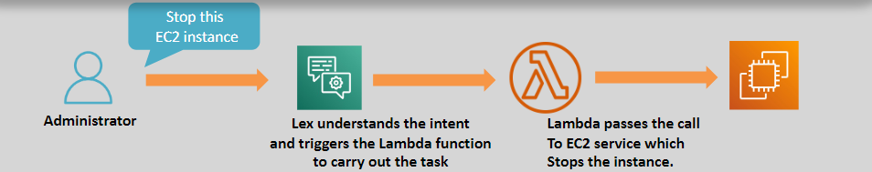

# 🤖 **Amazon Lex: Build Conversational Interfaces with Ease**

> _Create intelligent chatbots and virtual assistants using voice and text, powered by Amazon’s AI._

---

    

---

## 🌟 **What is Amazon Lex?**

**Amazon Lex** is a **fully managed AI service** that enables developers to:

- 🎙️ Build **voice-based** and **text-based** conversational interfaces.
- 🧠 Leverage advanced **Natural Language Understanding (NLU)** and **Automatic Speech Recognition (ASR)** technologies.
- 🚀 Integrate conversational experiences seamlessly into **web**, **mobile apps**, **contact centers**, and **enterprise workflows**.

✅ Built on the same deep learning engine as **Amazon Alexa**!

---

## ✨ **Key Features of Amazon Lex**

| Feature                                     | Description                                                                                |
| :------------------------------------------ | :----------------------------------------------------------------------------------------- |
| 🧠 **Natural Language Understanding (NLU)** | Recognizes user intents, extracts slots (parameters), and interprets requests intuitively. |
| 🎙️ **Automatic Speech Recognition (ASR)**   | Converts spoken language into text to support voice interactions.                          |
| 🔗 **Deep AWS Integrations**                | Easily connect to services like Lambda, Polly, Comprehend, Kendra, and Connect.            |
| 🛠️ **Simple Deployment**                    | Launch bots quickly across mobile, web, messaging apps, or call centers.                   |
| 🚀 **Scalability**                          | Automatically scales to handle thousands to millions of user interactions.                 |

✅ You can build smart conversational apps without deep AI/ML expertise.

---

## 🔗 **Key AWS Service Integrations**

| Integration              | Purpose                                                                      |
| :----------------------- | :--------------------------------------------------------------------------- |
| ⚙️ **AWS Lambda**        | Trigger backend logic (e.g., retrieve user orders, manage reservations).     |
| 🗣️ **Amazon Polly**      | Convert bot responses into natural-sounding speech.                          |
| 🔍 **Amazon Comprehend** | Perform sentiment analysis or extract entities from text.                    |
| 🔎 **Amazon Kendra**     | Add intelligent FAQ-style search to bot conversations.                       |
| 📞 **Amazon Connect**    | Power interactive voice response (IVR) for customer service contact centers. |

✅ Extend your bots with smart backend services — no heavy lifting!

---

## 🎯 **Common Use Cases for Amazon Lex**

| Use Case                             | Example                                                                  |
| :----------------------------------- | :----------------------------------------------------------------------- |
| 🤖 **Customer Support Automation**   | Build chatbots to answer FAQs, reset passwords, book appointments.       |
| 🛒 **E-Commerce Assistants**         | Guide customers through shopping, product recommendations, and checkout. |
| 🏥 **Healthcare Virtual Assistants** | Schedule doctor appointments, check symptoms, provide medical advice.    |
| 🏢 **Enterprise Internal Helpdesks** | Automate HR queries, IT support ticketing, onboarding FAQs.              |
| 🎓 **Educational Learning Bots**     | Deliver personalized quizzes, course assistance, and virtual tutoring.   |

✅ Lex is perfect for **external customer experiences** and **internal operational efficiency**.

---

## ✅ **Why Choose Amazon Lex?**

| Advantage                             | Why It Matters                                                        |
| :------------------------------------ | :-------------------------------------------------------------------- |
| 🧠 **Built on Alexa Technology**      | Access the same sophisticated conversational AI behind Alexa.         |
| 🛠️ **Flexible Modalities**            | Build bots that work with voice, text, or both (multi-modal support). |
| 🔗 **Deep AWS Ecosystem Integration** | Easily connect to backend services for smarter interactions.          |
| 🚀 **Auto-Scaling and Reliability**   | Scales up instantly to meet growing demand.                           |
| 💵 **Pay-As-You-Go Pricing**          | Pay only for what you use — no upfront commitments.                   |

✅ High-quality conversational experiences — without AI expertise or managing infrastructure.

---

## 🏆 **Final Smart Pro Tip**

> 🧠 **Always combine Amazon Lex + AWS Lambda for maximum flexibility.**  
> Example: Use Lex to handle conversations ➔ use Lambda to fetch user data, process transactions, or integrate with third-party APIs.

✅ This combo unlocks **dynamic, personalized, real-world conversational apps**!
