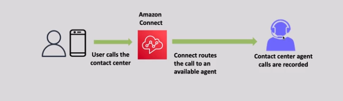
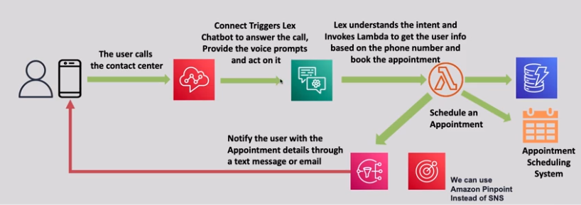

# ☎️ **Amazon Connect: Cloud-Based Contact Center Service**

> _Deliver better customer service with an easy-to-use, scalable, and AI-powered cloud contact center._

---

<div align="center" style="padding: 0 20px;">
   
</div>

---

## 🌟 **What is Amazon Connect?**

**Amazon Connect** is a **cloud-native contact center service** that enables businesses to:

- 📞 Set up **customer service centers** quickly with no upfront hardware investment.
- 🧠 Use **AI and machine learning** to improve customer interactions.
- 🚀 Scale easily to meet changing customer demands across voice and chat.

✅ Built on the **same technology used by Amazon Customer Service**!

---

## 🛠️ **Key Features of Amazon Connect**

| Feature                                 | Description                                                                                   |
| :-------------------------------------- | :-------------------------------------------------------------------------------------------- |
| ☎️ **Inbound and Outbound Calls**       | Handle incoming customer calls and initiate outbound calls.                                   |
| 💬 **Omnichannel Support**              | Manage **voice** and **chat** interactions in one interface.                                  |
| 🛠️ **No Hardware Required**             | Entirely cloud-based — no PBX systems or call center hardware needed.                         |
| 🎯 **AI-Driven Insights**               | Use Amazon Lex (chatbots), Contact Lens (conversation analytics), and Polly (text-to-speech). |
| ⚙️ **Easy Configuration**               | Drag-and-drop interface for designing call flows and chatbots.                                |
| 📈 **Real-Time and Historical Metrics** | Monitor agent performance, call volume, customer sentiment, etc.                              |
| 🔐 **Secure and Compliant**             | End-to-end encryption, PCI DSS, GDPR, HIPAA eligible.                                         |

✅ A **simple, flexible, and intelligent** contact center solution.

---

## 🛡️ **Built-in Integrations with AWS Services**

| Service                                | Purpose in Connect                                          |
| :------------------------------------- | :---------------------------------------------------------- |
| 🛠️ **AWS Lambda**                      | Integrate custom business logic during interactions.        |
| 🧠 **Amazon Lex**                      | Power intelligent chatbots for voice or chat conversations. |
| 🔍 **Contact Lens for Amazon Connect** | Analyze calls for sentiment, compliance, and trends.        |
| 🗣️ **Amazon Polly**                    | Convert text to lifelike speech during interactions.        |
| 🧹 **AWS S3**                          | Store call recordings and chat transcripts securely.        |
| 🔔 **Amazon CloudWatch**               | Monitor Connect metrics and set up alerts.                  |

✅ **Extend and enhance** your customer experience easily with AWS.

---

## ✨ **Popular Use Cases for Amazon Connect**

| Use Case                           | Example                                                               |
| :--------------------------------- | :-------------------------------------------------------------------- |
| ☎️ **Customer Support Centers**    | Handle customer inquiries, troubleshoot issues, and offer help desks. |
| 🛒 **E-Commerce Customer Service** | Manage orders, returns, and account support through voice/chat.       |
| 🏥 **Healthcare Hotlines**         | Provide appointment scheduling, nurse call centers, COVID helplines.  |
| 🏢 **IT Helpdesks**                | Internal or external tech support contact centers.                    |
| 🏦 **Financial Services**          | Secure client support for banking, insurance, and investment queries. |

✅ Versatile across **industries** and **use cases**.

---

## 🎯 **Key Benefits of Amazon Connect**

| Benefit                              | Why It Matters                                                                |
| :----------------------------------- | :---------------------------------------------------------------------------- |
| 🛠️ **Quick Setup**                   | Launch a fully operational contact center in minutes, not months.             |
| 📈 **Highly Scalable**               | Automatically scales to handle spikes in call/chat volume.                    |
| 💵 **Pay-As-You-Go**                 | No long-term contracts — pay only for what you use (per minute, per message). |
| 🧠 **Smarter Customer Interactions** | Add AI-driven call routing, analytics, and self-service options easily.       |
| 🌍 **Global Reach**                  | Serve customers worldwide with local telephony options.                       |

✅ Focus on **customer experience** — not managing telephony infrastructure!

---

## 📜 **How Amazon Connect Works (Simplified)**

<div align="center" style="padding: 0 20px;">

```mermaid
flowchart TD
    A[Customer Call/Chat] --> B[Amazon Connect Entry Point]
    B --> C{Routing Logic (based on Contact Flows)}
    C -->|Self-Service| D[Amazon Lex Bot]
    C -->|Agent Assistance| E[Available Agent]
    E --> F[Real-Time Monitoring + Call Recording]
    F --> G[Store in S3 + Analyze with Contact Lens]
```

</div>

✅ Customers reach your business —  
**either served by bots, live agents, or both** — with **smart routing and insights**!

---

## 💬 **Real Example: Small Company Scaling Support**

- 🛠️ Set up Amazon Connect in 1 hour using simple wizard.
- 🤖 Build a basic Amazon Lex chatbot for FAQs.
- ☎️ Route unanswered questions to live agents.
- 🔍 Use Contact Lens to review calls and find common complaints.
- 🏆 Outcome: 40% fewer support costs + faster customer response times.

✅ **Small startup?** Enterprise?  
Amazon Connect **fits any size**.

---

<div align="center">
    
</div>

---

## 🏆 **Final Smart Pro Tip**

> 🧠 **Always design your Contact Flows carefully** —  
> Create separate flows for sales, support, urgent issues, and integrate **Amazon Lex** where self-service can save agents’ time!

✅ Smart routing =  
**Lower wait times + Better customer satisfaction + Happier agents**.
