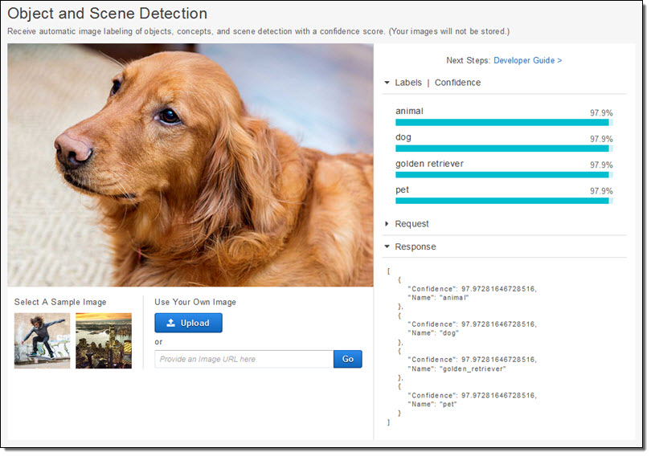

# 📷 **Amazon Rekognition: Simplify Image and Video Analysis**

> _Add powerful image and video analysis to your apps without needing machine learning expertise._

---

    

---

## 🌟 **What is Amazon Rekognition?**

**Amazon Rekognition** is a **fully managed computer vision service** that allows you to:

- 🔍 Detect **objects**, **faces**, **text**, **scenes**, and **activities** in images and videos.
- 🧠 Analyze **facial attributes** such as emotions, age range, and gender.
- 🚀 Build applications like **face-based authentication**, **content moderation**, **automated labeling**, and **security tracking** — with **no ML expertise needed**.

✅ Vision AI made **easy**, **fast**, and **scalable** for developers.

---

## ✨ **Key Features of Amazon Rekognition**

| Feature                                | Description                                                                                 |
| :------------------------------------- | :------------------------------------------------------------------------------------------ |
| 🔍 **Object and Scene Detection**      | Identify thousands of objects, activities, and scenes automatically.                        |
| 😀 **Facial Analysis and Recognition** | Detect faces, recognize emotions, compare faces across images, search faces in collections. |
| 📜 **Text Detection**                  | Read printed or handwritten text from images (OCR-like capabilities).                       |
| 📂 **S3 Integration**                  | Analyze images and videos directly from Amazon S3 storage.                                  |
| 🔞 **Unsafe Content Detection**        | Detect adult content, violence, and inappropriate material for moderation.                  |
| 🎯 **Celebrity Recognition**           | Identify famous personalities in media.                                                     |
| 🛡️ **Movement Tracking**               | Track people's paths across video frames for surveillance or investigations.                |

✅ One service, **dozens of powerful capabilities**.

---

## 🧠 **Deeper AI Capabilities in Rekognition**

| Capability                      | What It Does                                                              |
| :------------------------------ | :------------------------------------------------------------------------ |
| 📸 **Face Comparison**          | Verify if two faces belong to the same person (e.g., login verification). |
| 📚 **Face Search**              | Search large collections of faces to find a match.                        |
| 😃 **Facial Emotion Detection** | Identify emotions like happy, sad, angry, surprised, calm.                |
| 👕 **PPE Detection**            | Detect hard hats, masks, gloves, and safety gear in workplace settings.   |
| 🧾 **Text in Image (OCR)**      | Detect text on signs, documents, product packaging, or license plates.    |

✅ Boost both **security** and **user experience** with real-time insights.

---

## 🎯 **Real-World Use Case Examples**

    

---

    

| Use Case                                    | Example                                                                    |
| :------------------------------------------ | :------------------------------------------------------------------------- |
| 🔍 **Image and Video Search**               | Quickly find specific items or people in large media archives.             |
| 🔐 **Face-Based User Verification**         | Authenticate users via facial recognition for banking, travel, healthcare. |
| 👷‍♂️ **PPE Compliance Monitoring**            | Monitor workplace safety by detecting protective equipment.                |
| 😀 **Sentiment and Demographic Analysis**   | Analyze customer feedback, crowd emotions at events.                       |
| 🛑 **Moderation of User-Generated Content** | Filter out explicit or violent content from websites and apps.             |
| 📝 **Text Extraction**                      | Automate document processing by reading text from forms, IDs, invoices.    |
| 🎬 **Celebrity Identification**             | Recognize celebrities in media archives for news and entertainment apps.   |
| 🚶‍♂️ **Movement and Activity Tracking**       | Track individuals across video feeds for airports, malls, law enforcement. |

✅ Covers a **broad spectrum** of business and personal application needs.

---

## 🔞🚨 **Unsafe Content Detection and Moderation**

Amazon Rekognition can automatically detect and classify:

| Content Type           | Examples                               |
| :--------------------- | :------------------------------------- |
| 🔞 **Explicit Nudity** | Adult content detection.               |
| 🩸 **Violent Content** | Violence, weapons, blood, or injuries. |
| 🧨 **Hate Symbols**    | Offensive symbols and logos.           |

✅ **Protect your brand** by integrating automatic moderation into:

- Social media platforms.
- Dating apps.
- E-commerce user uploads.
- Advertising content pipelines.

---

## 🔄 **Advanced Workflow Integration**

| Service                          | How It Enhances Rekognition                                             |
| :------------------------------- | :---------------------------------------------------------------------- |
| ⚙️ **Amazon Augmented AI (A2I)** | Route uncertain predictions to human reviewers for manual confirmation. |
| 🛠️ **AWS Lambda**                | Trigger serverless actions based on recognition results.                |
| 🧹 **Amazon S3**                 | Store processed images/videos and extracted metadata.                   |
| 📈 **CloudWatch Metrics**        | Monitor system performance and trends in recognition events.            |

✅ Build **fully automated**, **scalable**, and **auditable** vision workflows.

---

## ✅ **Why Use Amazon Rekognition?**

| Advantage                       | Why It Matters                                       |
| :------------------------------ | :--------------------------------------------------- |
| ⚡ **Fast, Real-Time Analysis** | Get insights from images and videos in seconds.      |
| 🧠 **No ML Knowledge Needed**   | Pre-trained models ready to use immediately.         |
| 🔄 **Seamless AWS Integration** | Extend to any AWS service (Lambda, S3, A2I, etc.).   |
| 🌍 **Scalable to Any Size**     | From startups to global enterprises.                 |
| 💵 **Cost-Effective**           | Pay-as-you-go pricing — no infrastructure to manage. |

✅ **Focus on your application**, not the underlying AI complexities.

---

## 🏆 **Final Smart Pro Tip**

> 🧠 **For best results, prepare your images and videos carefully**:  
> High-resolution media + good lighting + clear faces = significantly higher recognition accuracy.

✅ Garbage in = Garbage out.  
✅ Good media = Outstanding results!
