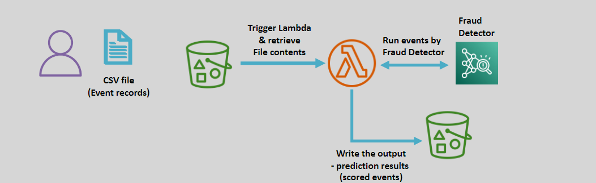
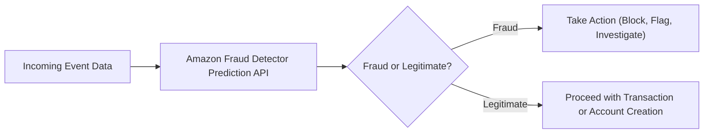

# 🤖🛡️ **Amazon Fraud Detector: Safeguard Against Online Fraud**

> _Detect and prevent fraud in real-time using Amazon’s machine learning expertise._

---

    

---

## 🌟 **What is Amazon Fraud Detector?**

**Amazon Fraud Detector** is a **fully managed machine learning service** that helps you:

- 🔍 Detect **fraudulent activities** such as fake account creation, payment fraud, and online abuse.
- 🧠 Leverage **Amazon’s deep ML expertise** without having to build complex models yourself.
- 🚀 Protect your applications in **real-time** or **analyze historical activities** in batch mode.

✅ Built using **the same fraud detection technologies that protect Amazon.com and AWS**!

---

## ✨ **Key Features of Amazon Fraud Detector**

| Feature                      | Description                                                                                       |
| :--------------------------- | :------------------------------------------------------------------------------------------------ |
| 🤖 **ML-Powered Detection**  | Pre-built fraud detection models trained with Amazon’s security data and best practices.          |
| ⚡ **Real-Time Predictions** | Evaluate events (e.g., logins, payments) instantly with millisecond-level response times.         |
| 📂 **Batch Processing**      | Analyze historical event data by uploading CSV files via Amazon S3.                               |
| 🛠️ **Customizable Models**   | Build your own models using your own data to fine-tune fraud detection specific to your business. |
| 🔗 **Seamless Integration**  | Integrates easily with Amazon S3, Lambda, EventBridge, and other AWS services.                    |

✅ A **ready-to-go**, **customizable**, and **scalable** fraud detection engine.

---

## 🧠 **How Amazon Fraud Detector Works (Simplified Flow)**

✅ Detect suspicious events → **Respond immediately** → **Reduce fraud loss**!

---

## 🎯 **Common Use Cases for Amazon Fraud Detector**

| Use Case                              | Example                                                                  |
| :------------------------------------ | :----------------------------------------------------------------------- |
| 💳 **Online Payment Fraud Detection** | Identify and block suspicious payment attempts in real time.             |
| 🧑‍💻 **Fake Account Prevention**     | Detect and block fake or automated account creation during registration. |
| 📦 **Transaction Reviews**            | Evaluate historical transaction records for potential fraud risks.       |
| 🚪 **Login Security Monitoring**      | Detect unusual or risky login patterns.                                  |

✅ Helps both **prevent future fraud** and **analyze past events** for hidden threats.

---

## 🚀 **Benefits of Using Amazon Fraud Detector**

| Benefit                       | Why It Matters                                                          |
| :---------------------------- | :---------------------------------------------------------------------- |
| 🎯 **Accuracy**               | Built on Amazon’s years of operational experience fighting fraud.       |
| 🛠️ **Ease of Implementation** | Use pre-built models or create custom models without deep ML knowledge. |
| ⚡ **Real-Time and Batch**    | Protect transactions immediately or analyze bulk data over time.        |
| 📈 **Scalable**               | Handle thousands to millions of events per day with built-in scaling.   |
| 💵 **Cost-Effective**         | Pay per prediction or batch evaluation — no upfront licensing fees.     |

✅ Focus on **protecting your business** — not managing infrastructure or building models.

---

## 🛡️ **Amazon Fraud Detector vs Traditional Fraud Detection Systems**

| Traditional Systems                   | Amazon Fraud Detector                                       |
| :------------------------------------ | :---------------------------------------------------------- |
| Rely on static rules (easy to bypass) | ML-based dynamic analysis adapts to evolving fraud patterns |
| Require manual tuning                 | Self-learning models continuously improve                   |
| Hard to scale quickly                 | Auto-scales based on traffic volume                         |
| Costly setup and maintenance          | Fully managed with usage-based pricing                      |

✅ **Future-proof fraud detection** for modern digital businesses!

---

## 🏆 **Final Smart Pro Tip**

> 🧠 **Always combine multiple event attributes** (IP address, device fingerprint, user behavior, etc.)  
> ➔ for higher fraud detection accuracy and lower false positives.

✅ The more **context** you provide, the smarter and sharper Fraud Detector gets!

---
