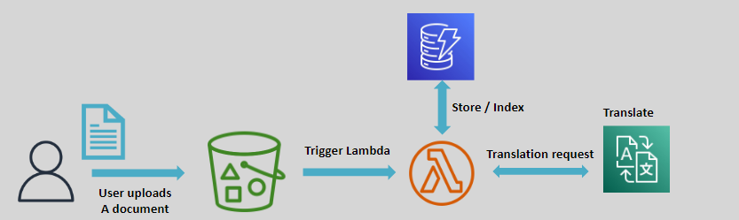
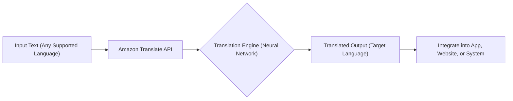

# 🌍 **Amazon Translate: Break Language Barriers with AI**

> _Expand globally, communicate locally — fast, affordable, and accurate translations at scale._

---

    

---

## 🌟 **What is Amazon Translate?**

**Amazon Translate** is a **fully managed neural machine translation (NMT) service** that:

- 🌐 Translates text between **English** and **100+ supported languages**.
- ⚡ Provides **fast**, **affordable**, and **high-quality translations** at scale.
- 🚀 Enables global applications, multilingual communication, and content localization effortlessly.

✅ Built on **deep learning models** that continuously improve translation accuracy over time.

---

## ✨ **Key Features of Amazon Translate**

| Feature                                 | Description                                                                                  |
| :-------------------------------------- | :------------------------------------------------------------------------------------------- |
| 🤖 **Neural Machine Translation (NMT)** | High-quality, context-aware translations based on deep learning.                             |
| ⚡ **High-Speed and Scalable**          | Translate millions of words quickly with low latency and high throughput.                    |
| 🔗 **Easy Integration**                 | Access via AWS Console, CLI, SDKs, or REST APIs for seamless app embedding.                  |
| 🔒 **Secure Translation**               | Encrypts data during transit and at rest, ensuring confidentiality.                          |
| 🏷️ **Custom Terminology Support**       | Define your own terms to ensure brand consistency (e.g., product names, industry jargon).    |
| 🛠️ **Batch and Real-Time Translation**  | Support for real-time translation (chat apps) and asynchronous batch processing (documents). |

✅ Translate **dynamically or in bulk** — depending on your needs!

---

## 🛠️ **How Amazon Translate Works (Simplified Flow)**

✅ **Input ➔ Translate ➔ Output ➔ Deploy**

---

## 🎯 **Real-World Use Cases for Amazon Translate**

    

| Use Case                                | Example                                                                              |
| :-------------------------------------- | :----------------------------------------------------------------------------------- |
| 📰 **Content Localization**             | Translate blogs, articles, marketing content into multiple languages.                |
| 💬 **Real-Time Chat Translation**       | Build multilingual chat apps where users communicate in their native languages.      |
| 🏢 **Global E-Commerce**                | Localize product catalogs, descriptions, and customer service FAQs.                  |
| 🎧 **Accessible Applications**          | Combine with Amazon Polly to create spoken translations for visually impaired users. |
| 📜 **Multilingual Document Processing** | Translate legal, educational, or technical documents at scale.                       |

✅ Reach **more customers**, **break down language barriers**, **expand your business** globally.

---

## 🔄 **Smart AWS Integration**

| Service                  | Purpose                                                                  |
| :----------------------- | :----------------------------------------------------------------------- |
| 🎤 **Amazon Polly**      | Convert translated text into lifelike speech for voice applications.     |
| ⚙️ **AWS Lambda**        | Automate translation workflows on document uploads or user interactions. |
| 📦 **Amazon S3**         | Store source files and translated outputs securely.                      |
| 🔍 **Amazon Comprehend** | Analyze the meaning, sentiment, or topics of translated text.            |

✅ Build **end-to-end multilingual pipelines** easily on AWS!

---

## 🚀 **Why Choose Amazon Translate?**

| Advantage                             | Why It Matters                                                             |
| :------------------------------------ | :------------------------------------------------------------------------- |
| 🎯 **High-Quality and Context-Aware** | Better than traditional statistical models — understands language nuances. |
| 🌐 **Global Reach**                   | Communicate across regions and cultures effortlessly.                      |
| ⚡ **Scalable for Any Project Size**  | From small apps to enterprise-scale document archives.                     |
| 🔗 **Simple and Flexible APIs**       | Integrate translation capabilities in hours, not months.                   |
| 💵 **Cost-Effective**                 | Pay per character translated — flexible and affordable for any business.   |

✅ **Speak every customer's language** — without breaking your infrastructure or budget.

---

## 🏆 **Final Smart Pro Tip**

> 🧠 **Always pair Amazon Translate with "Custom Terminology"** when dealing with brand-specific names, product lines, or special phrases ➔  
> This ensures **brand voice and consistency** across all languages!

✅ Custom terminologies = **Professional, polished translations** that fit your industry.
