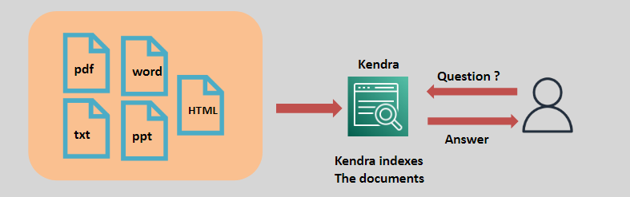
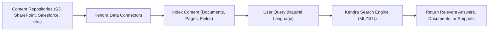

# 🔍 **Amazon Kendra: Intelligent Enterprise Search**

> _Transform unstructured documents into accessible, actionable knowledge using AI-powered search._

---

    

---

## 🌟 **What is Amazon Kendra?**

**Amazon Kendra** is a **highly accurate, fully managed enterprise search service** that:

- 📚 Indexes data from multiple content repositories (S3, SharePoint, Salesforce, and more).
- 🔍 Enables **natural language search** — users can **ask questions**, not just keywords.
- 🧠 Continuously improves **search relevance** using **machine learning** models.

✅ Designed to **bring intelligent, context-aware search** to business applications with minimal effort.

---

## ✨ **Key Features of Amazon Kendra**

| Feature                                | Description                                                                                   |
| :------------------------------------- | :-------------------------------------------------------------------------------------------- |
| 📄 **Broad Document Support**          | Index documents in formats like HTML, TXT, PDF, Word, PowerPoint, and more.                   |
| 🔗 **Multiple Repository Integration** | Connect to Amazon S3, SharePoint, Salesforce, ServiceNow, Google Drive, GitHub, and others.   |
| 🧠 **Natural Language Understanding**  | Understands questions like "What is the company vacation policy?" and returns direct answers. |
| 🔍 **Intelligent Ranking**             | Surfaces the most relevant documents or precise snippets, not just links.                     |
| 🔒 **Enterprise-Grade Security**       | Integrates with IAM, SAML-based identity providers, and controls access at document level.    |
| 🚀 **Continuous Learning**             | Improves search accuracy based on user feedback and usage patterns.                           |

✅ From **static search** ➔ to **AI-powered answers**!

---

## 🛠️ **How Amazon Kendra Works (Simplified Flow)**

✅ **Ingest ➔ Understand ➔ Search ➔ Answer**.

---

## 🎯 **Common Use Cases for Amazon Kendra**

| Use Case                              | Example                                                              |
| :------------------------------------ | :------------------------------------------------------------------- |
| 🛟 **Customer Support Knowledge Base** | Enable agents to find solutions quickly and accurately.              |
| 🏢 **Employee Self-Service Portal**   | Help employees search internal documents, policies, and FAQs.        |
| 🧪 **Research and Development**       | Easily locate technical papers, patents, manuals, or blueprints.     |
| 📜 **Compliance and Auditing**        | Quickly retrieve policies, reports, certifications for audits.       |
| 🎓 **Educational Resources Search**   | Universities indexing lecture notes, papers, and academic resources. |

✅ **Boosts productivity** and **improves decision-making** across industries.

---

## 🔒 **Security and Access Control in Kendra**

| Feature                            | Details                                                                  |
| :--------------------------------- | :----------------------------------------------------------------------- |
| 🛡️ **Document-Level Permissions**  | Restrict search results based on user credentials and group memberships. |
| 🔑 **SAML, Active Directory, IAM** | Integrate identity providers easily for secure, personalized access.     |
| 🛠️ **Field-Level Encryption**      | Protect sensitive metadata and content within search indexes.            |

✅ Ensures **only authorized users** see the right documents.

---

## 🚀 **Why Choose Amazon Kendra?**

| Advantage                     | Why It Matters                                                        |
| :---------------------------- | :-------------------------------------------------------------------- |
| 🎯 **Higher Search Accuracy** | Users find exactly what they need with natural language queries.      |
| 🛠️ **Easy Deployment**        | Connectors, APIs, and quick-starts for fast rollout.                  |
| 📈 **Scalability**            | Supports hundreds of thousands to millions of documents efficiently.  |
| 🎛️ **Customizable Tuning**    | Fine-tune search relevance models for specific industries or domains. |
| 💵 **Cost-Efficient**         | Pay only for data sources, indexing, and queries — scale as needed.   |

✅ A smarter, **future-ready search** engine for the enterprise!

---

## 🏆 **Final Smart Pro Tip**

> 🧠 **Always structure and tag your documents well (title, metadata, categories)** ➔  
> Amazon Kendra will leverage these fields to dramatically **improve search precision** and **answer quality**.

✅ Great search = **Great input + Great metadata**!
