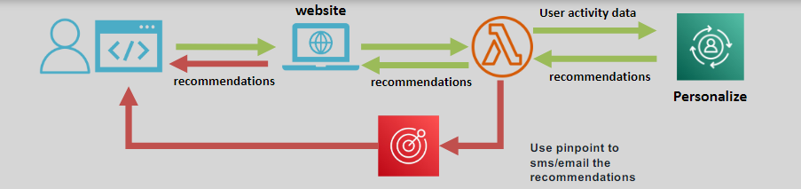
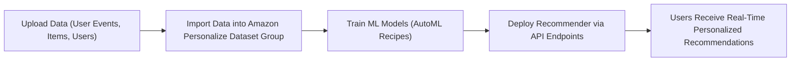

# 🎯 **Amazon Personalize: Deliver Tailored User Experiences**

> _Create real-time, dynamic, and highly relevant recommendations — without needing ML expertise._

---

    

---

## 🌟 **What is Amazon Personalize?**

**Amazon Personalize** is a **fully managed machine learning service** that enables you to:

- 📈 Deliver **real-time, individualized recommendations** to users.
- 🧠 Build ML-powered personalization **without needing to know machine learning algorithms**.
- 🚀 Continuously adapt recommendations based on **latest user behaviors and feedback**.

✅ Built on the **same technology powering Amazon.com’s recommendation systems**!

---

## ✨ **Key Features of Amazon Personalize**

| Feature                                       | Description                                                                        |
| :-------------------------------------------- | :--------------------------------------------------------------------------------- |
| 🤖 **Real-Time Personalized Recommendations** | Instantly adjust suggestions based on users' latest actions and trends.            |
| 📂 **Easy Data Integration**                  | Import user activity logs, item metadata (catalogs), and user demographics.        |
| 🛠️ **Pre-Built Models (Recipes)**             | Start fast with purpose-built ML recipes optimized for recommendation tasks.       |
| 🔁 **Continuous Learning**                    | The model automatically refines itself as new data arrives.                        |
| 🔗 **API-Based Deployment**                   | Easily integrate recommendations into web apps, mobile apps, or marketing systems. |

✅ **From raw data** ➔ to **smart recommendations** in record time.

---

## 🛠️ **How Amazon Personalize Works (Simplified Flow)**

✅ **Data Ingestion ➔ Model Training ➔ Recommendation APIs ➔ Personalization Delivered**

---

## 🎯 **Popular Use Cases for Amazon Personalize**

| Use Case                            | Example                                                          |
| :---------------------------------- | :--------------------------------------------------------------- |
| 🎬 **Video Streaming Apps**         | Suggest shows or movies based on watch history and preferences.  |
| 🛒 **E-Commerce Platforms**         | Recommend products tailored to individual shopper behaviors.     |
| ✉️ **Personalized Email Campaigns** | Customize newsletter content and offers based on user interests. |
| 🎯 **Targeted Ad Campaigns**        | Serve relevant promotions to different audience segments.        |
| 📚 **Content Discovery Apps**       | Help users find new books, podcasts, or articles they’ll love.   |

✅ **Boost user engagement**, **increase conversions**, and **enhance satisfaction**.

---

## 🧩 **Amazon Personalize Data Types**

| Data Type                         | Example                                                             |
| :-------------------------------- | :------------------------------------------------------------------ |
| 📄 **User-Item Interaction Data** | Clicks, purchases, video plays, page views, search queries.         |
| 📄 **Item Metadata**              | Product categories, genres, descriptions, tags.                     |
| 📄 **User Metadata**              | Age, location, preferences (optional for enhanced recommendations). |

✅ The **richer the data**, the **better the recommendations**.

---

## 🚀 **Why Choose Amazon Personalize?**

| Advantage                              | Why It Matters                                                         |
| :------------------------------------- | :--------------------------------------------------------------------- |
| 🎯 **Highly Relevant Recommendations** | Real-time suggestions based on actual user behaviors and preferences.  |
| ⚡ **Fast Time-to-Market**             | No need to build custom ML pipelines — deploy in days, not months.     |
| 📈 **Scalable**                        | Supports millions of users and items without infrastructure headaches. |
| 🧠 **Built-In Customization**          | Fine-tune models with domain-specific rules or business goals.         |
| 💵 **Pay-As-You-Go**                   | Only pay for what you use — no expensive licenses or fixed costs.      |

✅ Personalization made **accessible**, **affordable**, and **effective**.

---

## 🏆 **Final Smart Pro Tip**

> 🧠 **Feed Amazon Personalize continuously with real-time event data** (clicks, views, purchases) ➔  
> This allows the service to **retrain incrementally** and **keep recommendations fresh and context-aware**.

✅ **Dynamic personalization = higher conversions + happier users**!
