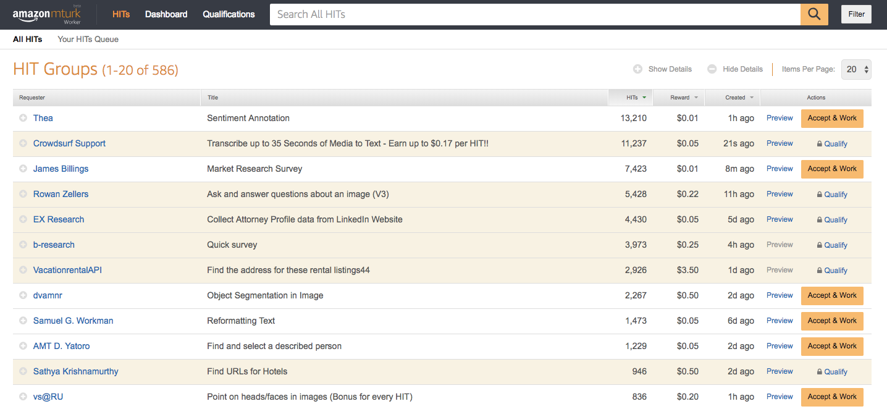

---
tags:
  - aws
  - aws/service
  - aws/domain/machine-learning
  - aws/topic/mechanical-truk
aliases:
  - "Amazon Mechanical Turk MTurk Human Intelligence at Scale"
  - "Mtruk"
---

# 🤖 Amazon Mechanical Turk (MTurk): Human Intelligence at Scale

**Amazon Mechanical Turk (MTurk)** is a **crowdsourcing marketplace** that allows businesses and developers to outsource tasks that require **human intelligence** to a large, global workforce.

---

    
    

---

✅ It’s designed to solve problems that are still **difficult for AI alone**, such as complex data labeling, content moderation, and surveys.

---

    

---

## 🌟 **Key Features**

| Feature                   | Description                                                                                                 |
| :------------------------ | :---------------------------------------------------------------------------------------------------------- |
| 👥 **Global Workforce**   | Access a distributed network of workers (Turkers) worldwide.                                                |
| 📋 **Task Variety**       | Post "Human Intelligence Tasks" (HITs) such as data labeling, surveys, transcription, and image moderation. |
| 🛠️ **Customizable Tasks** | Define your own tasks with flexible templates and workflows.                                                |
| 📈 **Scalable**           | Handle thousands to millions of tasks simultaneously.                                                       |
| 💵 **Pay-per-Task Model** | Pay workers only for the work they complete — affordable and flexible.                                      |

✅ Human skills, at cloud scale and speed.

---

## 🎯 **Popular Use Cases**

| Use Case                                  | Example                                                            |
| :---------------------------------------- | :----------------------------------------------------------------- |
| 🖼️ **Data Labeling for Machine Learning** | Annotate images, tag objects, classify text for ML model training. |
| 📝 **Survey Collection**                  | Quickly gather opinions and feedback from diverse demographics.    |
| 🧹 **Content Moderation**                 | Review user-uploaded images, videos, or comments for compliance.   |
| 🖋️ **Transcription and Translation**      | Convert audio files to text, or translate documents manually.      |

✅ Especially useful where **human judgment** is **better than AI**.

---

## ✅ **Why Choose Amazon Mechanical Turk?**

- **Low Cost**: Pay only for completed tasks — no long-term contracts.
- **Flexible Workforce**: Workers are available 24/7 globally.
- **Scalable**: Scale up or down based on your task volume instantly.
- **Simple Management**: AWS Console and APIs make it easy to create, monitor, and collect results.
---

## Related Notes
- [[aws-services/12.machine-learning/5.2.translate/translate|Amazon Translate Break Language Barriers with AI]] - mentions Translate

---
