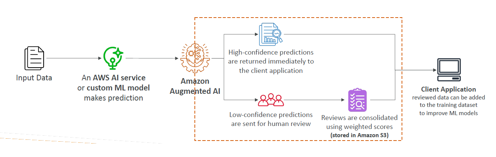
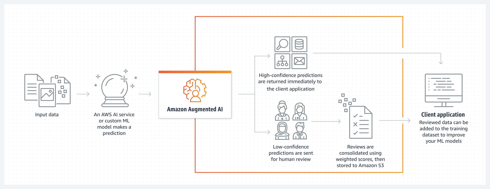

---
tags:
  - aws
  - aws/service
  - aws/domain/machine-learning
  - aws/topic/augmented-ai
aliases:
  - "Amazon Augmented AI A2I Human Review for AI Predictions"
---

# 🤖 Amazon Augmented AI (A2I): Human Review for AI Predictions

    

---

**Amazon Augmented AI (A2I)** is a fully managed service that makes it easy to add **human reviews** to machine learning model predictions.

✅ It solves the common problem:

> _"How can I bring in a human to verify the AI’s decision when needed?"_

---

    

---

## 🌟 **Key Features**

| Feature                             | Description                                                                                                |
| :---------------------------------- | :--------------------------------------------------------------------------------------------------------- |
| 👨‍💻 **Human Review Workflow**        | Automatically route low-confidence ML predictions to human reviewers.                                      |
| 🔗 **Built-In Integrations**        | Works out-of-the-box with services like **Amazon Textract**, **Amazon Rekognition**, and custom ML models. |
| 🛠️ **Customizable Review Triggers** | Define when human review is needed (e.g., model confidence < 80%).                                         |
| 👥 **Flexible Workforce Options**   | Use your own employees, third-party vendors, or Amazon Mechanical Turk.                                    |
| 🔒 **Security and Compliance**      | Manage reviewer permissions and audit human review results securely.                                       |

✅ Add **trust and oversight** to AI systems easily.

---

## 🎯 **Where You Can Use Amazon A2I**

| Use Case                                | Example                                                                                           |
| :-------------------------------------- | :------------------------------------------------------------------------------------------------ |
| 📄 **Document Processing (Textract)**   | If AI extracts uncertain fields from invoices, route to humans for correction.                    |
| 🎥 **Content Moderation (Rekognition)** | If the model is unsure about unsafe content, request human confirmation.                          |
| 🎯 **Custom Models**                    | Any ML model where you need humans to validate outputs, like insurance claims or medical reports. |

✅ Humans step in **only when needed** ➔ Saving time and improving reliability.

---

## ✅ **Why Choose Amazon A2I?**

- **Improved Accuracy**: Humans correct or confirm machine outputs.
- **Faster Time-to-Market**: Avoid building your own review system from scratch.
- **Flexible and Scalable**: Handle human reviews on-demand, at any scale.
- **Cost-Effective**: Only pay for what you review.
---

## Related Notes
- [[aws-daily/aws-waf/3.1.reliability|Reliability]] - mentions Reliability
- [[aws-services/12.machine-learning/4.3.rekognition/rekognition|Amazon Rekognition Simplify Image and Video Analysis]] - mentions Rekognition
- [[aws-services/12.machine-learning/5.1.textract/textract|Amazon Textract Intelligent Document Processing]] - mentions Textract

---
