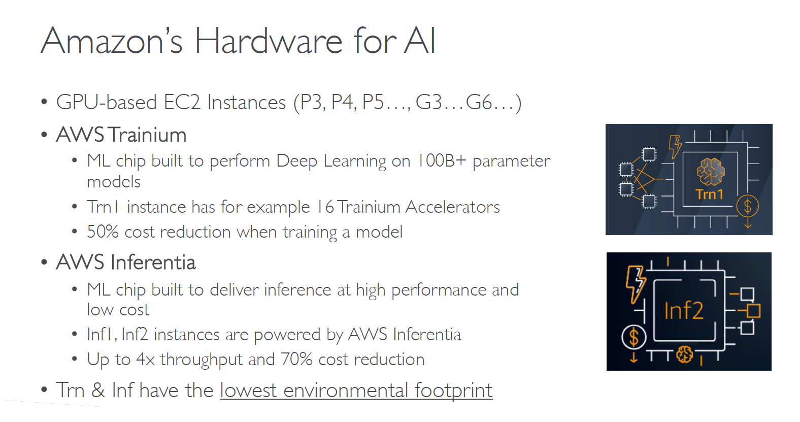

# 🖥️ Hardware for AI on AWS

## 🧠 Why Specialized Hardware for AI?

> **Definition**:  
> **AI and ML workloads**, especially **deep learning**, require **huge amounts of compute power** to train and run large models.  
> To meet these needs, **specialized hardware accelerators** like **GPUs**, **custom AI chips**, and **optimized instances** are essential for **speed**, **efficiency**, and **cost savings**.

---

  

---

📌 **Simply**:

- Normal CPUs are too slow for deep learning 🐢.
- Specialized hardware is like **putting a rocket on your model training** 🚀.

📌 **Key Highlights**:

| Reason            | Why Specialized Hardware                 |
| :---------------- | :--------------------------------------- |
| Speed             | Train models faster                      |
| Cost Efficiency   | Lower total training and inference costs |
| Scalability       | Handle billions of parameters            |
| Energy Efficiency | Reduce environmental footprint           |

---

## 🔥 Amazon’s Specialized Hardware for AI

### 🎮 GPU-based EC2 Instances

📌 **GPU (Graphics Processing Units)** are excellent for **parallel computation** —  
perfect for **training large deep learning models**.

| Instance Family | Description                                                                                |
| :-------------- | :----------------------------------------------------------------------------------------- |
| P3              | Older generation, still powerful for medium to large DL workloads                          |
| P4              | Better performance and lower cost per training job                                         |
| P5              | Latest generation, optimized for 100B+ parameter models                                    |
| G4 / G5 / G6    | Specialized for **inference** and **graphics**-intensive ML tasks (e.g., image generation) |

📌 **Real-World Example**:

- Use a **P5** instance to train a **large transformer model** like Llama 2 or GPT-like models much faster than CPU-based machines.

---

### 🚂 AWS Trainium

📌 **What is Trainium?**

- **Custom AWS chip** built **specifically for deep learning model training** 🧠🔥.

📌 **Key Features**:

| Feature        | Description                                                 |
| :------------- | :---------------------------------------------------------- |
| Purpose        | Train massive models (100B+ parameters)                     |
| Trn1 Instances | Built with 16 Trainium accelerators                         |
| Cost Savings   | Up to **50% cost reduction** compared to GPU-based training |
| Performance    | Extremely high throughput for tensor operations             |
| Eco-Friendly   | Lowest carbon footprint for training jobs                   |

📌 **Simple Rule**:

> "**If you're training huge AI models, Trainium is your best friend.**" 🚂

📌 **Real-World Example**:

- Training a **foundation model** or **large language model (LLM)** with billions of tokens is **cheaper and faster** using **Trn1 instances**.

---

### ⚡ AWS Inferentia

📌 **What is Inferentia?**

- **Custom AWS chip** **designed for inference** (i.e., running pre-trained models efficiently) 🏎️.

📌 **Key Features**:

| Feature                 | Description                                                         |
| :---------------------- | :------------------------------------------------------------------ |
| Purpose                 | Deploy models for low-latency predictions                           |
| Inf1 and Inf2 Instances | Powered by Inferentia v1 and v2 chips                               |
| Cost Savings            | Up to **70% lower cost** for inference                              |
| Throughput              | Up to **4x higher throughput** than traditional GPU/CPU deployments |
| Eco-Friendly            | Extremely low environmental impact per inference                    |

📌 **Simple Rule**:

> "**Train big with Trainium, run cheap and fast with Inferentia.**" ⚡

📌 **Real-World Example**:

- Hosting a **chatbot model**, **recommendation system**, or **vision classifier** for millions of users —  
  use **Inf2 instances** to serve predictions at **high speed** and **low cost**.

---

## 🌍 Environmental Impact: Greener AI

📌 **Both Trainium and Inferentia are built with sustainability in mind**:

| Metric                      | Benefit                             |
| :-------------------------- | :---------------------------------- |
| Lower Power Usage           | Efficient chips consume less energy |
| Less Carbon Emission        | Greener AI training and inference   |
| Better Cost-to-Energy Ratio | Save money and the planet 🌎        |

📌 **Simple Rule**:

> "**Faster models, smaller carbon footprint.**" 🍃

---

## ✍️ Mini Smart Recap

| Hardware                               | Best For                          | Main Benefit         |
| :------------------------------------- | :-------------------------------- | :------------------- |
| 🎮 GPU-based Instances (P, G families) | General ML training and inference | Flexible, powerful   |
| 🚂 AWS Trainium (Trn1)                 | Deep learning model training      | 50% cheaper training |
| ⚡ AWS Inferentia (Inf1, Inf2)         | Model inference                   | 70% cheaper serving  |

📌 **Simple Rule**:

> "**GPUs for flexibility, Trainium for massive training, Inferentia for lightning-fast inference.**" 🎯
