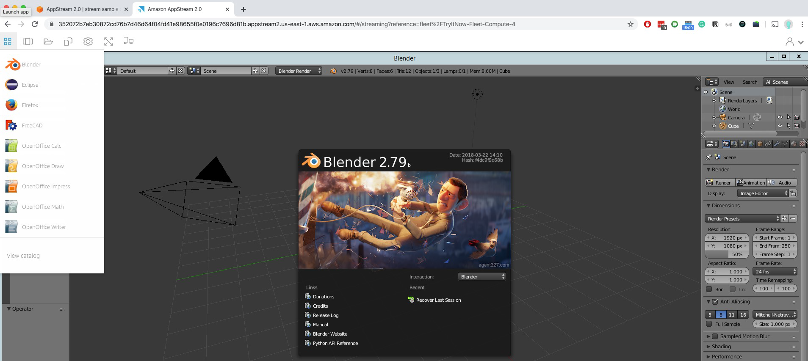

# 🎮 **Amazon AppStream 2.0**

_Stream Desktop Applications to Any Device, Anywhere!_

**Amazon AppStream 2.0** is a fully managed **application streaming service** that lets you stream **desktop apps** from AWS to **any device** via a **web browser**, without the need to manage or provision physical infrastructure.

---

    

---

## 🧠 Key Features

| ✅ Feature                      | 💡 Description                                                       |
| ------------------------------- | -------------------------------------------------------------------- |
| 💻 **App Streaming**            | Stream Windows apps (e.g., CAD, IDEs, Office) through the browser    |
| 🌍 **No Infrastructure Needed** | AWS hosts and scales your app backend                                |
| ⚙️ **Instance Flexibility**     | Choose instance type (CPU/GPU/RAM) per app workload                  |
| 🌐 **Cross-Device Access**      | Works on PCs, Macs, Chromebooks, tablets — any device with a browser |
| 🔒 **Secure & Scalable**        | Runs inside AWS VPC with user-specific access control                |

---

## 🔁 How It Works (Simplified)

1. You install and configure your app in a **fleet image**
2. Users log into a **web portal**
3. They interact with the app **as if it were installed locally**, but it's actually running in the cloud

---

## 🆚 AppStream 2.0 vs. Amazon WorkSpaces

| Feature               | **AppStream 2.0**                    | **Amazon WorkSpaces**                    |
| --------------------- | ------------------------------------ | ---------------------------------------- |
| 🧑‍💻 Access Type     | App-level only (streamed to browser) | Full virtual desktop (VDI)               |
| 💻 Device Requirement | Just a browser                       | Needs desktop client or WorkSpaces app   |
| 🔧 Usage Pattern      | Application-specific workloads       | Persistent or on-demand virtual desktops |
| 🎮 GPU Support        | Yes (GPU instance types available)   | Yes                                      |
| 💰 Billing Model      | Per use, based on app usage          | Hourly/monthly based on desktop use      |

---

## 🎯 Use Cases

- **Education**: Provide students browser-based access to IDEs or design software
- **Engineering**: Run CAD or simulation tools without local GPU machines
- **Training & Demos**: Deliver preconfigured apps for workshops and labs
- **BYOD Workforces**: Securely deliver corporate apps without device restrictions

---

## 🧠 Summary

| 🔹 Feature                    | 💡 Value                 |
| ----------------------------- | ------------------------ |
| Stream desktop apps           | ✅ Yes                   |
| Browser-based access          | ✅ Yes                   |
| Manage desktop infrastructure | ❌ No                    |
| Custom instance types         | ✅ CPU/GPU per app needs |
