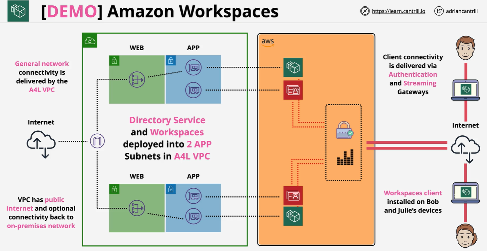

---
tags:
  - aws
  - aws/service
  - aws/domain/end-user-computing
  - aws/topic/workspaces
aliases:
  - "Workspaces Demo"
---

# Workspaces Demo

---

## Related Notes
- [[aws-services/14.end-user-computing/workspaces/1.2.use-cases|When to Use AWS WorkSpaces]] - previous lesson

---
