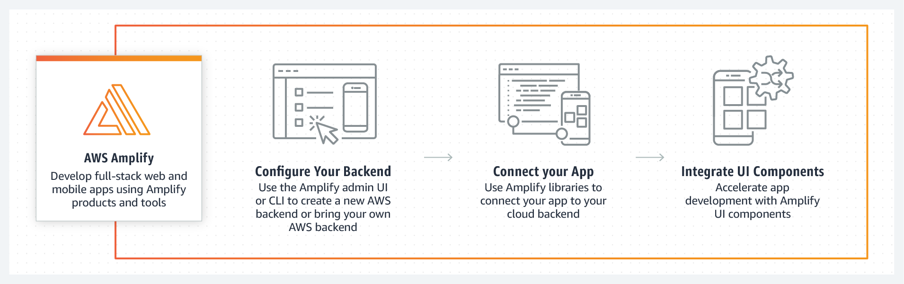
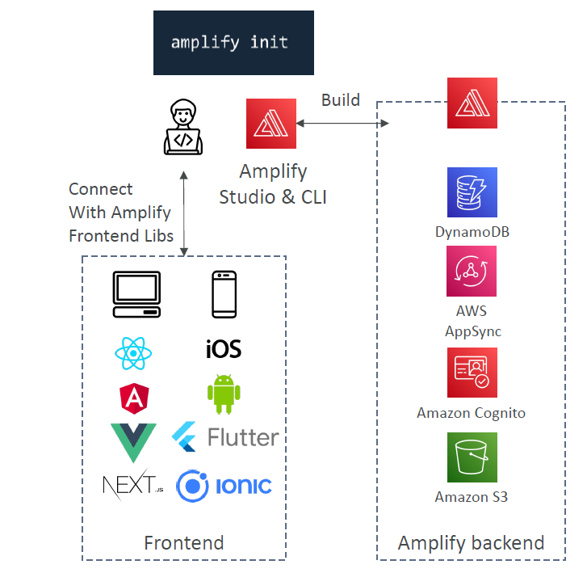
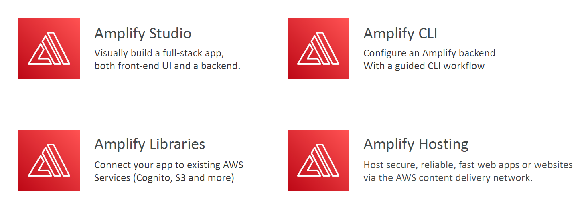
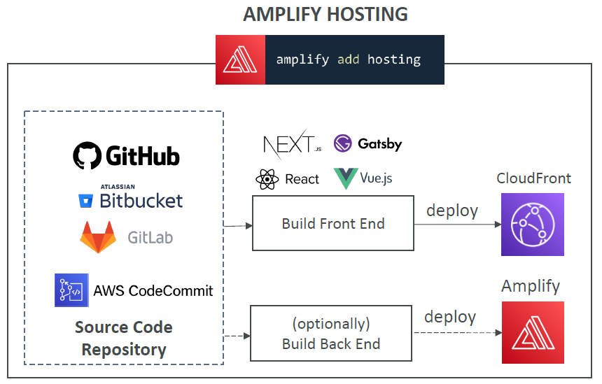

# 🚀 **AWS Amplify – Build Full-Stack Cloud Apps Faster**

**AWS Amplify** is a powerful set of tools and services designed to help frontend and mobile developers **build scalable, secure, and full-stack cloud applications** with ease.

---

<div style="text-align: center;">
    
</div>

---

> 💡 Think of Amplify as the **“Elastic Beanstalk” for frontend apps** — but purpose-built with **mobile/web devs** in mind. It handles **auth, storage, APIs, data, hosting**, and even **real-time + offline support** — all via declarative libraries, CLI, and a visual interface.

---

<div style="text-align: center;">
    
</div>

---

## 🧱 **Core Building Blocks of AWS Amplify**

| 🔧 Component          | 🌟 Purpose                                                                   |
| --------------------- | ---------------------------------------------------------------------------- |
| **Amplify Studio**    | Visually build & model backend and UI components                             |
| **Amplify CLI**       | Configure, manage, and deploy Amplify resources via CLI workflow             |
| **Amplify Libraries** | Connect frontend apps (React, Vue, Angular, iOS, Flutter...) to AWS services |
| **Amplify Hosting**   | Host & deploy full-stack apps with CI/CD, CloudFront, custom domains         |

---

<div style="text-align: center;">
    
</div>

---

## 🎨 **1. Amplify Studio – Visual Full-Stack App Builder**

Amplify Studio is a **low-code visual IDE** that empowers developers and designers to collaborate seamlessly.

### 🔹 **Key Features:**

- 🧩 **Visual Data Modeling** → Create schema, define relationships (1:1, 1\:M, etc.)
- 🔄 **Auto-generate CRUD APIs** using **GraphQL/AppSync** with real-time & offline support
- 🎨 **Drag-and-Drop UI Components** for React/Next.js apps using Figma integration
- ⚙️ **Connect UI to backend models** without writing boilerplate code

> ⚡ It combines **designer-friendly UIs** with **developer-level power**, making it ideal for MVPs or fast prototyping.

---

## 🧑🏻‍💻 **2. Amplify CLI – Command-Line Power for Devs**

Amplify CLI enables backend infrastructure provisioning with just a few commands.

### 🔧 **Supported Backends:**

```bash
amplify init               # Initialize Amplify project
amplify add auth           # Add Amazon Cognito for user login
amplify add api            # Add AppSync (GraphQL) or REST API
amplify add storage        # Add S3 bucket for files/images
amplify push               # Deploy all configured resources
```

### 🔹 **Use Cases:**

- Manage multiple environments (dev/stage/prod)
- Add custom domain, hosting, secrets, functions
- Easily integrate backend with frontend repos

> 💬 Ideal for devs who prefer **Infrastructure-as-Code** style workflows without diving into CloudFormation.

---

## 📦 **3. Amplify Libraries – Connect Any Frontend to AWS**

Amplify offers open-source libraries and UI components for seamless frontend integration.

### ✅ **Frameworks Supported:**

- **React**, **Vue**, **Angular**
- **Next.js**, **Gatsby**
- **iOS (Swift)**, **Android (Kotlin/Java)**
- **Flutter**, **Ionic**

### 🔹 **Features via Libraries:**

- 🔐 **Authentication** with Cognito
- 🗃️ **Data querying** via GraphQL or REST APIs
- 📁 **File upload** to S3
- 📡 **Real-time subscriptions** & **offline sync**
- 📲 **Push notifications**, geo location, analytics, predictions

> 🧠 You can build complex cloud-native mobile/web apps **without building your own backend**.

---

## 🌐 **4. Amplify Hosting – CI/CD + CDN for Frontend & SSR**

Amplify Hosting is a **fully managed deployment service** for modern web apps.

---

<div style="text-align: center;">
    
</div>

---

### 🔧 **Key Features:**

- ⚙️ **CI/CD Pipelines** from GitHub, GitLab, Bitbucket, CodeCommit
- 🌍 **Global CDN with CloudFront**
- 🌐 **Custom domains**, HTTPS, routing rules
- 🔄 **Atomic deployments + rollback**
- 🔍 **Monitoring, logs, branch previews**

### 🔁 **Supported Frameworks:**

- Next.js (SSR), Gatsby (SSG)
- React, Vue, Angular
- Static HTML/CSS/JS

> 🧪 Developers push code → Amplify builds, tests, and deploys → 🎯 your app is live instantly.

---

## 🔐 **Authentication with Amplify (via Amazon Cognito)**

Easily add user authentication to your app with just a few CLI commands.

### 🔑 **Features:**

- Sign-up / sign-in / MFA
- Social login (Google, Facebook, Apple)
- Account recovery flows
- Hosted UI or custom UI components
- Group-based or attribute-based **fine-grained access control**

```bash
amplify add auth
```

> 🔐 Backed by **Amazon Cognito**, with full IAM integration for secure resource access.

---

## 📡 **DataStore – Real-Time + Offline Sync**

Built on top of **AppSync + DynamoDB**, **DataStore** allows **offline-first development**.

### 🔹 **Capabilities:**

- Real-time GraphQL + subscriptions
- Syncs automatically when device reconnects
- Works across web & mobile
- Conflict resolution strategies
- Local-first operations with **no boilerplate**

> 🧠 Great for mobile apps that need to work offline (e.g., field reporting, chat apps, CRMs).

---

## 🧪 **End-to-End (E2E) Testing**

Amplify supports automated **End-to-End (E2E) testing** during the **test phase** of your deployment pipeline. This helps ensure your app behaves correctly **before reaching production**.

---

### 🚦 Why Use E2E Testing in Amplify?

- ✔️ **Detect Bugs Early** – Catch regressions during the CI/CD process.
- ✔️ **Prevent Broken Releases** – Block deployments if tests fail.
- ✔️ **Run UI Tests Automatically** – No manual interaction required.
- ✔️ **Generate Rich Reports** – Use frameworks like **Cypress** + **Mochawesome** for visual test reports.

---

### ⚙️ **How It Works**

You define your test scripts inside `amplify.yml` under the `test` phase. The pipeline executes:

1. **preTest**: Starts the app and installs testing tools.
2. **test**: Runs your test suite (e.g., Cypress, Mocha).
3. **postTest**: Aggregates results, generates reports, and shuts down services.

---

### 🧾 amplify.yml Example (With Cypress & Mochawesome)

```yaml
test:
  phases:
    preTest:
      commands:
        - npm ci
        - npm install -g pm2
        - npm install -g wait-on
        - npm install mocha mochawesome mochawesome-merge
        - pm2 start npm -- start
        - wait-on http://localhost:3000
    test:
      commands:
        - "npx cypress run --reporter mochawesome"
    postTest:
      commands:
        - npx mochawesome-merge cypress/results/*.json > mochawesome.json
        - pm2 kill

artifacts:
  baseDirectory: cypress
  configFilePath: "**/mochawesome.json"
  files:
    - "**/*.png"
    - "**/*.mp4"
```

---

### 🔧 Tools You Can Integrate

| Tool            | Purpose                             |
| --------------- | ----------------------------------- |
| **Cypress**     | Fast, powerful front-end testing    |
| **Mocha**       | Test runner                         |
| **Mochawesome** | Generate HTML test reports          |
| **PM2**         | Manage local server during test     |
| **wait-on**     | Wait until your app is ready (port) |

---

### 🔍 Amplify Test Flow

```text
Build --> 🧪 Test (E2E) --> 🚀 Deploy
```

- ✅ Tests run **while app is being built or deployed**
- ✅ Failures in this phase **stop the deployment**
- ✅ Results & screenshots/videos are stored as **artifacts**

## 🚀 **Amplify Use Cases**

| Use Case             | Why Amplify is Great                                                 |
| -------------------- | -------------------------------------------------------------------- |
| Mobile apps          | Easily add auth, offline data, cloud sync, and file storage          |
| MVPs or Prototypes   | Launch fast with pre-built UI + backend in minutes                   |
| Real-time Dashboards | Use GraphQL subscriptions with AppSync for live data                 |
| Ecommerce or Blogs   | Host JAMStack sites with custom backend, storage, and analytics      |
| Full-stack SaaS apps | Auth, APIs, storage, ML — all with CI/CD, GitOps, and scalable infra |

---

## 🎯 **Final Thoughts – Why Use AWS Amplify?**

- ✅ No need to manage backend infrastructure
- ✅ Visual tools **AND** CLI for developer flexibility
- ✅ Built-in CI/CD + CDN for global delivery
- ✅ Tight integration with **GraphQL (AppSync)** and **Auth (Cognito)**
- ✅ **Great DX (Developer Experience)** with open-source libraries

> 💥 Perfect for modern cloud developers building apps fast, securely, and at scale — without reinventing the wheel!
