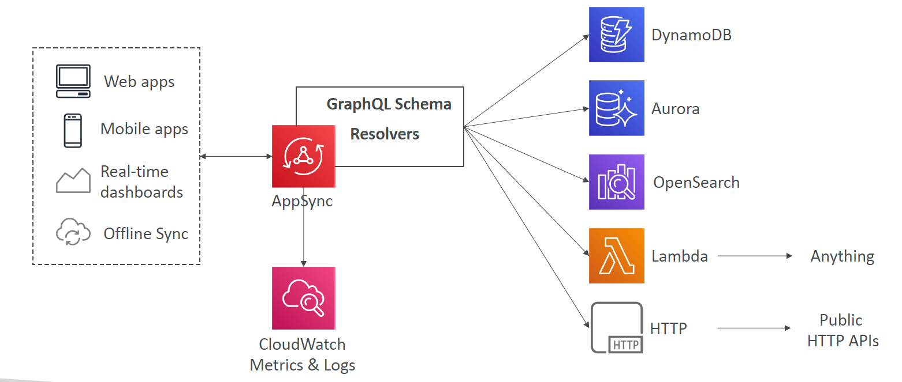
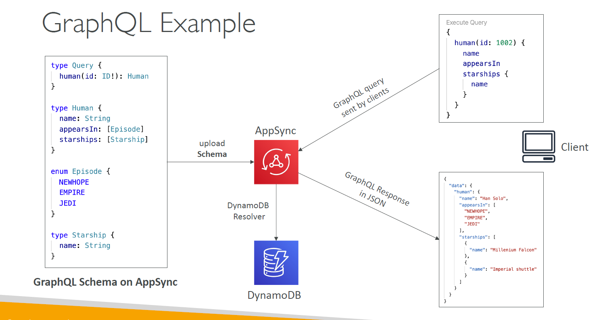

# ⚡ **AWS AppSync** – _GraphQL for Real-Time Data APIs_

AWS **AppSync** is a **fully managed GraphQL service** that simplifies the development of scalable, real-time applications by connecting to **multiple data sources**—from databases to APIs—all under a single endpoint.

---

<div style="text-align: center;">
    
</div>

---

## 🧠 **What is AWS AppSync?**

AppSync allows you to build flexible, efficient, and secure APIs using **GraphQL**, enabling clients to:

- 📦 Request **only the data they need**
- 🔗 **Combine** data from multiple sources in a single query
- ⚡ **Subscribe** to real-time updates with **WebSockets**
- 📶 **Sync offline data** in mobile/web apps

---

## 🗺️ **Core Architecture**

### 📐 **GraphQL Schema**

The developer defines a **GraphQL schema** that outlines the shape of the data:

```graphql
type Query {
  getPost(id: ID!): Post
}

type Post {
  id: ID!
  title: String
  content: String
  author: String
}
```

This schema is uploaded to AppSync to generate the **API layer**.

---

## 🔌 **AppSync Connects to Multiple Backends**

Once the schema is uploaded, each field (query, mutation, subscription) maps to a **resolver** connected to a data source:

| **Source** | **Integration Method**      | **Use Case**                              |
| ---------- | --------------------------- | ----------------------------------------- |
| DynamoDB   | Direct or Pipeline Resolver | NoSQL / key-value queries                 |
| Aurora     | RDS Proxy + Lambda          | Relational queries                        |
| OpenSearch | Direct Resolver             | Full-text search                          |
| Lambda     | Direct Resolver             | Business logic, aggregation, external API |
| HTTP API   | HTTP Resolver               | Fetch from public/private REST APIs       |

🔗 Each field is resolved independently and can target **any AWS service or 3rd-party system** via Lambda or HTTP endpoints.

---

## 📡 **Real-Time Capabilities**

AppSync supports **real-time data synchronization** with:

- **WebSocket Subscriptions** (standard GraphQL `subscription {}` pattern)
- **MQTT Protocol** (for IoT devices)
- Use cases: 📈 dashboards, 💬 chat apps, 🛒 live order tracking

---

## 📱 **Perfect for Mobile & Web**

AppSync helps modern apps stay synced even in poor network conditions:

- 🔄 **Offline Sync** – local storage with sync once back online
- 🧩 **Conflict Resolution** – automatic or Lambda-based
- 🔐 Built-in **security & caching** with:

  - Amazon Cognito
  - IAM
  - API Key
  - OpenID Connect

---

## 🛡️ **Security + Monitoring**

| Feature              | Description                                       |
| -------------------- | ------------------------------------------------- |
| 🔐 Authentication    | IAM, Cognito, OIDC, API Key                       |
| 🔍 Logging & Tracing | Integrated with **CloudWatch Logs** and **X-Ray** |
| 💾 Data Caching      | Response caching at resolver-level (TTL)          |

---

## 🧪 **End-to-End Example**

> **User sends a query → AppSync calls DynamoDB resolver → Returns GraphQL JSON response!**

<div style="text-align: center;">
    
</div>

---

## 🧰 **When to Use AppSync?**

- ✅ Real-time apps (chat, live feed, IoT)
- ✅ Offline-first mobile/web apps
- ✅ Aggregating data from multiple sources
- ✅ Reduce over-fetching in REST APIs
- ✅ Frontend-driven schema evolution

---

## 🏁 **Summary**

| Feature             | Benefit                                          |
| ------------------- | ------------------------------------------------ |
| GraphQL + Resolvers | Query exactly what you need from diverse sources |
| Real-Time Data      | Built-in subscriptions via WebSocket/MQTT        |
| Secure + Scalable   | IAM + Cognito + fine-grained permissions         |
| Mobile Optimized    | Offline support, sync, conflict resolution       |

## 📚 **Additional Resources**

Enhance your knowledge and skills with these valuable resources:

- **AWS AppSync Documentation:** [Amazon AppSync Docs](https://docs.aws.amazon.com/appsync/index.html)

- **Serverless Guru Blog:** [Serverless Orchestration Workflows with AWS Step Functions](https://www.serverlessguru.com/blog/serverless-orchestration-workflows-with-aws-step-functions)

- **Tutorials and Guides:** Explore comprehensive tutorials to build and deploy GraphQL APIs with AppSync.

- **AWS Training and Certification:** Participate in AWS-certified training programs to deepen your expertise in AppSync and related services.
