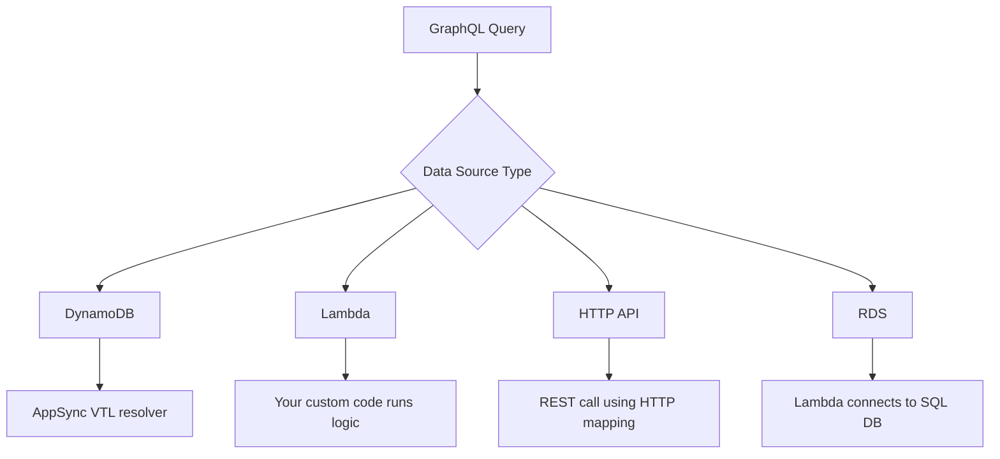

# ⚙️ **How AWS AppSync Handles Data Logic & Routing**

**AWS AppSync** is a powerful **managed GraphQL service** that allows you to expose data from multiple sources (like DynamoDB, Lambda, REST, or SQL) — but **it doesn’t execute logic itself**. Think of AppSync as a **smart API router** that delegates operations to the appropriate **data source resolver**.

---

## 🧭 **Who Actually Executes Business Logic in AppSync?**

AppSync does **not** run backend code. Instead, it delegates logic to your chosen data source. Here’s how the logic flow works across various backends:

| 🔌 **Data Source**            | 🧠 **Who Executes Logic?**                           | ✅ **Best Use Case**                         |
| ----------------------------- | ---------------------------------------------------- | -------------------------------------------- |
| **DynamoDB**                  | Auto-handled by AppSync resolvers (VTL)              | Fast NoSQL CRUD without writing backend code |
| **AWS Lambda**                | Custom logic written in code (Node.js, Python, etc.) | Validations, workflows, complex logic        |
| **Amazon RDS (Aurora)**       | Accessed through Lambda (SQL queries)                | SQL apps or legacy systems                   |
| **Amazon OpenSearch**         | AppSync queries directly (search index queries)      | Full-text search, analytics                  |
| **HTTP (External REST APIs)** | AppSync acts as proxy via mapping templates          | Calling external services or microservices   |

---

## 🧪 **1. Built-in Logic with DynamoDB (No Code Required)**

AppSync provides **auto-generated logic** for basic operations (CRUD) when connected to **Amazon DynamoDB**:

- `GetItem` → Fetch a single item by ID
- `Scan` → List all items
- `PutItem` → Create new entries
- `UpdateItem` → Update fields
- `DeleteItem` → Remove entries

### ✅ Example: Fetching a Todo

```graphql
query {
  getTodo(id: "abc123") {
    id
    title
    completed
  }
}
```

✔️ AppSync uses its **VTL resolver** to call DynamoDB's `GetItem` API — **you write no backend code**.

---

## 🏗 **2. Using AWS Lambda for Custom Business Logic**

If you need **custom validation, business rules, or complex database queries**, you must **use AWS Lambda** as a resolver.

### **Step 1: Create a Lambda Function**

1️⃣ Go to **AWS Lambda** → Click **Create Function** → Select **Node.js/Python**.  
2️⃣ Name it **appsyncTodoHandler**.  
3️⃣ Paste this **Lambda function for custom logic**:

```javascript
const AWS = require("aws-sdk");
const dynamoDB = new AWS.DynamoDB.DocumentClient();
const TABLE_NAME = "TodosTable";

exports.handler = async (event) => {
  console.log("Received event:", JSON.stringify(event, null, 2));
  const { fieldName, arguments } = event;

  switch (fieldName) {
    case "getTodo":
      return await getTodo(arguments.id);
    case "listTodos":
      return await listTodos();
    case "createTodo":
      return await createTodo(arguments.input);
    case "deleteTodo":
      return await deleteTodo(arguments.id);
    default:
      throw new Error(`Unsupported query: ${fieldName}`);
  }
};

async function getTodo(id) {
  const params = { TableName: TABLE_NAME, Key: { id } };
  const result = await dynamoDB.get(params).promise();
  return result.Item;
}

async function listTodos() {
  const params = { TableName: TABLE_NAME };
  const result = await dynamoDB.scan(params).promise();
  return result.Items;
}

async function createTodo(input) {
  const params = {
    TableName: TABLE_NAME,
    Item: { id: AWS.util.uuid.v4(), ...input },
  };
  await dynamoDB.put(params).promise();
  return params.Item;
}

async function deleteTodo(id) {
  const params = { TableName: TABLE_NAME, Key: { id } };
  await dynamoDB.delete(params).promise();
  return { id };
}
```

✔️ This function **implements CRUD logic manually** using **DynamoDB SDK** inside Lambda.

---

### **Step 2: Connect Lambda to AppSync**

1️⃣ In **AWS AppSync**, go to **Data Sources** → Click **Create Data Source**.  
2️⃣ Choose **AWS Lambda** as the data source.  
3️⃣ Select the **Lambda function (appsyncTodoHandler)**.  
4️⃣ Click **Save**.

---

### **Step 3: Attach Lambda to Resolvers**

1️⃣ Go to **Schema → Resolvers**.  
2️⃣ Attach **getTodo, listTodos, createTodo, deleteTodo** to **Lambda** instead of DynamoDB.

---

### **Step 4: Run GraphQL Queries**

#### **Fetch a Todo**

```graphql
query {
  getTodo(id: "123") {
    id
    title
    completed
  }
}
```

✔️ AppSync **routes the request to Lambda** → Lambda fetches the **record from DynamoDB**.

#### **Create a New Todo**

```graphql
mutation {
  createTodo(input: { title: "Learn AWS AppSync", completed: false }) {
    id
    title
    completed
  }
}
```

✔️ AppSync **calls Lambda** → Lambda **inserts a new record into DynamoDB**.

---

## 🌐 **3. Connecting to External REST APIs**

Sometimes your data lives **outside AWS** — that’s where **HTTP resolvers** come in.

### 🔗 Example: Call REST Endpoint

```json
{
  "version": "2018-05-29",
  "method": "GET",
  "resourcePath": "/todos",
  "params": {
    "headers": {
      "Authorization": "Bearer YOUR_TOKEN"
    }
  }
}
```

✔️ AppSync maps your GraphQL query to a REST call (e.g., from `https://api.example.com/todos`) and returns the result.

---

## 🧬 **Resolver Decision Tree**

> 📌 “Who should handle this query?”



---

## 🛡 **How AppSync Separates Routing vs. Logic**

| Layer         | Responsibility                                    |
| ------------- | ------------------------------------------------- |
| **AppSync**   | Parses GraphQL, maps to data source, handles auth |
| **Resolvers** | Translate GraphQL into a backend API call         |
| **Backends**  | Execute logic (Lambda, DynamoDB, REST, SQL, etc.) |

This design makes AppSync **modular**, **extensible**, and great for **serverless GraphQL APIs**.

---

## ✅ **Use Cases Breakdown**

| Scenario                              | Recommended Backend |
| ------------------------------------- | ------------------- |
| Simple CRUD, blazing-fast NoSQL       | DynamoDB            |
| Validations, logging, or conditionals | AWS Lambda          |
| Complex filtering or joins (SQL)      | Lambda + RDS        |
| Integrate with external APIs          | HTTP resolver       |
| Search & analytics                    | OpenSearch          |

---

## 🔐 **Security Note**

Every data source uses **its own IAM role** or **authorization logic**:

- **IAM roles** (backend-to-backend)
- **Cognito User Pools** (frontend users)
- **Lambda authorizers** (custom JWT logic)
- **OpenID Connect** (Auth0, Google OAuth)

AppSync supports **multiple auth modes** at the same time.

---

## 📌 Final Thoughts

- 🧠 AppSync **routes** requests; it doesn’t contain your logic
- 🧱 Choose the **data source** based on your app’s complexity
- ⚡ Start with **DynamoDB** for simple use cases
- 🧩 Use **Lambda** for anything that requires backend logic
- 🌐 Use **HTTP endpoints** for microservices or SaaS integrations
