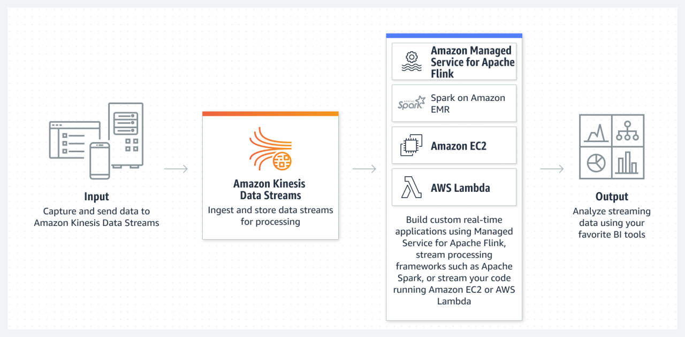
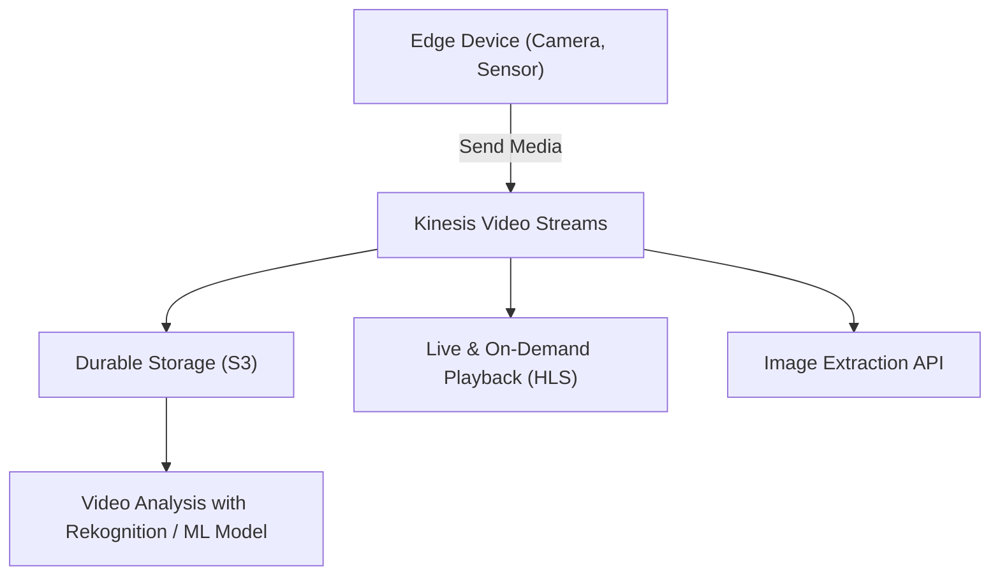
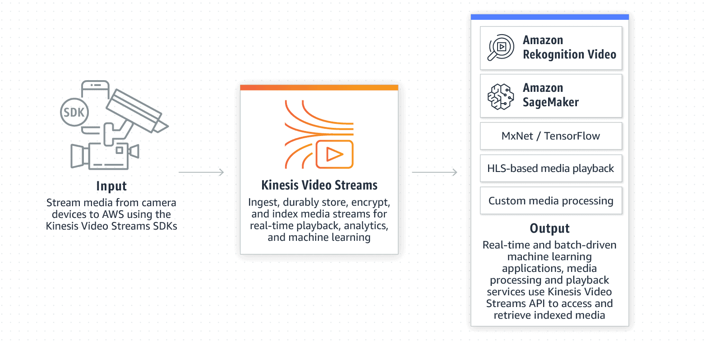
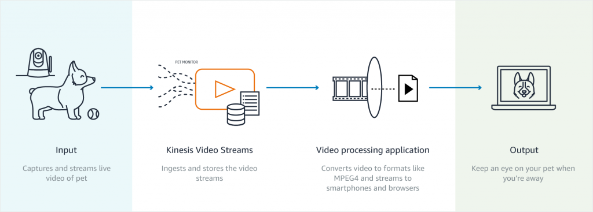
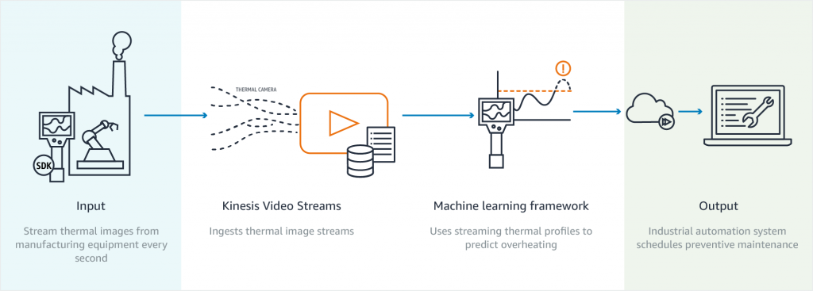
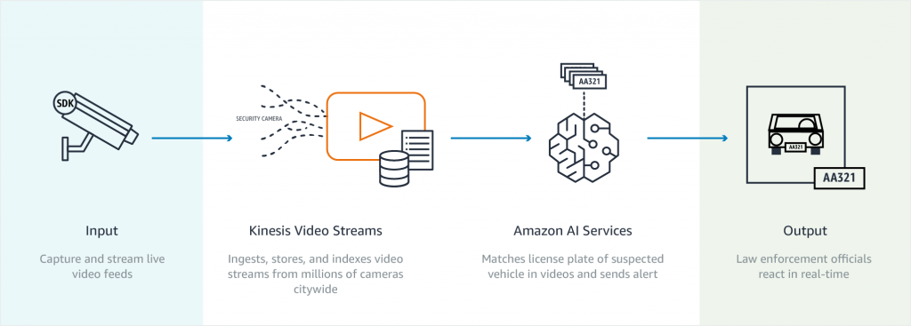

# 📹🔥 **Amazon Kinesis Video Streams (KVS)**

_Real-Time Video Streaming for ML, Analytics & Playback!_

**Amazon Kinesis Video Streams (KVS)** is a fully managed service that makes it easy to securely stream, ingest, store, and analyze video and time-encoded data from millions of edge devices to AWS for real-time or batch processing.

> ✅ Whether you're building a **smart home**, **industrial automation system**, or **AI-powered surveillance**, KVS is your backbone for scalable and intelligent video processing.

---

    

---

## 🧠 TL;DR Summary

| Feature                 | Description                                            |
| ----------------------- | ------------------------------------------------------ |
| 🎥 **Stream ingestion** | Video, audio, RADAR, LIDAR from edge to AWS            |
| 📦 **Durable storage**  | Indexed, encrypted, and stored in S3                   |
| ⏯️ **Playback options** | Live & archived playback using HLS                     |
| 🧠 **ML-ready**         | Integrates with Amazon Rekognition, OpenCV, TensorFlow |
| 🖼️ **Image extraction** | Extract images on-demand from video                    |
| 🔐 **Security**         | TLS in transit, KMS at rest, IAM access control        |

---

## 🏗️ Architecture Overview

---

## 🚀 Core Features

### 📥 1. **Secure, Scalable Ingestion**

- SDKs for **video, audio, and time-encoded sensor data**
- Support for **IP cameras, IoT sensors**, and **custom producers**
- Upload streams directly from **on-prem devices** or **mobile apps**

### 📦 2. **Durable & Timestamped Storage**

- Streams are stored in **Amazon S3 (via internal KVS backend)**
- Indexed by **timestamp** for precise playback or analysis
- Encrypted at rest using **AWS KMS**

### ⏯️ 3. **Live & Archived Playback (HLS)**

- Serve video in real-time or from archive using **HTTP Live Streaming**
- Playback via **browsers, mobile apps**, or custom players
- Use it for **monitoring**, **incident review**, or **remote access**

### 🧠 4. **ML & Computer Vision Integration**

- Built-in integration with:
  - 🧠 **Amazon Rekognition Video** (face detection, labels, people tracking)
  - 🤖 **OpenCV / TensorFlow** (for custom ML pipelines)
- Supports real-time or post-processing analysis

### 🖼️ 5. **Image Extraction APIs**

- Extract **frame-by-frame snapshots** from video streams
- Use images in **dashboards, training datasets**, or visual monitoring

### 🔐 6. **Security & Access Control**

- **TLS** for data in transit
- **AWS KMS** for encryption at rest
- Full control via **IAM policies and resource-level permissions**
- Integration with **CloudTrail** for audit trails

---

## 🌍 Use Case Examples

| Industry                    | Use Case                                                 |
| --------------------------- | -------------------------------------------------------- |
| 🏙️ **Smart Cities**         | Analyze traffic, detect anomalies, monitor public safety |
| 🏥 **Healthcare**           | Remote patient monitoring and movement tracking          |
| 🏗️ **Industrial IoT**       | Monitor factory lines using computer vision              |
| 🎓 **Education & Training** | Stream recorded labs, surgeries, or simulations          |
| 🎥 **Live Broadcast**       | Ingest and replay live events with minimal latency       |

---

    

---

    

---

    

---

    

---

## 🛠️ Hands-On Steps to Use KVS

1. **🎯 Create a Kinesis Video Stream**  
   AWS Console → Kinesis Video Streams → Create stream

2. **📦 Set Up a Producer (Camera, App, etc.)**  
   Use KVS SDKs (C++, Java, GStreamer) to start pushing media to AWS

3. **🔍 View / Playback**  
   Use the AWS Console or HLS endpoints for live and recorded playback

4. **🧠 Integrate with ML**  
   Process streams using Amazon Rekognition Video or custom Lambda functions

5. **📸 Extract Images (Optional)**  
   Use the `GetMediaForFragmentList` or `GetImages` API to pull key frames

---

## 💰 Pricing Overview

| Component                  | Billed Based On              |
| -------------------------- | ---------------------------- |
| 🎥 Video Ingestion         | GB ingested per stream       |
| 📦 Data Storage            | Hours of data retained       |
| ⏯️ HLS Playback            | GB delivered                 |
| 🧠 Rekognition Integration | Per minute of analyzed video |

🔗 [AWS KVS Pricing](https://aws.amazon.com/kinesis/video-streams/pricing)

---

## 🔧 Integration with Other AWS Services

| AWS Service          | Purpose                                         |
| -------------------- | ----------------------------------------------- |
| 🧠 Rekognition Video | Analyze video using ML (faces, motion, objects) |
| 🧪 Lambda            | Trigger functions on media ingestion or alerts  |
| 📜 CloudWatch        | Monitor KVS metrics and alerts                  |
| 📂 S3                | Store processed outputs or backups              |
| 🧾 EventBridge       | Automate workflows on stream events             |

---

## 🧠 Best Practices

✅ Use **fragmented MP4** for compatibility  
✅ Enable **logging and metrics** (CloudWatch)  
✅ Rotate **IAM keys and roles** regularly  
✅ Integrate with **VPC endpoints** for secure private access  
✅ Compress/resize streams where possible to optimize costs

---

## 📘 References & Resources

- 📚 [KVS Developer Guide](https://docs.aws.amazon.com/kinesisvideostreams/latest/dg/)
- 🔧 [KVS Producer SDKs](https://docs.aws.amazon.com/kinesisvideostreams/latest/dg/producer-sdk.html)
- 🎥 [Getting Started with KVS](https://docs.aws.amazon.com/kinesisvideostreams/latest/dg/getting-started.html)
- 💡 [KVS + Rekognition Guide](https://aws.amazon.com/rekognition/video-features/)

---

## 🏁 Conclusion

**Amazon Kinesis Video Streams** is your go-to service for **secure, scalable, and intelligent video streaming**. Whether you're building a smart camera network, doing real-time analytics with AI, or broadcasting live content — KVS offers the tools and scalability to do it all without managing infrastructure.

> 💡 With KVS, you can focus on **what your video means**, not how to manage it.
