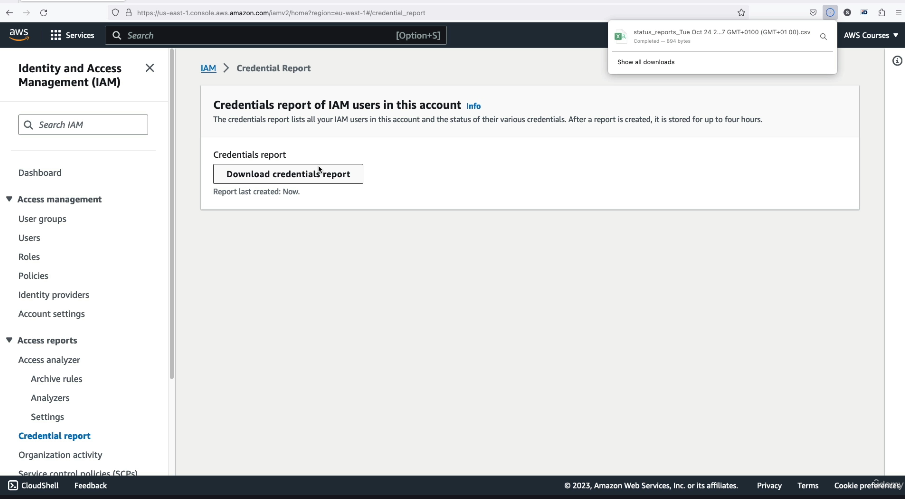
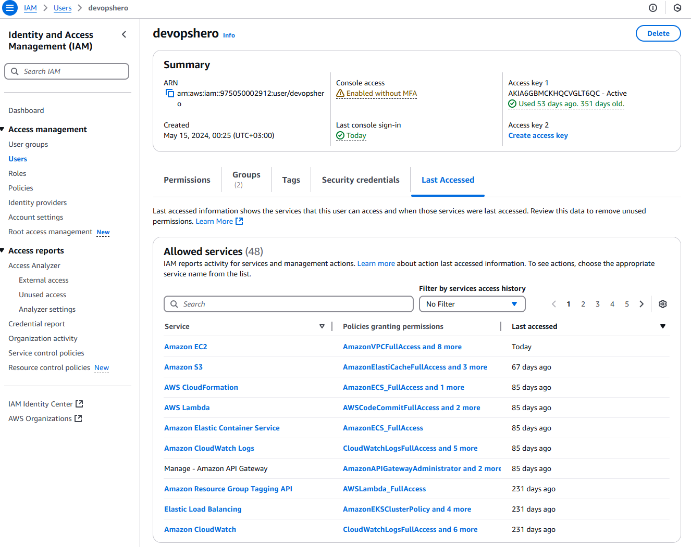

# 🔐 **IAM Security Tools in AWS**

AWS provides built-in IAM tools to help you **monitor and secure user access**. Two key tools every administrator should know:

---

## 📄 1. **IAM Credentials Report** (📊 Account-Level)

- Generates a CSV file listing **all IAM users** in your account.
- Shows:
  - Whether **passwords** or **access keys** are enabled
  - If **MFA** is enabled
  - When credentials were **last used** or **rotated**
- Helps identify **unused credentials** and improve **account hygiene**.

> 📍Access it from:  
> **AWS Console → IAM → Credential Report**

---

    

---

## 👁️ 2. **IAM Latest Accessed** _(previously called Access Advisor)_ (📌 User-Level)

- Shows **which AWS services** a user or role has **permissions for**.
- Indicates the **last time each service was accessed**.
- Helps **refine IAM policies** by removing unused permissions (principle of least privilege).

> 📍Access it by selecting a user → **Access Advisor tab**

---

    

---

## ✅ Why Use These Tools?

- 🔍 Detect and clean up **unused users or keys**
- 🛡️ Enforce **least privilege** access
- 🔒 Improve overall **account security posture**
