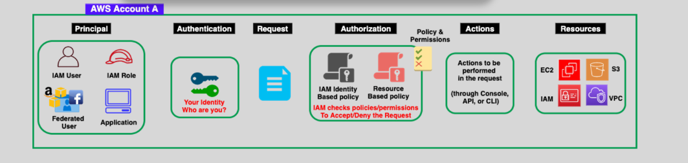
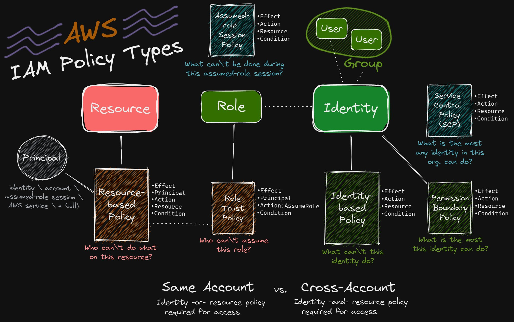

# 📑 **IAM Policies in AWS: Control Access with Precision**

> 📌 "Who can do what, on which resource, under what condition?"

**IAM Policies** are the **brains behind access control** in AWS. They determine **who can do what**, **on which resources**, and **under what conditions**.  
They’re written in **JSON**, evaluated by AWS every time an action is attempted, and are essential to implementing the **principle of least privilege**.

---

<div align="center">
  
</div>

---

## 🧠 **What Are IAM Policies?**

IAM Policies are **permissions documents** <u>attached</u> to **identities** or **resources**. These JSON-based policies explicitly **allow** or **deny** actions on AWS services.

✅ Think of a policy as a **"rules list"** saying:

> “User X **can** read objects from this S3 bucket, but **can’t** delete them.”

---

## 🧱 **Key Components of a Policy**

```json
{
  "Version": "2012-10-17",
  "Statement": [
    {
      "Effect": "Allow",
      "Action": "s3:GetObject",
      "Resource": "arn:aws:s3:::mybucket/*"
    }
  ]
}
```

| 🔹 Field    | 🧾 Description                                                 |
| ----------- | -------------------------------------------------------------- |
| `Version`   | Policy language version (always `"2012-10-17"` for AWS).       |
| `Statement` | One or more permission rules.                                  |
| `Effect`    | `"Allow"` or `"Deny"`. Deny always takes precedence.           |
| `Action`    | The operation to allow/deny (e.g., `"s3:GetObject"`).          |
| `Resource`  | The ARN(s) of the AWS resources to which this action applies.  |
| `Principal` | (Resource-based policies only) Who the policy applies to.      |
| `Condition` | (Optional) Additional constraints for when the policy applies. |

---

## **🔍 Policy Evaluation Logic**

IAM policies use a **implicit default deny** model and evaluate requests in a specific way:

1. **🏠 Default Deny**: By default, **all requests are implicit denied** until explicitly allowed by a policy.

2. **✅ Explicit Allow**: If a policy explicitly allows an action, it will be granted even if a general **deny** is in place.

3. **❌ Explicit Deny**: If a policy explicitly denies an action, that denial **overrides any allows**. Deny always takes precedence over allow.

### ✍️ Example: Allow All S3 Actions on a Bucket

```json
{
  "Version": "2012-10-17",
  "Statement": [
    {
      "Effect": "Allow",
      "Action": "s3:GetObject",
      "Resource": "arn:aws:s3:::mybucket/*"
    }
  ]
}
```

### ✍️ Example: Deny All S3 Actions on a Bucket except for `"s3:GetObject"`

```json
// - The principal can perform all actions on mybucket/* except s3:GetObject
{
  "Version": "2012-10-17",
  "Statement": [
    {
      "Effect": "Deny",
      "Action": "s3:GetObject",
      "Resource": "arn:aws:s3:::mybucket/*"
    },
    {
      "Effect": "Allow",
      "Action": "*",
      "Resource": "arn:aws:s3:::mybucket/*"
    }
  ]
}
```

```json
// - No actions are permitted on mybucket/*, including s3:GetObject.
{
  "Version": "2012-10-17",
  "Statement": [
    {
      "Effect": "Allow",
      "Action": "s3:GetObject",
      "Resource": "arn:aws:s3:::mybucket/*"
    },
    {
      "Effect": "Deny",
      "Action": "*",
      "Resource": "arn:aws:s3:::mybucket/*"
    }
  ]
}
```

```json
// -The principal (user, role, etc.) can download objects from mybucket, but cannot list the bucket or perform any other actions unless additional permissions are granted elsewhere.
{
  "Version": "2012-10-17",
  "Statement": [
    {
      "Effect": "Allow",
      "Action": "s3:GetObject",
      "Resource": "arn:aws:s3:::mybucket/*"
    }
  ]
}
```

---

## **🧩 Types of IAM Policies**

We’ll group them into **3 categories** to make them easier to remember:

<div align="center" style="background-color: #0c2230ff; border-radius: 20px; border: solid">

| Category                     | IAM Policy Types                                                                       | Main Question Answered                                                                                                                      |
| ---------------------------- | -------------------------------------------------------------------------------------- | ------------------------------------------------------------------------------------------------------------------------------------------- |
| **Attached to Identity**     | ✅ Identity-Based Policy<br>✅ Permissions Boundary<br>✅ SCP (Service Control Policy) | ❓ What _can\’t_ this identity do?<br>❓ What is the _max_ this identity can do?<br>❓ What is the _most_ any identity in this org. can do? |
| **Attached to Resource**     | ✅ Resource-Based Policy                                                               | ❓ Who _can’t_ do what _on this resource_?                                                                                                  |
| **Attached to Role Context** | ✅ Role Trust Policy<br>✅ Assumed-Role Session Policy                                 | ❓ Who _can assume_ the role?<br>❓ What _can’t_ be done during a session?                                                                  |

---

  

</div>

---

### 📜 **1. Identity-Based Policy**

> 👉🏻 What _can’t_ this **identity** (user, group, or role) do?

- ✅ Attach to: **IAM users**, **groups**, **roles**
- 🧾 Example:

  ```json
  {
    "Effect": "Allow",
    "Action": "s3:ListBucket",
    "Resource": "arn:aws:s3:::my-bucket"
  }
  ```

- 🔄 Can be:
  - **AWS Managed**
  - **Customer Managed**
  - **Inline**

🔐 **Best For:**  
Controlling access for developers, EC2, Lambda, or service roles.

---

### 📜 **2. Resource-Based Policy**

> 👉🏻 Who _can’t_ do what on **this resource**?

- ✅ Attach to: **S3 Buckets**, **Lambda**, **Secrets Manager**, etc.
- 🧾 Example (S3 Bucket):

  ```json
  {
    "Effect": "Allow",
    "Principal": {
      "AWS": "arn:aws:iam::111122223333:user/Alice"
    },
    "Action": "s3:GetObject",
    "Resource": "arn:aws:s3:::my-bucket/*"
  }
  ```

- ✅ Must include a `Principal` (i.e., who is allowed)

> ⚠️ **Important Note:**  
> To allow **cross-account access**, a **resource-based policy** is required!

---

### 🎓 **3. Role Trust Policy**

> 👉🏻 Who _can assume_ this role?

- ✅ Embedded in **IAM Role** definition
- 🧾 Example:

  ```json
  {
    "Effect": "Allow",
    "Principal": {
      "Service": "ec2.amazonaws.com"
    },
    "Action": "sts:AssumeRole"
  }
  ```

🛠️ **Use Cases:**

- Allow EC2 to assume a role (EC2 instance profile)
- Cross-account access
- AWS services using roles (Lambda, ECS)

---

Perfect setup, Hady — let’s build on your IAM role trust policy example and clarify the **two layers that define what the role can actually do once assumed**:

---

### 📜 **4. Role's Permission Policy**

> 👉🏻 This is the **main policy attached to the IAM role** itself. It defines **what actions the role is allowed to perform** once someone assumes it.

- 🔧 Where It Lives:

  - Attached directly to the IAM role (like a user policy)
  - Written in JSON, just like any other IAM policy

- 🧠 What It Controls:

  - Actions the role can perform (e.g., `s3:GetObject`, `ec2:DescribeInstances`)
  - Resources it can access (e.g., specific buckets, tables, or EC2 instances)

- 🧾 Example:

  ```json
  {
    "Effect": "Allow",
    "Action": ["s3:GetObject"],
    "Resource": ["arn:aws:s3:::mybucket/*"]
  }
  ```

- 🛠️ Use Cases:
  - EC2 instance profile role that can read from S3
  - Lambda execution role that can write to DynamoDB
  - Cross-account role that grants read-only access to a bucket

---

### 🧱 **5. Role Session Policy (SP)**

> 👉🏻 This is an **optional inline policy** passed during the `AssumeRole` API call. It can **further restrict** what the session is allowed to do — even if the role’s permission policy allows more.

- 🔧 Where It Comes From:

  - Passed as a parameter in `sts:AssumeRole` or `AssumeRoleWithWebIdentity`
  - Not stored permanently — it only applies to that session

- 🧠 What It Controls:

  - Temporary, scoped-down permissions for the session
  - Acts like a **filter** on top of the role’s permission policy

- 🧾 Example:

  ```json
  {
    "Version": "2012-10-17",
    "Statement": [
      {
        "Effect": "Allow",
        "Action": "s3:GetObject",
        "Resource": "arn:aws:s3:::mybucket/reports/*"
      }
    ]
  }
  ```

- 🛠️ Use Cases:

  - Limit what a federated user can do during a session
  - Restrict automation scripts to read-only access
  - Enforce least privilege in temporary credentials

---

### 🧱 **6. Permissions Boundary Policy (PB)**

> 👉🏻 What’s the **maximum** permissions this identity can get?

- ✅ Attach to: IAM **users** or **roles**
- ✅ Acts as a **guardrail**: Identity-based policies must be _within_ this boundary

🧾 Example:

```json
{
  "Effect": "Allow",
  "Action": "s3:*",
  "Resource": "*"
}
```

> 🚨 If the boundary doesn't allow `s3:DeleteObject`, the user can't perform it, even if their identity policy allows it.  
> 🚨 It `NOT` grant permission, it just make limit, for example if user has not policy to `s3:DeleteBucket` and the permssion Boundary allow all action in the bucket, user still can't delete the objects in a bucket.  
> ⚠️ Think of it as a **"maximum allowed scope"**.

---

### 🧱 **7. Service Control Policies (SCPs)**

> 👉🏻 What’s the **maximum** any identity in this org can do?

- ✅ Applies to: **AWS Organization Accounts**
- ✅ Attached to: **OU**, **root**, or **accounts**
- ❌ SCPs don’t grant permissions — they **limit** them.

- 🧾 Example: Deny deleting buckets

  ```json
  {
    "Effect": "Deny",
    "Action": "s3:DeleteBucket",
    "Resource": "*"
  }
  ```

> 🧠 **Important:** Even if an IAM policy allows `s3:DeleteBucket`, SCP can block it.

---

## 🎯 **Common Use Cases**

<div align="center" style="background-color: #0c2230ff; border-radius: 20px; border: solid">

| Scenario                                 | Policy Type            | Description                                                         |
| ---------------------------------------- | ---------------------- | ------------------------------------------------------------------- |
| EC2 instance needs to access S3          | Identity-Based + Role  | Attach a policy to a role, and assign the role to the EC2 instance. |
| Share S3 bucket with another AWS account | Resource-Based         | Add a bucket policy with a cross-account `Principal`.               |
| Prevent S3 bucket deletion org-wide      | Service Control Policy | Use an SCP with `Deny: s3:DeleteBucket`.                            |
| Restrict session to read-only            | Session Policy         | Attach a read-only session policy when assuming a role.             |
| Define max permissions for developers    | Permissions Boundary   | Set a boundary limiting what policies can allow.                    |

</div>

---

## 💡 **IAM Groups ≠ Principals**

IAM **Groups** help you organize users, but they **can’t act on their own**.

- ✅ You can attach policies to groups.
- ❌ You **can’t assign roles or trust policies** to groups.

---

## 🔐 **Best Practices for IAM Policies**

<div align="center" style="background-color: #0c2230ff; border-radius: 20px; border: solid">

| ✅ Practice                              | 💬 Why It’s Important                                           |
| ---------------------------------------- | --------------------------------------------------------------- |
| 🔒 Grant Least Privilege                 | Prevent unintended access or privilege escalation.              |
| 🛠 Use Managed Policies First             | Reduces errors and simplifies maintenance.                      |
| 🧾 Use Customer-Managed for Custom Logic | For business-specific needs.                                    |
| ❗ Avoid Inline Policies When Possible   | They’re hard to audit and reuse.                                |
| 🔁 Regularly Audit and Rotate            | Remove unused policies and review permissions quarterly.        |
| 📋 Tag Your Policies                     | Use tags to organize policies by team, project, or environment. |
| 📚 Use IAM Access Analyzer               | Detect policies that allow unintended access.                   |

</div>

---

## ✅ **Summary Table: IAM Policy Types**

<div align="center" style="background-color: #0c2230ff; border-radius: 20px; border: solid">

| Type                  | Attached To              | Defines Who or What  | Common Use Case                    |
| --------------------- | ------------------------ | -------------------- | ---------------------------------- |
| Identity-Based        | Users, Groups, or Roles  | What they can do     | Access to S3 or EC2                |
| Resource-Based        | AWS Resources (e.g., S3) | Who can access       | Grant cross-account S3 access      |
| Permissions Boundary  | IAM Users or Roles       | Max what they can do | Limit delegated permissions        |
| SCP (Service Control) | AWS Accounts             | Org-wide limits      | Prevent DeleteBucket for everyone  |
| Role Trust Policy     | IAM Roles                | Who can assume       | EC2 assuming a role                |
| Session Policy        | Temporary Role Sessions  | What they can do     | Scoped session for federated users |

</div>

---

## 🧠 Final Thoughts

> “**IAM Policies** are your cloud’s rulebook — precise, powerful, and critical.”

- Understand the **types** of policies to choose the right tool for your job.
- Master **policy evaluation logic** to troubleshoot and secure access.
- Always **review and test** policies in a dev/test environment before applying to production.
